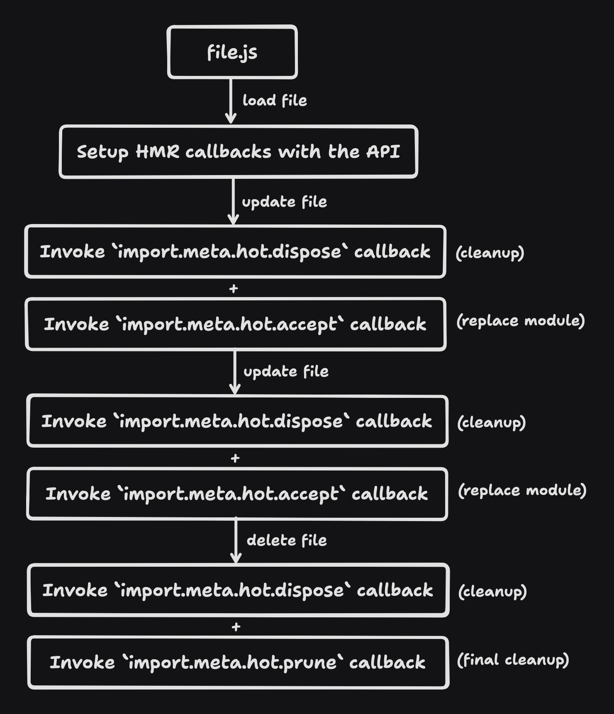
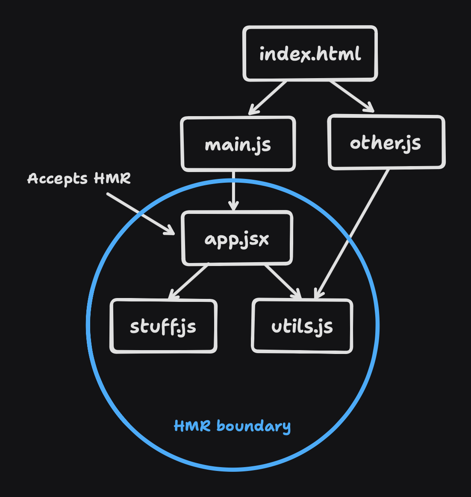
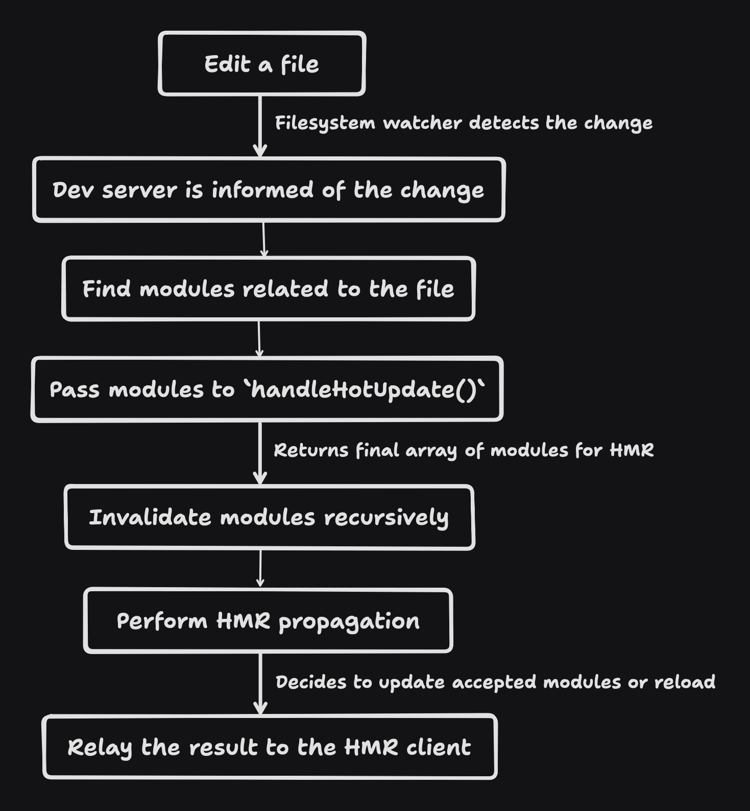

# vite的热更新原理

中文网络上，截止目前(2024.7.31)似乎没有太多的文章讲解 vite 的热替换原理。

> vite 在运行时是如何保证旧文件运行过的状态先被销毁，并通过增量更新的方式来实现替换旧文件的效果。

本篇文章翻译了[ vite 官网推荐阅读的一篇英文 blog](https://cn.vitejs.dev/guide/api-hmr.html#further-reading)，来讲讲这个过程。

阅读须知

- 翻译过程结合我自己的理解，删减和添加了一些东西。
- 需要阅读基础：如果你对 rollup 的[工作流程图](https://cn.rollupjs.org/plugin-development/#build-hooks)并不是很熟悉，则需要先学习 rollup 再看。
- 结合文档：大部分人很少用到 [HMR API](https://cn.vitejs.dev/guide/api-hmr.html), 所以对这部分不熟悉是理所应当的。如果不熟悉，可以结合官方文档一起观看，以便能够看懂。
- 长文预警。

## 导言

如果你正在使用 vite, 那么你很可能也听说过它的 HMR (热替换)。简单来说，热替换让我们在不刷新页面的前提下，将编辑器上的更新（无论是编辑 html, css, 还是 js）同步到浏览器中，实时看到效果。这一点改善了开发者的体验。

你当然也知道，热更新并不是在 vite 上独有的，它更早地来自 webpack 和 parcel。在这篇文章中，我们将深入探讨针对于 vite 的热更新，而不是其他的构建工具。但你应该清楚，这些构建工具的热更新，其实原理上大同小异。

## 模块更新的生命周期

大多数构建工具都使用 ESM 规范(vite 也是如此)，因为支持静态语法分析的 ESM 能够更容易的分析依赖关系。这一点很重要，因为对于一个修改过的文件，它能更容易的分析出哪些文件依赖了该修改的文件。

我们通过观察 vite 为我们提供的四个 `HMR API` 生命周期钩子，来观察一个模块的更新历程：

```js
import.meta.hot.accept()
import.meta.hot.dispose()
import.meta.hot.prune()
import.meta.hot.invalidate()
```

请先仔细看一遍四个钩子的调用顺序，我们将依次讲解他们。对于其他的 `HMR API`，他们对于理解 `HMR` 并不是那么重要，不讲解：



需要清楚的是，这四个钩子都在我们书写的具体的代码中由我们自己使用，他们将被 vite 在代码分析中分析出来，并被 vite 挂入**所在的模块**的更新流中。

另外，一定要确保用一个 `if` 语句包裹所有`HMR API` 的使用，这样代码就可以在生产环境中被 `tree-shaking` 优化掉了。

```js
if (import.meta.hot) {
  // 调用这四个钩子
}
```

### import.meta.hot.accept()

有三个术语需要我们学习：

- `HMR boundary`
- `accepted module`(直译："可接受的模块")
- `self-accepted module`(直译："可自我接受的模块")

如果你在一个模块中调用了这个函数，那么 `HMR boundary` 就产生了，以它为入口（注意，是入口，不是根节点）。如果这样的一个模块还导入了其他的模块，那么自然就可以用它作为入口，来构建一个依赖图。这整个图就位于了所谓的 "HMR boundary"(HMR 边界) 中。当没有导入的模块的时候，`HMR 边界` 内部就只有一个节点，就是它自己。



对于剩下的 2 个术语，它们对应了 `accept` 的两种形式的重载：

1. import.meta.hot.accept(cb: (newModule) => void) - 该 cb 函数接收自己的变化后的状态 newModule
2. import.meta.hot.accept(deps: string | string[], cb: (newDep | newDeps[]) => void) - 该 cb 函数接收所有依赖的模块变化后的状态, 如果有多个则为数组。

如果你在一个模块中以第一种形式调用了 `accept`，那么这个模块被称为 `self-accepted module`; 如果是第二种形式，这个模块就被称为 `accepted module`。之所以要引入这个*重要*区别，是为[下文](#hmr-propagation---热更新的核心)作铺垫。

#### accept 的作用

`accept` 负责了如何处理新修改的模块来实现*增量式更新*，以表现出*和初次导入新模块一样*的行为。我们来看一个实际的使用例子：

```js
export let data = [1, 2, 3]

if (import.meta.hot) {
  import.meta.hot.accept((newModule) => {
    // 增量更新: Replace the old value with the new one
    data = newModule.data
  })
}
import { value } from './stuff.js'

document.querySelector('#value').textContent = value

if (import.meta.hot) {
  import.meta.hot.accept(['./stuff.js'], ([newModule]) => {
    // 当文件发生变动我们需要 re-render 元素，即重新挂载，就可以保证和一开始直接加载该新模块的行为相同
    document.querySelector('#value').textContent = newModule.value
  })
}
```

##### warning

如果一个模块没有在内部使用 `import.meta.hot.accept()`，或者调用的时候传入空参数，那么默认的增量更新行为就是重新加载自身。

### import.meta.hot.dispose()

当一个被引用的模块，被该模块的最新修改替换之前，或者该模块的最新修改就是单纯的删除掉它自己（不再被引用）之前，都会触发存在的 `import.meta.hot.dispose(cb)`。该回调用于在处理新的状态的前一刻，处理好旧的状态：

```js
globalThis.__my_lib_data__ = {}

if (import.meta.hot) {
  import.meta.hot.dispose(() => {
    // Reset global state
    globalThis.__my_lib_data__ = undefined
  })
}
```

### import.meta.hot.prune()

当一个被引用的模块不再被引用(也就是该模块的最新修改就是单纯的删除掉它自己)之前，会触发 `import.meta.hot.prune()`。  这一点和 `dispose()` 类似，但它只发生在模块将不再出现在运行过程中，也就是被彻底的删除，而非每次模块被更新前都被调用（参考上面的声明周期图）。

```js
if (import.meta.hot) {
  import.meta.hot.prune((data) => {
    // ...
  })
}
```

这是一个 CSS HMR 的例子：

```js
// Import utilities to update/remove style tags in the HTML
import { updateStyle, removeStyle } from '/@vite/client'

updateStyle('/src/style.css', 'body { color: red; }')

if (import.meta.hot) {
  // 传入空的回调：
  // `updateStyle` 被重新加载是更新的预期行为
  import.meta.hot.accept()
  // 在模块不再被导入的时候，调用 removeStyle 来删除样式
  import.meta.hot.prune(() => {
    removeStyle('/src/style.css')
  })
}
```

### import.meta.hot.invalidate()

不像上面提到的三个 API, `invalidate` 函数是一个单纯的 api 而不是生命周期钩子，但是可以在生命周期钩子中被使用。他一般在 `import.meta.hot.accept()` 接收的 cb 中被使用。

在 `accept()` 接收的 cb 中，一个 `self-accepted` 的模块接收新的自己，并进行增量更新。如果无法进行增量更新，则可以调用 `import.meta.hot.invalidate()`。该构子被调用意味着 `accept()` 无法受理该模块的主动热更新，这个时候 vite dev server 将会尝试重新以该模块为入口进行 `HMR boundary` 并根据结果进行热更新。

这一钩子暂时无法理解没有关系，因为它并不是 vite 热更新的核心部分，后续也很少提到这个钩子，当明白 vite 的底层执行流程的时候，就知道这个钩子的作用了。

另外，`invalidate()` 被触发的时候会打印一条相关日志到控制台。

```js
// `invalidate` 使用方式: 
import.meta.hot.accept((module) => {
  if (cannotHandleUpdate(module)) {
    import.meta.hot.invalidate()
  }
})
```

## 开始模块更新

在上一大节中，我们通过三个生命周期钩子和一个 api 介绍了大体上热更新的流程：`dispose` 用于销毁之前的旧模块、`accept` 用于增量更新以保证行为和初次导入新模块一致、`prune` 在模块不再被引用的前一刻调用，标志着该模块不成为运行时的模块依赖图的一部分。

下面这张图，更全面的描述了热更新从产生、触发到作用的全过程：



让我们一步步的分析这张图吧。

### Editing a file - 修改文件

在一开始，[`chokidar`](https://github.com/paulmillr/chokidar) 能够监听文件目录中文件的修改和保存操作，并将文件内容发生变化的文件路径传递给 `vite`。

### Processing edited modules - 处理修改的 module

随后，`vite` 拿到了这些路径，并从一个 `map` 中查找到这些路径对应的 `module` 数组(如果看不懂这块内容，请先学习 rollup. 简单来讲，一个文件能够被分解为一个或者多个 `module`，每个 `module` 对应一个 `moduleId`。比如一个 `.vue` 文件可以被处理为一个 `js` 和一个 `css` 内容的 `module`)。

拿到这个数组后，首先将调用插件 API `handleHotUpdate()`。这个 API 用于进一步处理这个数组，你可以选择向数组中添加或者过滤 `module`：

```js
// Example: 过滤 module
function vuePlugin() {
  return {
    name: 'vue',
    handleHotUpdate(ctx) {
      if (ctx.file.endsWith('.vue')) {
        const oldContent = cache.get(ctx.file)
        const newContent = await ctx.read()
        // 如果 .vue 文件中实际上只有 style 标签的内容被改掉了，我们只需要热更新 CSS module，而过滤掉 JS module
        // If only the style has changed when editing the file, we can filter
        // out the JS module and only trigger the CSS module for HMR.
        if (isOnlyStyleChanged(oldContent, newContent)) {
          return ctx.modules.filter(m => m.url.endsWith('.css'))
        }
      }
    }
  }
}
// Example: 添加 module
function globalCssPlugin() {
  return {
    name: 'global-css',
    handleHotUpdate(ctx) {
      if (ctx.file.endsWith('.css')) {
        // 如果一个 CSS 文件被修改，我们也可以添加一个全局的虚拟模块（这是 rollup 的概念），让它也参与热更新
        // If a CSS file is edited, we also trigger HMR for this special
        // `virtual:global-css` module that needs to be re-transformed.
        const mod = ctx.server.moduleGraph.getModuleById('virtual:global-css')
        if (mod) {
          return ctx.modules.concat(mod)
        }
      }
    }
  }
}
```

### Module invalidation - 删除 module

在正式开始处理 `module` 数组之前，我们首先知道，这些内存中的模块实际上已经过时了。我们先把该模块对应的时间戳标记为过时，然后我们会清理掉这些模块对应的代码，他们的代码占有的内存被释放。等待下一次浏览器请求的时候再根据最新的文件来生成最新的模块代码。在生成的时候，我们将拿到一个最新的时间戳，也就是经常会在控制台的网络中看到的 `t` 参数。该时间戳实际上就起到了表示当前模块是否过期的作用。

### HMR propagation - 热更新的核心

最终的 `module` 数组将会经历热更新的核心步骤：HMR propagation(HMR 广播)。我们将使用一个例子来演示这个过程。


#### 场景1

我们假设 `stuff.js` 被修改，它是最终 `module` 数组中的唯一一个元素。广播算法将会从它自己开始，*递归的*查看所有**导入过该模块的其他模块**，直到找到一个 [`accepted module`](#importmetahotaccept)。

它首先找到了它自己 `stuff.js`。我们假设它并没有不是 `accepted module`，即不含相应的 `accept()`。广播将继续向上查找。

随后它又找到了 `app.jsx`。该模块提供了一个 `accept()`。找到该模块之后，我们知道该模块有两种，取决于他的 `accept` 传入什么参数：

- 如果 `app.jsx` 是 `self-accepted module`（即接收一个 cb 作为参数，该 cb 处理他自己）；或者是一个 `accepted module`，但能够在第一个参数中接收 `stuff.js`，那么本次 HMR 的更新将会交给该 `accept()` 的 `cb`。
- 否则，即使 `app.jsx` 是一个提供了 `accept()` 的 `accepted module`，我们也忽略它，继续递归的向上查找，直到找到能够处理本次 HMR 的 `accepted module`。
- 如果递归的遍历到最根节点（一般是 `index.html`），仍然找不到能够处理 HMR 的 `accepted module`，则会导致页面重新刷新。

#### 场景2

再复杂一点，我们假设 `utils.js` 被修改。不同于之前的 `stuff.js`, 有两个模块都使用了他们。对于这种情况，他们将都被依次遍历一遍，且两个模块位于两次递归向上查找中，互相不影响：

第一轮，它首先找到它自己。假设它不是 `accepted module`。则随后它递归向上查找 `app.jsx`。它有 `accept()` 并且能够处理 HMR，所以广播自此停止。形成的 `HMR boundary` 内部包括了 `app.jsx`, `stuff.js` 和 `utils.js`。

第二轮，它首先找到它自己。假设它不是 `accepted module`。则随后它递归向上查找 `other.jsx`。它有 `accept()` 并且能够处理 HMR，所以广播自此停止。形成的 `HMR boundary` 内部包括了 `other.js` 和 `utils.js`。

通过以上两个场景，我们了解了 HMR 广播的基本过程。

实际上，在真实的实现中仍然有一些边界情况需要考虑，比如循环引用。但是最终的结果都是，如果 HMR 广播无法确定最终的 `accept`，将导致页面重刷新。

## 进行模块更新

前文我们实际上介绍的都是发生在本地 vite 服务器的工作。接下来，真实的模块更新将发生在客户端。

如果你在开发一个 `vite` 应用，那么打开浏览器控制台刷新页面，你会注意到一个特殊的 `script` 标签被插入到了接收到的根 `index.html` 中，它请求 `/@vite/client`。没错，它就包含了所有关于客户端热更新的代码。

该代码中主要做了：

1. 和 vite dev server 建立一条 ws(WebSocket) 连接，并通信。
2. 导出了一些 HMR API

### Client 端热更新初始化

首先，我们将创建一条 [WebSocket](https://developer.mozilla.org/zh-CN/docs/Web/API/WebSocket) 连接，大概像这样：

```js
const ws = new WebSocket('ws://localhost:5173')

ws.addEventListener('message', ({ data }) => {
  const payload = JSON.parse(data)
  switch (payload.type) {
    case '...':
    // Handle payloads...
  }
})

// Send any events to the Vite dev server
ws.send('...')
```

我们将在下一节详细讨论 `payloads` 都有哪些。在那之前，我们先讨论一个很重要的东西。

#### 新模块与 Client HMR 核心的交互

不要被这个小标题打断思路。我们继续讨论 `/@vite/client` 干的事：随后，HMR Client 的代码应该将导出一些 API，典型的就是 `createHotContext()`。

这些 API 至关重要。在 vite server 传递模块给 Client 之前，一些热更新的代码将被注入，这些注入的代码中就包含了被导出的这些函数调用：

```js
// app.jsx

// 被 Vite 的 import-analysis 插件注入
import { createHotContext } from '/@vite/client'
import.meta.hot = createHotContext('/src/app.jsx')

export default function App() {
  return <div>Hello World</div>
}

// 被 `@vitejs/plugin-react` 注入的热更新代码
if (import.meta.hot) {
  // ...
}
```

传递给 `createHotContext()` 的字符串参数被称作 "owner path"。它标识了哪一个模块正在发生变化：一般就是传入该模块自己的路径。当 `createHotContext` 在模块内被调用，Client 端的热更新就很自然的被触发了。在内部，`createHotContext` 将进行一系列操作，比如， 它将收集该模块的所有 `HMR callback`: `accept callbacks`, `dispose callback`, `prune callback`。具体来讲，将更新一个 Map，它存储了 "owener path" 到这些回调的映射。 我们很快还会谈到这一点。

通过上面的描述，你就已经知道了新模块与 Client HMR 的交互的过程。其基本原理就是，当我们拿到一个新的模块时，vite 服务端在新的模块中已经提前注入了一些代码，这样在加载浏览器加载该新模块的时候，自然就会执行这部分代码，从而实现模块与 Client HMR 核心的交互。

那么新的模块为什么能够被获取呢？换句话说，Client 是如何知道要去 `fetch` 新的模块的？

### 处理来自 server 的 payloads

在建立 ws 连接后，我们开始处理来自 server 的消息(payloads)：

```js
ws.addEventListener('message', ({ data }) => {
  const payload = JSON.parse(data)
  switch (payload.type) {
    case 'full-reload': {
      location.reload()
      break
    }
    case 'update': {
      const updates = payload.updates
      // => { type: string, path: string, acceptedPath: string, timestamp: number }[]
      for (const update of updates) {
        handleUpdate(update)
      }
      break
    }
    case 'prune': {
      handlePrune(payload.paths)
      break
    }
    // Handle other payload types...
  }
})
```

这个例子中，我们受理了服务端 HMR 广播的结果（比如结果是告诉我们应该重新刷新页面`reload`，或者进行 HMR 更新 `update`，或者单纯的进行某些模块的清理工作`prune`）。其实有更多类型的消息(payloads)，他们并不一定针对于 HMR 消息，毕竟 HMR 热更新只是 vite Client 的一部分功能。

### HMR 热更新

我们在上一大节详细讨论了服务端 vite 服务器做的事，核心部分就是它通过 HMR propagation 生成了一个 HMR 边界，边界中包含了所有能够受理所有更新的模块（注意，不一定是发生修改的模块，但一定包含了所有发生修改的模块）。在 vite 中，一次这样的更新对应的数据结构如下:

```js
interface Update {
  // 更新的类型
  type: 'js-update' | 'css-update'
  // HMR boundary root (HMR 根节点)
  path: string
  // HMR 入口节点，也就是在编辑器修改的那个文件，它触发了 HMR 广播
  // 我们将稍后讨论为什么要传入 acceptedPath
  acceptedPath: string
  // 本次更新的时间戳，用于发请求
  timestamp: number
}
```

在 vite 中， 更新类型分为两种，CSS 和 JS。

CSS 模块被视为一个特例，它的热更新仅仅就是简单的替换在 html 中的 link 标签。

对于 JS 模块的更新，我们需要调用该模块的 `import.meta.accept()` 来实现更新：

```js
// 被 `createHotContext(path)` 填充好的已有 map
const ownerPathToAcceptCallbacks = new Map<string, Function[]>()

async function handleUpdate(update: Update) {
  // 我们先找到根节点对应的 cb： 这意味这次拿到的 cb 其实是较旧的模块(修改前的)对应的 cb。
  // 这是理所当然的，因为上次的 cb 理应在下次更新中生效，所以我们需要先拿到 cb
  // 类推的，最新的 cb 将在下次热更新中生效。
  const acceptCbs = ownerPathToAcceptCallbacks.get(update.path)

  // 导入新模块，这将发送 http 请求拿到目标模块，它不仅仅包含了编译后的产物，还包含了 vite 插件等注入的热更新代码
  // 比如 createHotContext('path')，就将在本次 import 中被调用，它会反过来将上面的 Map 更新到最新
  const newModule = await import(`${update.acceptedPath}?t=${update.timestamp}`)

  // 依次将将导入的模块传递给 acceptCbs
  for (const cb of acceptCbs) {
    cb(newModule)
  }
}
```

以上就是热更新的真实实现。不过再继续之前，需要补充和完善一下上述代码。

#### 第一次修改

首先，最后一步直接调用所有的 cb 是不对的。注意到，每个 cb 函数其实都对应一组 deps:

```js
// URL: /src/app.jsx
import { add } from './utils.js'
import { value } from './stuff.js'

if (import.meta.hot) {
  import.meta.hot.accept(...)
  // { deps: ['/src/app.jsx'], fn: ... }

  import.meta.hot.accept('./utils.js', ...)
  // { deps: ['/src/utils.js'], fn: ... }

  import.meta.hot.accept(['./stuff.js'], ...)
  // { deps: ['/src/stuff.js'], fn: ... }
}
```

调用 cb 的顺序应该是，我们依次遍历所有的 cb，**找到以 `acceptedPath` 作为 dep 的 cb**，然后调用它们：

```js
// Map populated by `createHotContext()`
const ownerPathToAcceptCallbacks = new Map<
  string,
  { deps: string[]; fn: Function }[]
>()

async function handleUpdate(update: Update) {
  const acceptCbs = ownerPathToAcceptCallbacks.get(update.path)
  const newModule = await import(`${update.acceptedPath}?t=${update.timestamp}`)

  for (const cb of acceptCbs) {
    // Make sure to only execute callbacks that can handle `acceptedPath`
    if (cb.deps.some((deps) => deps.includes(update.acceptedPath))) {
      cb.fn(newModule)
    }
  }
}
```

注意修改后的代码，对于每一个模块路径，都对应了一组 `{fn, deps}`(一个模块中可以调用多次 `accept`，他们预期表现是**会叠加**)，而每个这样的一个 `{fn, deps}` 对象对应了一个 `accept` 函数调用。代表该 fn 对应的 deps 路径数组。

我们在遍历所有的 `cb` 的时候，只选择性的调用 deps 包含 `acceptPath` 的函数。

#### 第二次修改

整个生命周期除了 `accept` 钩子，还有有 `dispose` 钩子被每次更新中都调用。我们应该在合适的时机也调用它。

```js
const ownerPathToAcceptCallbacks = new Map<
  string,
  { deps: string[]; fn: Function }[]
>()
// 我们再添加一个 Map 来维护每个模块对应的 dispose fn
const ownerPathToDisposeCallback = new Map<string, Function>()

async function handleUpdate(update: Update) {
  const acceptCbs = ownerPathToAcceptCallbacks.get(update.path)

  // 率先调用 dispose 
  ownerPathToDisposeCallbacks.get(update.path)?.()
  // 随后照抄
  const newModule = await import(`${update.acceptedPath}?t=${update.timestamp}`)
  for (const cb of acceptCbs) {
    if (cb.deps.some((deps) => deps.includes(update.acceptedPath))) {
      cb.fn(newModule)
    }
  }
}
```

至此，我们已经基本完成了的 Client 客户端的工作原理。在此基础上，你可以添加空值处理、功能增强、边界处理等等，以让程序变得更健壮：这里仅仅介绍了最基本的实现。

#### HMR pruning

正如我们在之前讨论的，`HMR` 还有第三个生命周期钩子 `import.meta.hot.prune()`，它在模块不再参与热更新的时候被调用，意味着该模块的消失。vite 服务端在分析依赖图的时候，如果发现一个模块在最新的修改中不再被引用（也就是说，它不再成为依赖图的一部分），那么它将在之后的更新中向浏览器端 vite 发送一个单独的事件（和修改所导致的 `update` 事件区分开来。当你在模块中进行修改，比如删掉一行，不再引用另一个模块的时候，该模块确实会触发 `update` 事件，但是更新这个模块的热更新事件和另一个模块的消失事件是毫无关系、相互独立的。），来处理该模块最后的生命周期钩子。

具体来讲，vite dev server 将发送一个 ` { type: 'prune', paths: string[] }` 的消息：

```js
// 再新建一个 Map。此 Map 同样在 `createHotContext()` 中被更新和填充。
const ownerPathToPruneCallback = new Map<string, Function>()

function handlePrune(paths: string[]) {
  for (const p of paths) {
    // 生命周期结束前，仍然会调用一次 dispose，来清理旧的状态
    ownerPathToDisposeCallbacks.get(p)?.()
    // 不需要再 accept() 新的状态，而是调用 prune 生命周期钩子。
    ownerPathToPruneCallback.get(p)?.()
  }
}
```

#### HMR invalidation 

只剩下最后一个 API 了。`import.meta.hot.invalidate()` 在 `accept()` 的 cb 中被使用，它能够让所位于的本次 `accept` 的 `cb` 失效，就像一开始就没有该 cb 一样。并且针对于本次失效，client server 将向 dev server 针对该模块抛出一个事件：

```js
// `ownerPath` comes from `createHotContext()`
function handleInvalidate(ownerPath: string) {
  ws.send(
    JSON.stringify({
      type: 'custom',
      event: 'vite:invalidate',
      data: { path: ownerPath }
    })
  )
}
```
当 dev server 拿到这条消息，它将以该模块为入口点重新执行热更新流程：执行 HMR 广播，生成 HMR 边界，与 client server 通信...就好像该模块被人为编辑了一次一样（实际上确是 client server 无法处理该模块的热更新导致的）。

#### HMR data

最后的最后，我们来看一看 `import.meta.hot.data`。它是在 HMR API 之间共享数据的手段。没错，他就是 `dispose`，`prune` 等接收的回调中传入的那个 `data`。

以上文 `handlePrune` 举例：

```js
// Maps populated by `createHotContext()`
const ownerPathToDisposeCallback = new Map<string, Function>()
const ownerPathToPruneCallback = new Map<string, Function>()
const ownerPathToData = new Map<string, Record<string, any>>()

function handlePrune(paths: string[]) {
  for (const p of paths) {
    const data = ownerPathToData.get(p)
    // data 将被作为参数传入
    ownerPathToDisposeCallbacks.get(p)?.(data)
    ownerPathToPruneCallback.get(p)?.(data)
  }
}
```

## 尾声

这就是关于 HMR 的全部内容了。整个过程并不容易，作为回顾，我们复习一下学过的内容：

1. 我们首先学习了 HMR 有关的三个生命周期 API 钩子。
2. 我们探讨了当编辑器中的文件被修改的时候，本地服务器随之触发的一系列变化，并将最终的结果交给浏览器中的 vite client server 代码。
3. 最后，我们介绍了在 client server 中运行的实际代码的样子。

### FAQ

1. vite 的 HMR 实现具体相关的文件有哪些？

- vite/src/client/client.ts - `/@vite/client` 的源码.
- vite/src/shared/hmr.ts - 被 `/@vite/client` 使用的具体 HMR 实现.
- vite/src/node/server/hmr.ts - HMR propagation 的实现. (See handleHMRUpdate)

2. vite 的 HMR 实现和 webpack 有什么差别？

我(作者) 并没有具体查看过 webpack 的源码。但是我能告诉你的是，webpack 将 HMR propagation 放到了 client 端而不是 server 端。[具体解释参考这里](https://bjornlu.com/blog/hot-module-replacement-is-easy#how-does-vites-implementation-differ-from-webpack-and-others)。

3. HMR 具体有哪些应用场景？

HMR 一般被用于含有 `compoennt` 概念的 JS 框架，每个组件都能进行类似重新挂载、卸载的操作以实现增量更新(HMR)。这是一些著名框架：

- React: [Fast Refresh](https://github.com/facebook/react/tree/main/packages/react-refresh) and @vitejs/plugin-react
- Vue: [@vue/runtime-core](https://github.com/vuejs/core/blob/main/packages/runtime-core/src/hmr.ts) and @vitejs/plugin-vue
- Svelte: [svelte-hmr](https://github.com/sveltejs/svelte-hmr/tree/master/packages/svelte-hmr) and @vitejs/plugin-svelte
