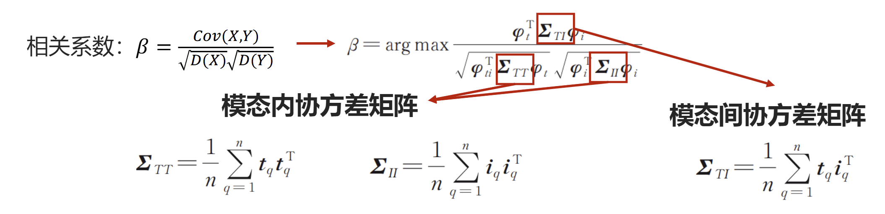
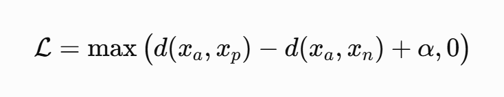
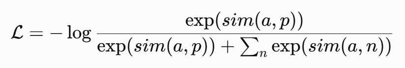
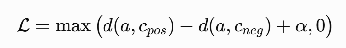
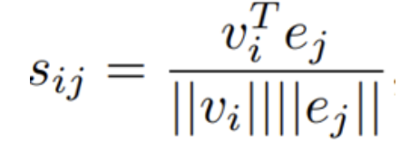
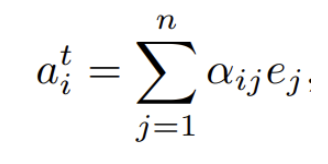
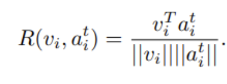
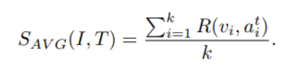

# 跨模态对齐

跨模态对齐要学习的是语义对应关系，如哪些区域对应哪些词、这句话和这幅图的哪些区域是对应的。它的训练目标是最大化图级/区域级与对应词句的相似度。模态对齐的难点在于语义鸿沟问题，图片和文本模态经过编码得到的向量表示天生不在同一个维度的语义空间里。

跨模态对齐得到的模型可以作为多阶段任务的一部分来使用，也可以直接混入端到端的多任务混合训练当中。在这种情况（后者）下，跨模态对齐模型本身可以不再和其他目标分的过清，它的能力被其他目标共用。例如 VQA 任务直接使用本章的模型进行多模态推理顺便对齐也是可能的。用 AI 的话来讲，两阶段训练先教“看图说话规则”，再教“做题”；而端到端训练相当于直接让学生做题，从做题中学规则。对于非通用任务/大模型胜任的场景来讲，多阶段的训练是最稳定、性能不错、且需要数据量不大的。

跨模态对齐的结果表征可以是交互编码得到的联合表征（如单流单输出模型）也可以是独立编码的表征（如 CLIP），二者各有不同的使用场景。

跨模态对齐分为显式对齐和隐式对齐：

- 显式对齐有人为设定的对齐监督信号，不同模态的语义靠直接约束进行对齐，例如传统的基于数学算法的对齐，对比学习。它是 1v1 的对齐，如名词和图片的对应。
- 隐式对齐没有强的对齐监督信号，语义具有模糊性，如多模态语言模型。它并非 1v1 的对齐，如动词和图片特征图中某片通道的语义对齐。

> 隐式对齐（Implicit Alignment）指无需显式构建映射关系，而是依赖模型自身的内部机制实现跨模态的间接对齐。

tips: 显式对齐和隐式对齐的界限并不明显，可以混合在一起使用。例如下文中基于注意力的对齐，实际上用了对比学习，有明确的正负标签，虽然其特征是模型自己学到的。如果一定要做区分，我更愿意把其分为认为标注好的特征来学习（基于结构、数学特征）和无标注的自学特征（各种深度学习模型）。

## 评价指标

- 精确率 𝑃@𝐾：精确率也称查准率，即正确对齐的数量占全部对齐结果（查询结果）数量的比例。
- 召回率 𝑅@𝐾：正确检索的样本的占**整个图库**中全部正确样本的比例。
- 平均精确率均值（Mean Average Precision, MAP）：每次查询都对应一个平均精确率（AP），MAP 是多次查询的均值

## 显式对齐

### 典型相关性分析 CCA

典型相关性分析(Canonical correlation analysis，CCA) 从概率论上衡量两个变量分布之间的相似程度，是一个数学极值问题，s属于‌无监督对齐‌。

目标：求解公共空间线性映射矩阵𝝋𝟏, 𝝋𝟐，使得配对的图文表示相关性最大。

- 第一步：获得文本和图像公共空间的表示，映射矩阵反映每维变量的线性组合；
- 第二步：最大化相关系数，根据随机变量相关性进行对齐。

CCA 的经典模型有：

- 语义相关匹配模型（Semantic Correlation Matching , SCM）
- 核 CCA，用核技巧克服传统CCA处理非线性关系限制
- 深度 CCA，利用深度神经网络中嵌入的多层次映射解决非线性问题

### 成对度量学习

成对度量学习即用一对对的正负样本来学习，即对比学习。它常常作为其他对齐手段的基本损失。

#### 基本损失

三元组损失（InfoNCE）：

anchor 和 positive 更近，同时 anchor 和 negative 更远，并且至少差距一个间隔（α）。

#### 负样本选取

- 基本三元组：若存在较多容易三元组，模型损失为0，不更新，未学习到有用的对齐信息（弱正例）。
- 难样本挖掘：只选择最难区分的正负样本对来计算三元组损失。只选择困难负样本（难负例） ，容易导致模型对噪声敏感（伪负例，false negative，即实际为正例的错误标注）
- 中心三元组：从计算 anchor 到正负样本的距离改为了计算锚点到正负样本**所在类别中心**的距离。

#### 其他

- 多分类 N 对损失：拉近一对正样本时，选取多个负样本
- 对称四元组损失：在基本的对比学习时添加了模态内的匹配样本距离尽量近的约束。

## 隐式对齐

### 基于注意力机制

整个流程如下：

- 通过两个可微调的编码器分别把图片和文本嵌入向量，得到正样本 (image, caption) 对；
- 将它们送入 transformer decoder 做一个交叉注意力融合。模型会计算每一个图像区域与各个文本单词之间的相似。两者越相似，对应的注意力得分就越大。随后，通过 Softmax 操作将这些得分归一化，得到图像区域对于各个单词的注意力分布权重。
  
  
  
- 对所有文本单词的表征向量基于上一步得到的权重加权求和。这样就为每一个特定的图像区域，组合出了一个与之最相关、最匹配的最终文本表征向量。
  
  
- 计算图像区域向量与刚刚融合得到的文本表征向量之间的局部相似度 R，然后对这些局部相似度进行平均池化，从而得到整张图像与整段文本的全局相似度 $S(I,T)$。
  
  
  
  
  
- 用对比学习拉近正样本推远负样本。

通过这种方式获得的模型，在推理阶段，天然的可以用于图文相似度匹配（是训练阶段的标准输出就是图片和文字的相似度）。

### Dense constrastive learning

使用稠密对比学习来进行对齐。[稠密对比学习](https://arxiv.org/abs/2011.09157) 最开始作为 MoCo 算法的增强，基于特征图的粒度来进行对比学习。在 MoCo 算法中，对比学习是基于图级的，通过对图的增强来获取新的正样本。而稠密对比学习基于特征图的粒度来进行图片的向量表示，一个图由 H*W 个向量来表示。

将这种思想迁移到跨模态对齐，流程如下：

- 获得文本和图片模态的向量表示，图片得到特征图，文本得到嵌入词向量
- 挖掘潜在局部正样本对，对于局部特征通过计算最大相似度得到最匹配的正样本
- 基于特征图粒度进行对比学习损失；也可以与图级别的对比学习一起混合计算。全局对比学习为稠密对比学习中潜在局部正样本对的选择提供依据，局部对比学习促进全局特征学习。

### 基于跨模态预训练模型

跨模态的预训练的模型分为单流和双流架构：

- 单流结构：不区分图像和文本输入，图像和文本直接输入到一个模型中，进行模型学习训练
- 双流结构：区分图像和文本输入，图像和文本分别输入不同模型进行各自的特征提取，之后在某个阶段融合起来以进行模型学习训练

具体见[跨模态预训练模型](./6_跨模态预训练模型.md)

### 基于结构

相同上下文的图像和文本，每个模态内包含的元素及元素之间的关系（结构知识）天然具备对齐关系。面对平行的多模态数据，采用无监督方法捕捉各模态内部概念间的相似性矩阵。通过比对各模态内概念之间的临近关系，可以学习模态间的概念对齐关系矩阵。

通用流程如下：

- 将每个模态进行向量表征；
- 构建结构；
- 使用不同的方式尽可能对齐不同模态之间的结构（结构一致性损失/结构增强的对比学习）。
