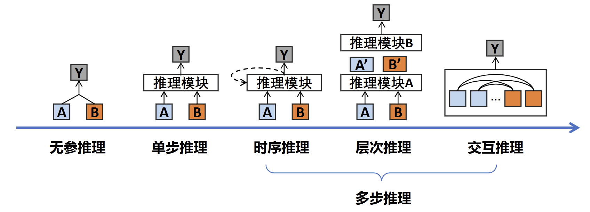
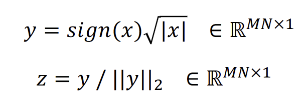
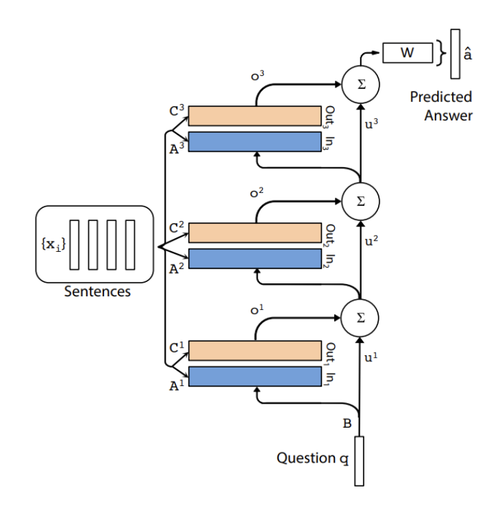
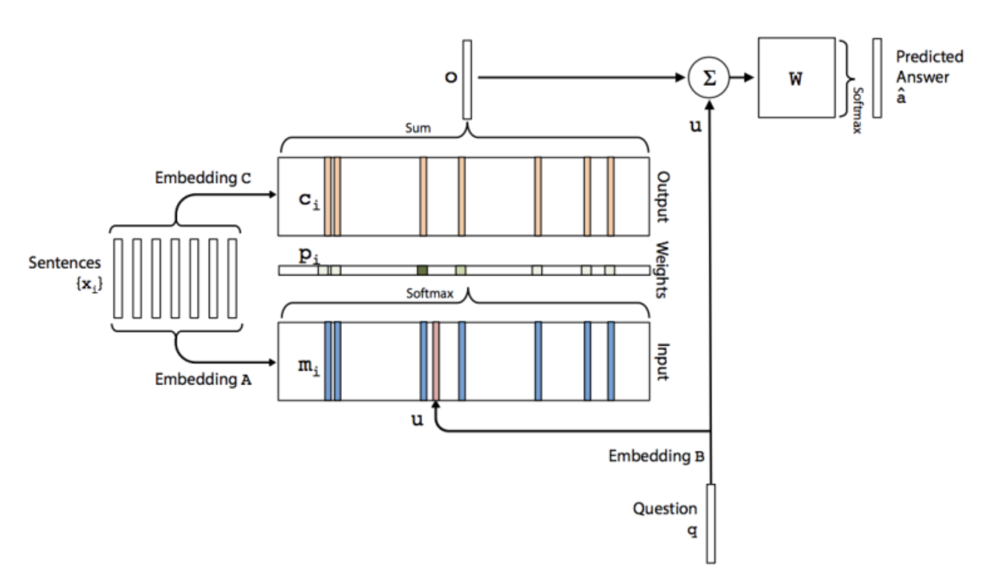
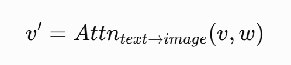
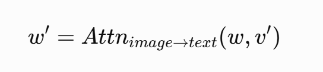

# 跨模态推理

跨模态推理的做法是在共享语义空间中，通过注意力机制融合不同模态信息，并利用语言模型在该空间中进行隐式或显式的多步逻辑推断。LLM 在跨模态推理上展现出了良好的能力，这得益于其本身在单模态（文本）下就有强大的能力。

推理模型的架构分为无参直接推理、单步/多步推理：

## 双线性池化（无参推理）

最早的推理工作直接进行推理结果的输出，其中用到了一个双线性池化的技术。

双线性池化的主要思想：对于两个特征 𝑥 和特征 𝑦 ，通过双线性池化，捕捉两个特征元素之间的两两关联，从而刻画特征协同信息（如颜色与形状的关联），增强后续任务。其流程如下：

1. 计算特征向量 $f_x$ 和 $f_y$ 的外积，得到特征矩阵
2. 将矩阵展开为向量的形式 $x$
3. x 进行特征规范化，𝑠𝑖𝑔𝑛(𝑥)为符号函数，𝑥大于0的位置为1，否则为-1。|𝑥|表示𝑥的1-范数，即𝑥中所有元素绝对值的和。||𝑦|| 表示𝑦的2-范数：

    

双线性池化的精细交互存在维度爆炸问题，不利于存储与计算，后续采用了压缩双线性池化(Compact Bilinear Pooling, CBP)。

通过双线性池化得到融合的特征向量，交予后续网络直接输出结果。现代的网络将双线性池化改为了注意力机制。

## 基于 RNN 的循环推理架构

为了实现多步推理，使用了 RNN；同时解决神经网络缺乏长期记忆能力的问题，使用记忆网络（Memory Network），整体架构如下：

如图所示，它是多层记忆网络的堆叠。除了第一层，每一层的问题状态 $u^i$ 作为上一层的输出，把最后一层的输出用于答案预测。

每一层的结构如下：

输入时两个 embedding A 和 B，A 是上一层的 $u$，B 则是本层的记忆 $m$。通过问题 $u$ 对记忆向量 $m$ 的查询，输出 $c$，然后和 $u$ 进行融合增强它，作为本层的输出。

## 注意力机制推理

### 协同注意力

协同注意力（Co-Attention）分为并行和交替。

并行协同注意力意思就是图像和文本同时计算注意力，同时计算：$A_{I\to T}$ 和 $A_{T\to I}$。

交替协同注意力的意思是交互进行，如第一步先基于文本指导视觉：

然后基于得到的这个视觉再反过来指导文本：

如此重复堆叠 n 层。

### 自注意力

一种方法是直接用文本模态取代图像模态，用 visual concept 和文本向量拼接，单流输入到 Transformer 自注意力结构中实现推理。如 Q-BERT。这种方式强制的融合视觉和文本的语义空间。

### 对比

从推理能力的角度来讲：

- 并行协同注意力的对齐能力强，但推理能力弱；
- 交替注意力使用了多步骤融合和推理，可模拟 reasoning chain，推理能力强；但是它的劣势在于串行计算，难以大规模训练。
- 自注意力的方案是目前最主流的，它在预训练模型上取得了成功（大模型大数据量上）。

## 预训练模型与大模型相关

预训练模型本质上是基于注意力机制的隐式推理，这种隐式推理的能力来自于不同目的的预训练任务。模型通过大规模数据上的预训练，学到不同模态之间的语义对应关系、并利用这种隐式关系实现跨模态推理。

LLM 训练的流程是：

1. 预训练：学习知识，实现跨模态的对齐、生成、推理、理解能力
2. 指令与参数微调：通过指令微调适配 LLM 的输入和输出，满足下游任务需要
3. 偏好对齐：让模型学习在已经获得正确答案的基础上，根据用户要求的输出要求满足人类的偏好，以及价值观、安全性控制。本质还是基于偏好对齐数据进行模型训练的微调。

围绕已经训练好的 LLM 的相关主题：

- 提示词设计。
- 上下文学习：通过设计提示模板（Prompt），结合少量任务相关的输入输出示例（Demonstrations）和任务说明/指令（Instruction），引导模型在不更新参数的情况下适应新任务；学习方式上可以归类为懒惰学习（Lazy learning，如KNN），推理方式上可以归类为类比推理
- 思维链：通过显式生成中间推理步骤来提升模型复杂任务推理能力的技术，将问题拆解为多个逻辑关联的子步骤，引导模型像人类一样分步思考；重点关注显式推理过程。使用方式：
  - 构造相关问答数据集做 LLM 微调；
  - 显式提供给 LLM skill/思维链指令，甚至带有少量的示例样本
- 检索增强生成 RAG
- AI 生成合成数据，并通过 self-instruction 过滤质量低的数据
