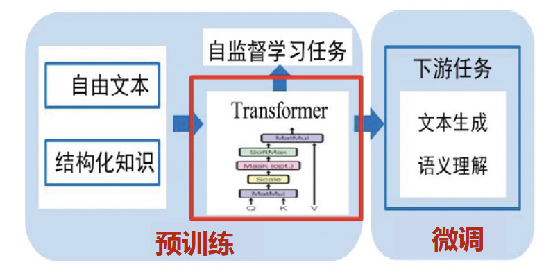
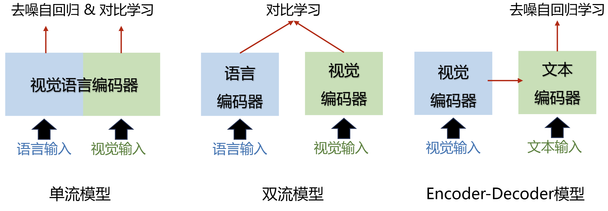
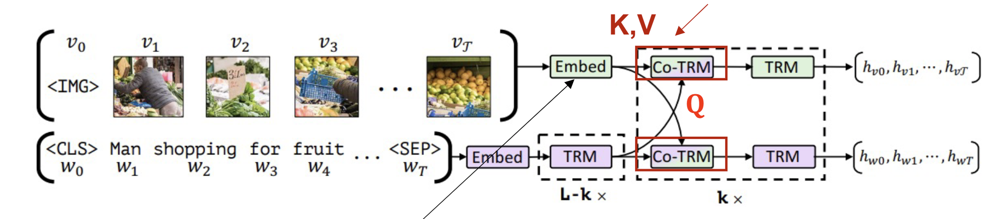
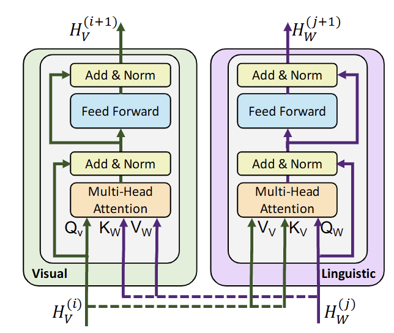
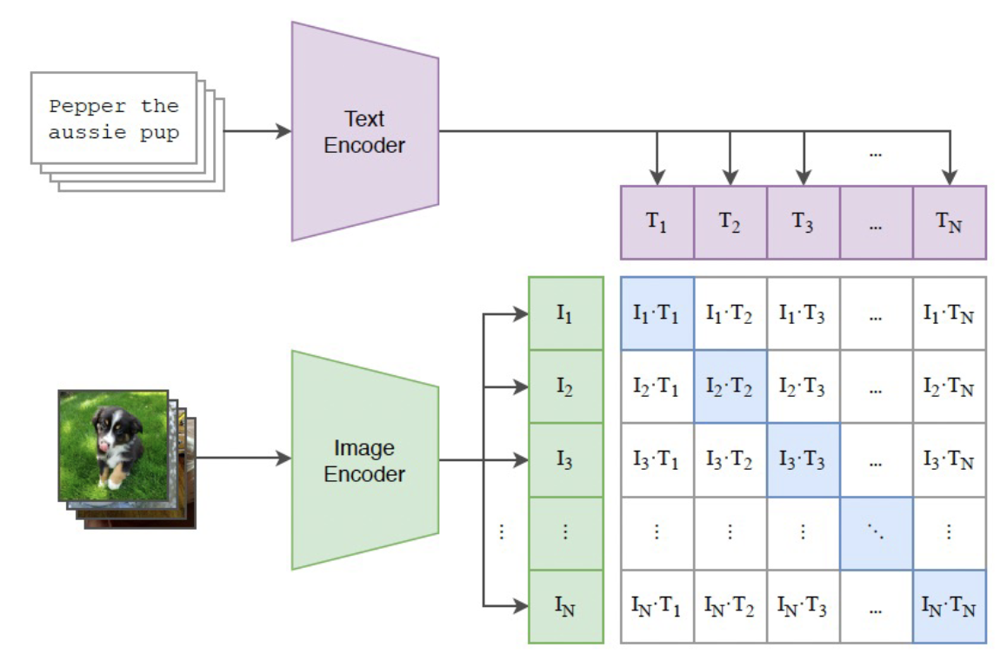
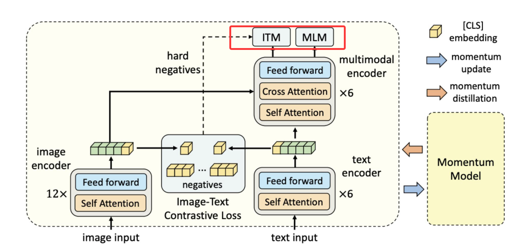
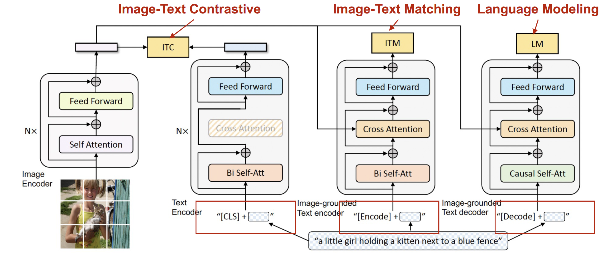

# 跨模态预训练模型

预训练模型用 Transformer 作为基本模型，通过设计基于**自监督学习**的预训练任务从大量无标注的自由文本中学习语言知识。然后再下游任务中针对具体任务做微调：如引入各种辅助任务 loss 和额外参数，将其添加到预训练模型中，使用特定数据进行**监督学习**，以便让其适配下游任务。

基本架构分为单流、双流、encoder-decoder 三种架构。单流即混合文本和图片 token 作为输入；双流指的是分别以另一种模态作为辅助来增强当前模态的表示，不直接混在一起；encoder-decoder 指的是一种模态转换为另一种模态的表示：

## 自监督学习

上游自监督学习任务有：

- 对比匹配：对比损失、模态匹配
- 遮罩重建：遮罩语言建模、遮罩目标分类、遮罩目标回归、自编码
- 理解生成：视觉问答（分类）、图文生成（生成）

常见的损失：

- 对比学习损失，度量文本和图像之间的差异
- 模态匹配损失，本身是一个交叉熵损失，配对图文标签是1，非配对图文标签是0。通常用于强制提高模型对于困难负样本的处理能力。
- 单词区域对齐： Word Region Alignment，类似于上面两种。
- 遮罩语言建模 Masked Language Modeling（MLM）：文本 mask 做预测
- 降噪自编码：Image-conditioned Denoising Autoencoding (IDA)：首先人为地对整段输入文本注入噪声（比如随机遮罩部分词汇、删除片段、甚至打乱词序）。然后，模型需要利用这段损坏的片段和图像特征，从头到尾**完整地重建**出原始的文本序列。
- 遮罩目标分类 Masked Object Classification (MOC) / 遮罩目标回归 Masked Object Regression (MOR)：图像的类别和区域 mask 做预测
- 图像问答损失：Image Question Answering（QA）：将答案预测作为模型的预训练任务之一，训练模型的跨模态推理能力。
- 图像文本生成：Image-Text Generation (ITG)：用于 Encoder-decoder 架构的模型。

## 常见模型

### 单流：Unicoder VL

其基于 BERT 模型进行跨模态大模型搭建。由于单流大模型不区分图像和文本输入，统一当作同一模态输入进行自注意力机制交互。对于 Q 来说，K，V 既来自同一模态，也可以来自不同模态。本质上是多个 Transfomer encoder 的堆叠。

输入：[CLS]，图像块表征，[IMG]，文本单词, [SEP]的拼接。其中图像块表征是用 Faster r-cnn 得到图像区域表征和位置信息拼接而成；文本单词与 BERT 处理相同。

由于 Encoder 的输出和输入长度相同，所以输出的是：

- [CLS] （用于判断文本和图片是否语义相符）；
- 图像块混入文本语义的表征；
- 文本混入图像块的语义标注。

训练任务总共有三个：

- 文本掩码预测(Masked Language Modeling, MLM)
- 图像遮掩区域预测(Masked Object Classification, MOC)
- 图文匹配(Visual-linguistic Matching ,VLM)：利用[CLS]的最终隐藏状态来预测语言句子是否与视觉内容语义匹配

### 双流：ViLBERT

Visual and Linguistic BERT 是早期非常经典的双流跨模态预训练模型，它的架构是双流 Transformer + 互注意力 Transformer。先使用将两个模态各自嵌入向量，然后使用交叉注意力来相互进行交互。

交互层（Co-TRM block）具体如下：

一共两种预训练任务：

- 文本掩码预测(Masked Language Modeling, MLM)
- 图文匹配任务(Visual-linguistic Matching ,VLM)

### 双流：CLIP

CLIP 很简洁，它通过大规模跨模态对比学习预训练，实现跨模态对齐。训练上，使用 ViT 得到初始视觉 token，类似 BERT 的架构得到初始文本 token，然后将两个向量直接通过对比学习进行对齐。

最后得到两种模态向量的表示，使用时根据需要取对应头即可。

#### ALBEF

ALBEF 在 CLIP 的基础上混入了图文匹配损失（ITM）和遮罩语言建模（MLM），在跨模态对齐上进一步提升跨模态推理能力。

另外，它使用了动量蒸馏的思想，用参数滞后于训练中的模型（过去的自己）作为动量模型，通过将动量模型作为教师模型获取预训练任务伪标签，并进行知识蒸馏，保证模型在训练过程中更新幅度不会过大，减少噪声数据对于训练的影响，提高训练稳定性。

### Encoder-decoder：BLIP

前述的单流双流方法关注于对齐检索和推理，难以实现跨模态生成任务，而 Encoder-decoder 架构将视觉输入和语言输入融合成一个统一的表示，并具备文本生成能力。

BLIP 是目标是做一个统一的视觉-语言预训练框架，它的架构是按照目标任务进行设计的：

如图所示，它的 Encoder 是一个双流架构，根据目标损失的不同选用不同的子 Encoder：

- 可以看到，ITC 损失只使用了自注意力机制，它没有跨模态，适用于粗粒度的对齐，也就是 Image-Text Matching，目的是提高召回率；
- 而 ITM 是交叉注意力，是 Image-grounded text encoder，它适用于细粒度的对齐，目的是获得准确率；
- 最后是 LM，它所在的模块设计成了 transformer 的 decoder，它接受视觉编码器的输出作为交叉注意力的输入，是为了生成任务准备的。

## 基于大模型的预训练模型

这个主题主要探索预训练模型如何和大模型连接在一起，通过借助 LLM 来完成任务。

最开始是的 LLM 是文本单模态的，无法处理视觉信息。后来为了让 LLM 能够处理多模态信息，在 LLM 的训练上出现了几种方式：

- 在文本 LLM 训练完成后，冻结文本 LLM 和 ViT，使用一个可训练的适配器 Adaptor将视觉图像的向量转换为文本向量，这种方式在只有文本 LLM 的时代被证明可行。
- 训练一个文本 + 图片的端到端 MLLM，它在训练上混入了多模态拼接的向量作为原始单流输入。这种方式可以看作是第三种方式的一部分。
- 在文本 LLM 预训练完成后，使用多阶段训练 LLM + 训练 Adaptor （可选）来用各种损失逐渐对齐多模态数据。这是最常见的模式。

