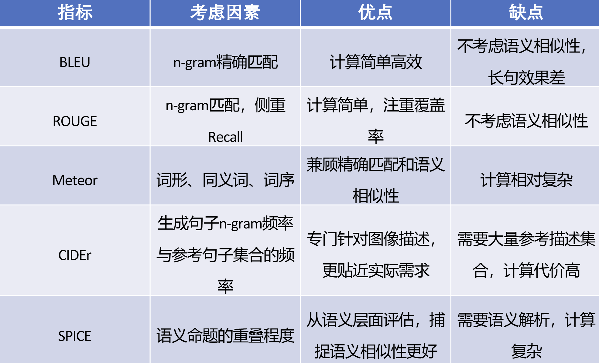

# 常见跨模态任务

## 检索任务

跨模态检索是指用户通过输入任意媒体类型的查询数据，检索出所有媒体类型中的语义相关数据。它考验的是跨模态对齐。

### 模型

#### 独立编码型（双流模型）

获取图文全局表征，映射到公共空间中，利用简单的相似度计算方法计算相似度。由于不同模态数据包含的信息往往是不对等的，如果强制将它们映射到相同的单一空间中，会损失部分模态特有的信息，并且引入一定噪声。

#### 交互编码型（单流模型）

获得图文局部表征，通过整合局部相似度以获得整体相似度。最大的缺点是计算复杂度极高 。因为图文特征必须在模型内部实时交互融合，导致无法对数据进行预先存储，从而严重影响了模型的检索效率。

### 检索效率

粗粒度检索的点积召回率高但准确率低，细粒度检索则相反。为了平衡检索的效率和准确率，有一些方法：

- 跨模态哈希：速度最快，将图像特征和文本特征转化为二进制编码，投影到公共汉明空间，通过二进制异或操作进行快速的相似度计算和排序，但哈希码不具备语义比较能力。
- 交互去冗余方法：准确率最高，基于交互编码的跨模态检索方法，通过过滤冗余的局部对齐步骤，从而在保证检索精度的同时提升检索效率。但由于是交互编码，速度仍然不快。
- 优化全局特征表征方法：基于独立编码的跨模态检索框架，通过提升最终全局表征的语义质量从而在保持检索效率的同时提升检索准确率。

工业界的最终解决方案：两阶段检索（Two-stage Retrieval）。为了兼顾“点积的高速度”和“深度融合的高精度”，目前最优的使用方式是：

- 第一阶段（召回 Recall）：使用独立编码 + 点积的结构，在百万级数据库中瞬间过滤出最相似的 Top-100 个候选结果。使用点积时，图像和文本的编码是完全独立的。这意味着在实际应用中，你可以提前把千万级、亿级的图片全部通过模型算出向量，存入向量数据库。当用户输入一段文本时，只需要把文本过一次模型变成向量，然后用点积在数据库里做极其快速的近似最近邻（ANN）搜索，几毫秒就能出结果。

- 第二阶段（重排 Re-ranking）：使用Cross-Attention等深度融合提取融合向量的庞大模型，对这选出来的 100 个结果进行细粒度的图文交互计算，得出极其精准的相似度得分，重新排序后展现给用户。如果使用 Cross-Attention 这种深度的融合向量，图像和文本必须同时送入网络才能发生交互并得出分数。这意味着如果你要在100万张图片中检索，你需要把这段文本和这100万张图片组合拼成100万个输入对，跑100万次庞大的Transformer模型。在海量数据检索中，这在工程上是绝对无法落地的。

## 视觉问答（VQA）

视觉问答（Visual-Question-Answering）根据问题和参考图片输出答案。它考验的是跨模态对齐和跨模态推理。

和图生文的基本任务类似，它的一个难点在于描述的多样性和准确性，基于评价指标分为两类：

- 选择性问答（分类任务）：采用分类的准确率（BLEU）作为评价指标，它对于跨模态推理要求不高，从候选答案中做选择，是最经典的模型。将 VQA 任务建模为一个多分类问题，候选空间是预先从训练集中统计出出现频率最高的一定数量的答案（例如前 1,000 或 3,000 个最频繁的答案）作为类别标签。训练目标是给定图像特征和问题特征，预测在候选答案集上的概率分布。
- 开放式问答（生成任务），采用语义相似度作为评价指标，评判生成答案与标注答案之间的相似度。主要的工作是 LLM。

## 图像描述生成

图像描述生成和 VQA 差不多，都属于图生文的任务，其考验的为跨模态对齐能力，对于推理能力要求不是很高。

### 指标

常见指标如下：

- BLEU：准确率
- ROUGE：召回率
- Meteor：考虑近义词和逆语法语序惩罚，计算复杂
- CIDEr：TF-IDF(词频-逆文档频率)
- SPICE：基于语法的纯语义比对，计算复杂

