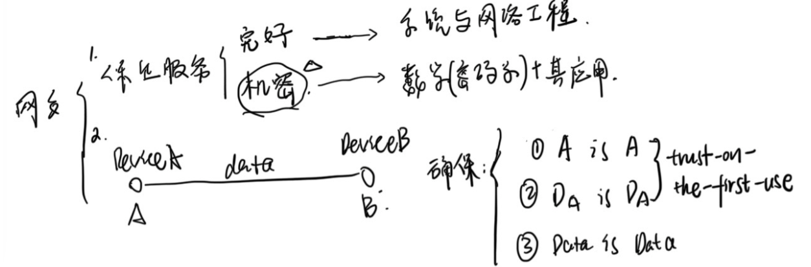
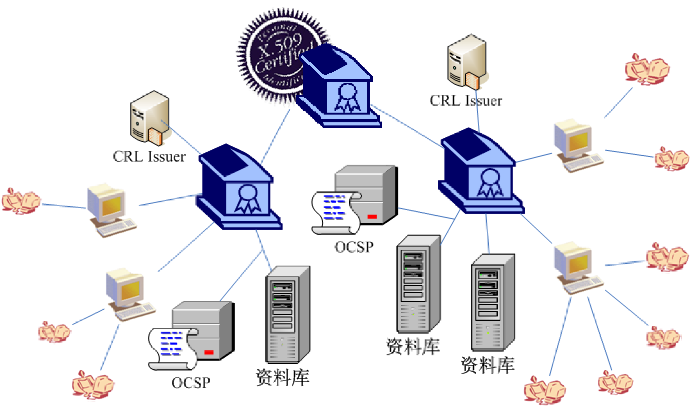
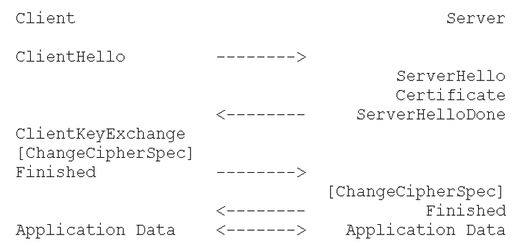
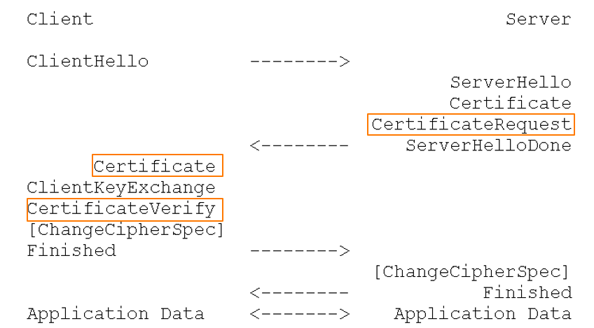
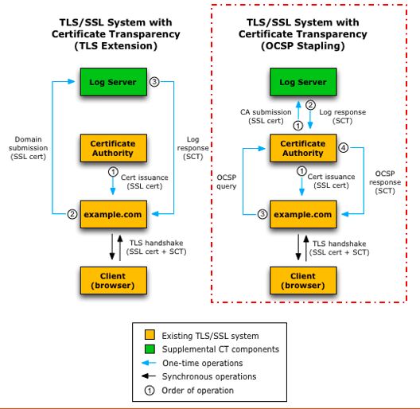
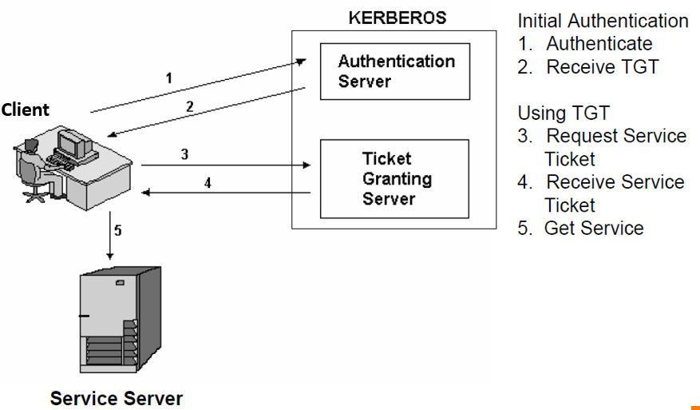
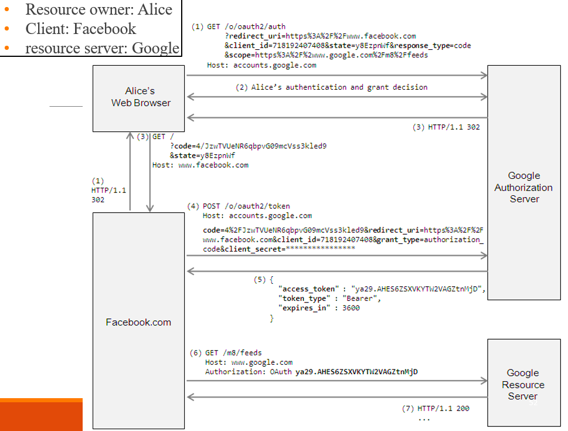
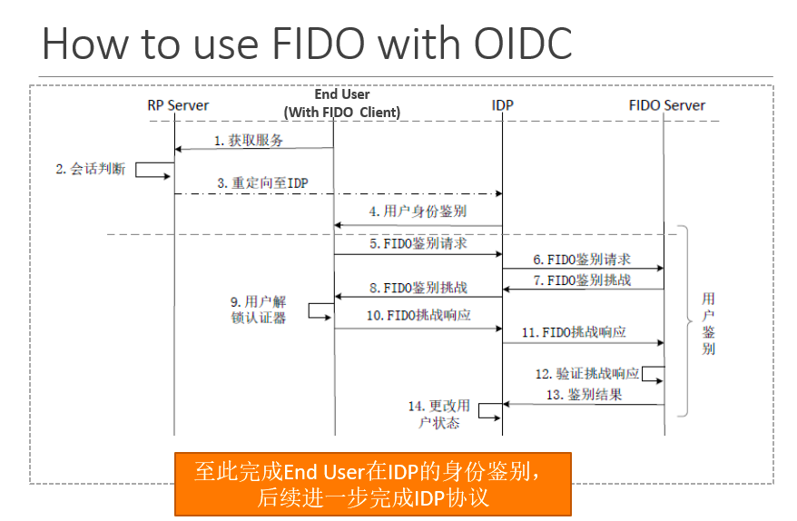

# [网络认证技术](https://jwba.ucas.ac.cn/sc/course/courseplan/294929) 2025 年秋

1. 网络安全要保证网络服务的机密性和完好性。本课程聚焦为机密性，即密码学算法在网络保护上的应用。
2. 在一个典型的通信里，需要保证 `A is A`, `DeviceA is DeviceA`, `Data is Data`。在采用 `trust-on-first-use` 时，第一条和第二条是等价的，即设备(或者说生成的私钥，因为实际应用中私钥和设备往往是一对一的)代表用户，如ssh。`A is A` 被称为鉴别(authentication)，具体在加密通信前的握手过程，该过程实现了了目标的鉴别和通信密钥的协商。`Data is Data` 即应用的数据被完好、加密的传输。本课程讲述前者。
3. 用户的凭证信息（口令，生物特征，私钥）不能轻易放置于网络传输中，也不应该直接保存在存储介质中，二者都必须加密起来。



## 1. 导言

安全信道+可信设备/人的识别

1. Identification, certification, authentication
2. 口令与密码：口令就是一串字符，密码是cryptography（密码算法）
3. 对称加密、非对称加密
4. CA，PKI是什么；洋葱路由（Tor onion route）

## 2. 密码学基础

1. 本章介绍的密码算法

   - 非对称加密：sm2（ECC）, ElGamal, RSA；
   - 对称加密：sm4，AES(Advanced Encryption Standard)

   - 哈希加密：md4, md5(16bits), sm3(32bits), sha-256；
   - DH（Diffie-hellman）

2. 雪崩效应

   > ***两个不同的明文用同一个密钥加密能否得到相同的密文？***
   >
   > 现代加密算法设计时考虑了**雪崩效应**，即明文中的微小变化会导致密文发生显著变化，从而确保不同的明文加密后几乎不可能产生相同的密文。在**理想的安全加密算法**（如AES、DES等）下，两个不同的明文使用同一个密钥加密**通常不会得到相同的密文**。
   >
   > - 如果加密算法设计有缺陷，可能会出现两个不同的明文用同一个密钥加密得到相同密文的情况。例如，一些早期的简单加密算法或者自制的、未经充分验证的加密算法，可能存在某种规律，使得不同的明文在加密后出现相同的结果。
   >- 另外，如果加密过程中某些参数设置不合理，也可能导致这种情况。比如在使用分组密码的某些模式（如密码分组链接模式CBC）时，如果初始化向量（IV）没有正确设置，而是使用了固定的值，那么对于某些特定的明文组合，可能会出现相同的密文。不过这是因为使用方式错误，而不是加密算法本身的问题。正确使用CBC模式要求每次加密都使用不同的、随机的初始化向量，以保证加密的安全性和密文的唯一性。

3. 对称加密的优缺点：

   - 优点：速度快占用低；

   - 缺点：1. 需要事先共享密钥，对N方通信不友好，同时密钥分配中心成为安全和性能的瓶颈；2. 没有数字签名的概念

4. 非对称加密：

   - 公钥加密，私钥解密；私钥加密，公钥验签。
   - 优缺点：td

5. hash编码与mac消息鉴别码的区别：mac的编码使用密钥，只有拥有密钥才能验证消息完整性。

6. 秘钥生成算法Diffie-hellman：DH算出的密钥无法通过被动攻击被拿到，必须需要主动攻击；它能用于保证了前向安全的秘钥协商。

## 3.4. 基于口令和基于密码算法的鉴别

1. 他们都是鉴别目标是否合法的方式，但前者是基于用户的口令的，后者是基于密码算法的（往往带有生成的秘钥对）。
2. 基于口令鉴别的安全需求以及解决方案
   - 针对口令本身的攻击：强制要求用户增加密码强度；口令尝试次数的限制；使用一次性口令服务（如短信验证码）
   - 针对传输的攻击：设计可证明安全性的传输协议，如One-time协议
   - 针对服务器端存储的攻击：口令禁止以明文存储，必须加密，使用基于Vertifier的口令鉴别协议
3. 基于加密的鉴别

## 5. PKI的基本结构

1. CA发布证书的安全需求：需要完整性和鉴别真实性，不需要保证机密性
2. PKI组件：
   - 进行订户证书**签发**：根/sub CA，RA
   - CA证书**发布**：资料库Repository（用于发布CA系统的公开信息，如CA证书），订户与用户
   - CRL（Certificate Revocation List）签发并发布：
     - 用户 -- RA -- CRL Issuer -- CRL Distribution Point，定时发布撤销的证书
     - OCSP协议供用户直接查询subCA内部数据库（因为撤销证书会直接更新掉内部数据库）
3. PKI的基本流程：用户以安全的方式获取到根CA证书。
4. 数字证书的基本结构：证书持有者名称，CA机构名称；持有者公钥以及CA签名结果；证书有效期。



## 6.7. PKI 证书编码和证书扩展

1. 证书编码：

```markdown
sequence => 集合
sequence of => 无序列表
set of => 有序列表
choice => 多选一
Octet String 字符串
Bit String bit串

Object Identifer => Struct{Typ, Len, Val}
and defined by xxx
validity 有效期
```

2. Length的歧义：

0-127 => 0xxx xxxx

128~ => 第一个字节表示len占的字节数n & 0x80，剩下的n个字节表示Len

3. tag的作用：Optional 会产生编码的歧义。[0] explict 表示该字段要再包一层tag类型；implict是把type修改为tag。如果为choice类型可能会导致两种type被修改为同一个tag字节，造成分不清；所以explict tag仍然是必要的。
4. 证书扩展
   - critical的用处：如果该扩展解码后发现标记了critical，而自己不认识该字段，则拒绝该证书 
   - 大致上一个证书包含了证书签发者和持有者的信息。
   - 1. Basic Constraints （基础约束）：用于区分是CA证书还是订户证书，以及路径的深度。防止普通用户 “越权”：比如你办了一张个人数字证书（订户证书），这个扩展会明确标注 “不是 CA”，你就不能用自己的证书给别人发证。如果是CA证书，它限制 CA 的 “扩张”：比如根 CA 给子 CA 发证时，设置 “路径深度 = 2”，子 CA 只能再签 1 级下级 CA，不能无限制往下签，避免信任链太长导致风险。
     2. Authority Key Idnetifier（签发者密钥标识）：用于表示证书是用父CA的哪个密钥来签发的，便于用户找到秘钥和验证证书。
     3. Subject key Identifier（证书持有者密钥标识）：用于表示证书是用订户（或子CA）的哪个密钥来签发的，一般是订户/子CA的某个公钥的hash。对于一个典型的信任链，父节点证书的SKI等于子节点证书AKI。
     4. Key Usage（密钥用途）：本证书解密出的秘钥的用处：用于数字签名、邮件加密、签撤销列表CRL、签订户证书...等。
     5. Extended Key Usage（扩展密钥用途）：是 Key Usage 的补充，详细说明 key usage。
     6. Private Key Usage Period（私钥使用期限）
     7. Issuer Alternative Name（签发者别名）与 Subject Alternative Name（证书持有者别名）
     8. Subject Directory Attributes（持有者目录属性）：证书持有者除了别名以外的额外信息。
     9. Certificate Policies（证书策略，简称 CP）与 Inhibit Any-Policy（禁止任意策略）：Any-Policy 是一个特殊的 CP OID ，如果 CA 证书里带了这个 CP，意思是 “这个 CA 能签发任意安全等级的证书”。它的核心是一个整数 N，意思是：在当前 CA 的证书之下，最多允许下面 N 级 CA 的证书带 Any-Policy；第 N+1 级及以下的 CA 证书，不能再带 Any-Policy。
        - CA或者订户证书都可以有几个CP字段，用于指定安全性；而 IAP 只有 CA 证书才有。
     10. 交叉认证证书：Policy Mappings（策略映射）+ Policy Constraints（策略约束）；Name Constraints（命名约束）
         - 策略映射和策略/命名约束只有交叉证书有。
     11. CRL Distribution Points（CRL DP，CRL分发点）和 Freshest CRL（最新增量 CRL 的获取地址）

## 8. PKI 信任体系

### POP的三种形式

- 签名密钥，订户用自己的私钥对请求的信息（PKCS规定的，包括了公钥）进行加密然后传给CA
- 加密密钥
  - 直接方式：用户上传公钥，CA得到加密随机数传给用户，用户私钥解密随机数传给CA
  - 间接方式：用户上传公钥，CA直接签证书，但是证书要用公钥加密，用户拿到后响应证书
- 密钥协商秘钥

三种模式中只有第；；一种不需要CA维持会话状态（要求CA维持会话数据，双方都在线才能进行协商。）

### 多根CA 和 PKI 系统互认

1. Certificate Trust List与ACA(Accreditation CA)：

   - CTL：可以通过通过权威发布，让用户自主选择；CA也可以直接直接对CTL文件进行签名，让用户选择是否使用该CA根证书作为信任锚。
   - ACA：新引入一个特殊的根CA用于给所有其他的根CA颁发证书。它本身作为信任锚被加进来是永远可信的，它用于添加信任锚，即添加具有自签名的CA证书。

2. 交叉认证：将对方CA看做是自己的子CA。可以引入路径限制，命名限制，策略限制（Certificate Policy）和策略映射。

   - 优点：不改变信任锚；可以随时撤销，信任扩大是可控的，使用各种证书扩展；配置由CA统一完成不需要用户操作介入。

   - 桥CA：各个CA根节点都和Bridge CA进行交叉认证。
     - 优点：相当于一个一般等价物，统一了不同策略的度量；连接了所有的CA，避免了图的复杂性造成的循环和策略不等问题。
     
     - 缺点：间接互连多了一次交叉认证，图模型可以直接互连；需要通过命名限制来控制信任范围。
     

其他：CA Accreditation：对根CA的CP策略进行安全评估和审查，确保根CA的CP和CPS符合安全要求

## 9. 证书撤销CRL

1. 资料库提供了完全/增量CRL；直接CRL就是CA来处理撤销证书的情况，间接CRL使用CRL Issuer来签发和发布CRL，缺点就是多一层CRL Issuer证书验证。
3. CRL的基本内容：版本，issuer名字，时间（thisUpdate, nextUpdate），证书的撤销时间和序列号；CRL扩展
4. CRL的验证方式：拆分排序的CRL文件
5. 重定向RCRL：证书的CRL可能不固定，该CRL只记录真实的CRL在哪里找
6. OCSP的缺点：需要多一次数字签名验证；直接和CA通信可能导致安全问题，和CRL通信不能解决时效性问题。
7. CRT：使用树来存储，列表长度短所以下载量为 logn，查询也为logn；不需要多一层OCSP的数字签名，响应速度和CRL类似
8. 短周期证书回避了CRL，但是增加了CA的负担；但它需要用户每天都去更新证书。
9. 证书撤销存在延迟；默认假设是当查询撤销状态不可得时默认认为证书仍未被撤销。

## 10. SSL协议

1. TLS的原理过程：非对称加密 DH秘钥生成 随后通过对称加密来加密数据，使用MAC来保证数据的完整性。
2. Record层的各种密码运算参数是通过handshake协议协商得到的
3. 协商过程：互发随机数、协商算法；client验证server发送的证书并用公钥加密premaster secret，server收到后解密。ClientKeyExchange就是用服务器的秘钥协商的过程



4. 变体：server增加对client证书的验签过程，在certificateverify中加密之前所有的消息：
     
     
5. 变体：如果server的证书不能用于加密只能用于签名，则增加一个serverKeyExchange消息，它解密后包含了能够用于加 premaster secret的临时公钥：
   
   
    

## 11. 证书的应用及实践

1. PKI是基于Public Key Cryptography的基础设施（代码库实现）。PKI API提供对 PKI 用户系统内证书的操作和加解密相关算法（如秘钥原语，计算和存储）。
2. windows提供了 cryptoAPI 和 CNG（next generation）
3. openSSL提供了开源的一系列开发和用户操作PKI系统的API，同时包含加解密API

## 12. PKI 安全增强

1. 入侵容忍的CA系统：可用性和机密性。
   - ITTC和ICNP的分布式签名方式对比：
     - ITTC增加或减少CA的shared server，调整秘钥麻烦，需要每台服务器都更新；在t-out-of-n下需要CA知道具体和哪些服务器来通信从而拼出最终的秘钥。
     - ICNP增加或减少CA的shared server，调整秘钥简单，只需要动1台服务器；但是计算量大。它适用于移动网络的CA，即CA总是动态变化的情况。
2. PKI 信任增强：客户端检测，限制CA的权利，证书透明化
   - 客户端检测：
     - Pinning：浏览器维护自己的CA证书，不完全依赖OS。
     - Perspectives：基于Notary-based方案，使用可信的第三方Notary server检查证书合法性。
       - perspectives: 比较多个TLS链接的服务器证书是否一致。
       - The ICSI Certificate Notary: 从网络流量中被动收集数据。
       - EFF SSL Observatory: 浏览器群体上传证书。
       - Doublecheck: 通过TOR比较证书，效率低但保护隐私。
   - 限制CA权利
     - Certlock: 假定TLS服务器只向同一国家的CA申请证书。首次访问时，浏览器检查证书来源；再次访问时，比较新旧证书的CA，不同国家则警告。被 Pinning 取代。
     - CAge: 限定CA签发证书的顶级域名范围。CA需在相应TLD中至少签发过一个证书。未签发过则警告用户。、
   - 证书透明化
   - DNS中的安全增强：
     - DNSSEC
     - DANE
     - CAA: 将权力转给域名拥有者（TLS网站）。
     - Sovereign Key: TLS服务器的再次确认。

## 13. 证书透明化

CA在复杂的实现情况和恶意攻击下，仍会导致现实中存在虚假证书。证书透明化：

- 让我们更容易对CA监控，提高CA的可信程度；
- 具有No single trusted的特点，赋予了各方更大的权利，削弱了CA的中心化信任特点
- 让系统能够对虚假证书更快的做出反应（虚假证书只能从在SCT获得后到证书被加入日志前的时间MMD内使用，被加入后就会被发现）。
- **不能**阻止CA签发假的证书，不能阻止攻击者利用和用户接受虚假证书，只能发现；
- log server私钥被攻破的收益很低
- SCT 的引入并不对现有体系有大的改动；传输性能也不带来损失

组成成分：增加公开日志服务器，监视员和审计员。

- 公开日志服务器Public log server:
  - 以append-only的原则接收数字证书，并为其提供凭据（SCT），而TLS链接必须需要证书+该凭据（SCT）。证书来源可以是任何人，被撤销的证书、经过CA验证的证书。
    - 预证书：log收到预证书后返回一个SCT，自己记录一个MMD；
      - CA用SCT签发带有SCT的正式证书再给用户。SCT过期了需要用户重新申请真的证书。
      - 或者 SCT 通过OCSP stapling来和CA通信查看，CA和log server通信查到SCT（不常用）；
      - 或者TLS协议里有一个扩展字段，通过它TLS直接主动向log服务器查看；
      
      

  - 公开日志的结构：唯一的、一直增长的Merkle hash Tree。它是公开唯一的（定期提供树头STH, signed tree head，作为唯一性证明）、一致的(即append-only的，没有被修改过；通过新书和旧树的比较来进行一致性证明)、诚实的(被收录的证书一定出现在日志中，反之亦然)。

- 监视员Monitor：周期性的获取日志并检查是否存在虚假证书。

- 审计员Auditor：评估日志服务器可信与否，可以是任何人

## 14. 隐式证书

1. 目的和优势：网络、计算和存储资源比较少的场景（如嵌入式和物联网），x.509 证书的替代形式；它**体积小，验证计算量小**。

2. X.509证书计算过程:

   - 提取CA公钥（不涉及耗时的密码操作）
   - 验证订户证书（验签计算）
   - 提取订户公钥（不涉及耗时的密码操作）
   - 验证消息签名（验签计算）
   - 计算代价 (次): 2 (次验签计算)

   隐式证书计算过程:

   - 提取CA公钥（不涉及耗时的密码操作）
   - 计算订户公钥（专门的计算）
   - 验证消息签名（验签计算）
   - 计算代价 (次): 1 (次专门的计算) + 1 (次验签计算)

3. 车联网：

   - 特点：高速，频繁，注重隐私
   - 要求：匿名；但可监管（特定条件的匿名解除）；不可关联（多个证书之间不能相互先换使用，每个实体有唯一性）。
   - 实现：IEEE1609.2 - SCMS

## 15. Kerberos

- 基于Ticket的鉴别协议，提供可信的第三方鉴别服务
- 在client和server端通过共享密钥通信，避免了重放攻击和窃听。

- 基于对称密码学的三方鉴别，即使用了四次交互双向鉴别TP.TS
- 实现了单点登录

基本流程：



## 16. OAuth/OIDC

1. SAML是XML形式的标记语言，用于交换用户身份识别信息，定义了一些基本的字段，主要用于实现联邦鉴别和联邦身份管理。（现在其使用已经很少了，web/api 环境里主要使用 json，saml 基于 xml 很臃肿，主要用于国家、金融系统的内网。）
2. pseudo-SSO（agent based）和true Single sign-on（broker based）：前者原有SP不需要改动，简化用户操作、不简化管理；后者原有SP需要改动，简化用户操作和管理
3. OIDC（OpenID Connect）+ OAuth 能够实现 SSO。就相当于多了一台idp服务器作为进行OAuth授权的第三方提供session ID，从而实现了单点登录
4. OAuth 的特点：可以随时取消授权，无需暴露用户口令，用户操作和系统管理都得到简化，细粒度的权限控制
5. 京东通过微信登录的流程



## 17. FIDO

1. FIDO 把秘钥和设备、指纹强绑定，且通过生物特征来验证设备是否属于你。包含三个组件：UAF(Universal Authentication Framework)用于非密码的验证，U2F(Universal 2nd Factor)用于双重身份认证，CTAP用于通信协议。
   - 注册流程：用户选择一个认证器authenticator，使用指纹和U2F录入信息，随后服务生成一对秘钥，私钥保存在用户设备与设备强绑定，公钥保存在用户。
   - 登录流程：用户使用指纹和U2F来解锁anthenticator，然后通过私钥和远程服务器进行通信。

2. FIDO的特点：设备丢失后账号不可找回，安全性依赖于anthenicator的安全。



## 18. WI-FI

1. 三种方式：基于共享口令/基于离线客户端和网页/基于在线账号。
2. WIFI的安全标准：WPA3（数据链路层协议，提供wifi连接和链路加密）
3. eduroam工作原理：分层的RADIUS服务器网络，通过RADIUS代理层次结构将用户身份转发到所属机构进行验证。

## 19. 多种类型的身份鉴别机制

1. 身份鉴别手段：what you have：拥有的能代表身份的东西，如私钥，账号密码(what you know)；what you are:自带的生物特征

2. 多因素身份鉴别
3. 紧急身份鉴别
4. somebody you know 辅助鉴别：可能面临的社会工程攻击：Helper与用户之间的关系、PIN问题、依赖于vouchcode等.

其他（不考）

1. 零信任架构：其思想是假设没有任何一个设备是可信的，对网络中的每个流都进行身份鉴别和授权。
   - 所有数据和计算服务被视为资源
   - 所有通信都要以安全方式进行，网络位置不再预示着可信.
   - 访问企业资源时，基于每个连接进行授权，对资源A的访问授权不能用来访问资源B。对资源的访问由策略决定，应用最小特权原则.
   - 监视系统则确保它们保持在最安全的状态.
   - 用户身份验证是动态的，在允许访问之前必须严格执行。
2. ZTA的演变模型一般有如下四种： Device Agent/Gateway-Based Deployment （基于设备代理/网关） Microperimeter-Based Deployment（基于微边界） Resource Portal-Based Deployment（基于资源门户） System Application Sandboxing（沙箱机制）。

## 期末（回忆）

期末判断题（15x2），其余均为简答题（70）。简答题没有涉及任何数学公式，全部为文字表述题，复习的中心应该放在各种名词的概念和PKI系统的各种组成。

考了一道PKI是什么以及其组成、作用；一道 SSL1.2/1.3 协议的区别和两个协议的握手过程；一道FIDO的注册和登录流程；一道OAuth/OIDC的区别以及原理过程描述；一道证书透明化是什么、描述其基于证书扩展的实现原理；一道证书撤销（CRL和CRT和OCSP三种的对比）；一道基于口令鉴别的安全需求以及解决方案（上面提到的三种攻击）。

试卷难度简单，老师捞人。

## 参考

[2024](https://www.cnblogs.com/inanb/p/18675953/network-authentication-technology-zgmb1e#%E5%8D%81%E5%85%AD-oauth)
