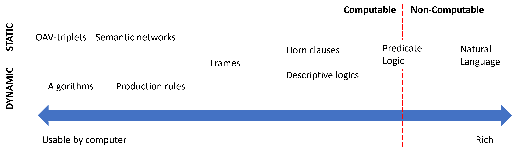

# Symbolic reasoning and Expert system(符号推理与专家系统)

在早些时候，AI 的发展是基于符号推理的：

1. `Knowledge Representation`: 将知识以某种格式存入计算机
2. `Reasoning`: 通过这些已有的知识来进行推理，得到需要的答案

如果将**某一特定领域**的知识都录入计算机并设计一套推理方案，让它能够表现出如专家一样的回答，这被称为“专家系统”(Expert system)。

## Knowledge Representation

如何存储知识，从而让它变得可用，是我们需要首要解决的问题。

到现在，有很多利用计算机来表达知识的方案：

在右侧，自然语言显然无法被计算机直接理解，所以纯文本对于计算机来讲往往是毫无用处的一串字符，即 `Non-Computable` 的。

1. Network representations
- semantic network: 人脑中，会将相似的知识联系起来形成一幅联系图。我们用点表示实体，用边表示关系，就可以模拟这个图的表示。
- Object-Attribute-Value triplets: 一个 `semantic network` 中的每条边都可以表示为一个三元组，如，(Python, is, program language), (it, can, fly).

2. Hierarchical representations
- Frame: 它强调**继承**关系，类似于 OOP 编程语言中的继承与拥有，我们人脑也会有类似的知识存储，比如鸟是会飞的动物，会飞的动物都有翅膀。

3. Logic
通过逻辑来表达人类知识比较偏向数学理论，最早由亚里士多德(Aristotle)提出。通过描述逻辑(Descriptive Logic)、谓词逻辑(Predicate Logic)，来表达实体关系。

4. Procedural representations (dynamic)
- Production rules: 它是指通过一系列 `if-then` 声明语句来表达知识。这些知识的一个特点是直接可用，也就是说，程序拿到这些语句后，可以通过直接给出原始条件来过滤结果。这也类似于一个图的搜索过程。大量的 `if-then` 构成了一个图。
- 算法可以被看作是另一种形式的过程表示（procedural representation），但是通常不会在知识库中直接使用。因为知识库存储更侧重于“知道什么”而不是“怎么做”，单纯的 `if-then` 就已经“超纲”了，通常不需要涉及更复杂的算法控制流程。

## Expert System

一个典型的专家系统包含如下：

- Problem memory: 即问题相关的记忆
- Knowledge base: 知识库
- Inference engine: 推理过程。它负责从问题相关的记忆中提取有用的线索；当有必要的时候向用户提问索要知识；通过搜索知识库来寻找合适的答案。

## Semantic Web

在二十世纪末，出现了使用 description logics([DL](https://en.wikipedia.org/wiki/Description_logic)) 来进行网络资源标注，从而让我们更快、准确的查找相关网络资源的想法，被称为语义网络(Semantic Web)。它将整个互联网资源视为一个庞大的知识库。这种想法并没有被广泛使用，是因为搜索引擎算法的成功和随后自然语言处理技术的崛起。虽然没有被广泛使用，但是在某些大型知识库上仍然可以找到他们的踪迹，比如 [wikidata](https://wikidata.org/)，专注于维基百科数据的搜索。

