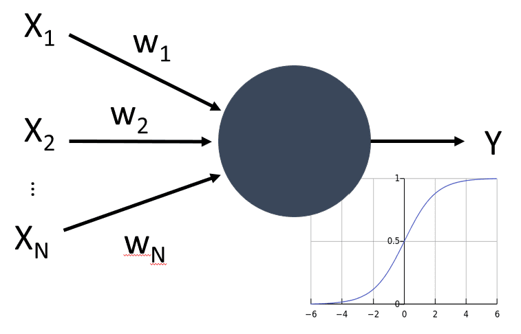
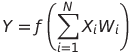

# Neural Network(神经网络)

## 机器学习

神经网络实际上是机器学习的一部分主题：用数据来训练出能够给出答案的模型。机器学习自身构成了 AI 领域的很大部分。机器学习主要做了两件事，一件是回归，就是用一个函数模型来拟合散点，然后用这个函数来进行预测；另一件就是分类，就是把数据分成两类或者几类。

在机器学习中，我们假设输入的数据集为 X，而对应的输出是 Y。X 一般是 M 个 N 维向量，每一维表示 `features`，而输出 Y 被称为 `labels`。

> When representing inputs and outputs as tensors, the input dataset is a matrix of size M×N, where M is number of samples and N is the number of features. Output labels Y is the vector of size M.

## 神经元模型

首先需要明确的是，现代人工神经网络借鉴了生物神经网络的一些概念（如神经元、突触、激活函数等），但它们的目标并不是完全复现人脑的工作方式，而是构建能够高效完成特定任务的计算系统。神经网络的成功，主要来自于大规模数据、计算能力的提升、优化算法的改进，而不是对人脑的深入模拟。

因此，研究人员更倾向于优化已有的人工神经网络，而不是直接去研究和复现人脑的全部功能。但类脑计算（Neuromorphic Computing）和计算神经科学（Computational Neuroscience）等方向仍然在积极探索如何从人脑中汲取灵感。

从生物学中我们能够知道，我们的脑由神经元细胞构成，他们中的每一个都包含多个输入轴突(axons)和一个输出树突(dendrite)。轴突和树突都可以传递电信号，并且控制不同的电导率。

 | 
---- | ----
Real Neuron *([Image](https://en.wikipedia.org/wiki/Synapse#/media/File:SynapseSchematic_lines.svg) from Wikipedia)* | Artificial Neuron
---- | ----

所以， 通过模拟轴突和树突，我们能够得到一个最简单的神经元，包含多个 inputs X1, ..., XN 伴随权重(weights) W1, ..., WN ，和一个 output Y:

而 f 则是一个非线性的激活函数(activation function)。