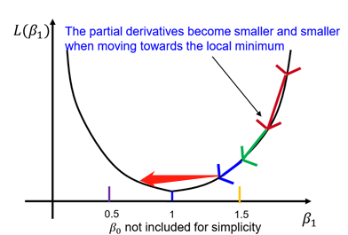

# Perceptron(感知机)

一个感知机(Perceptron)是种用于解决分类(classification)的算法。也就是说，该模型的作用是给出一个东西，它能够判断该问题属于类 A 还是类 B。感知机有以下特点或者缺陷：

1. 它是一个二分类(binary classification)算法，也就是说不能进行多分类；
2. 它是线性分类器(linear classifer), 只能用于[线性可分的划分](https://en.wikipedia.org/wiki/Linear_separability).

## 数学表示

用一个神经元对输入的 `x` 进行二分类，得到结果类 A 或者类 B：y(x) = f(wTx).

在这里， wTx 大于 0 表示类 A，小于 0 表示类 B. 激活函数 `f` 表示分类，用大于 0 表示类 A，小于 0 表示类 B。所以激活函数 `f` 就是 sign 函数：

为了更加普遍，我们加上一个偏置 `b`。虽然描述的是 `wx+b>0` 的表示，但能够表示 `wx+b>M`，因为 `b` 和 `M` 都是常数，它可以直接表达为 `wx+b-M>0`，也就变成了下述形式，感知机的最终表示：

> y(x) = sign(wTx+b)

其中，`w` 是权重参数，`b` 是偏置，`sign` 是 sign 函数。

### 损失函数

我们希望找到一个最优的 `w`，能够最精确的给出分类。为此，设计了误差函数 E。其中，求和中的 `i` 表示对于当前 `w`，误分类的样本，xi 是该样本的输入值， ti 是预测值(`+1` 或者 `-1`)。它的每一项都是 >= 0 的：

E(w) = -&sum;wTxiti

我们希望 E 越小（趋近于 0）越好，我们根据它的导数(也就是梯度)迭代，每轮都减去它的梯度：

w(t+1) = w(t) - &eta;&nabla;E(w)

这里 &eta; 表示每轮减去梯度的多少倍，称为学习率(learning rate)。这个参数设置的小了，无疑，我们会得到一个相对精确的解，但是迭代的速度就会很慢；相反，迭代的速度当然就会提升，但容易迭代过头：

由于梯度就是导数，对之前式子求导可得到最终的结果：

> w(t+1) = w(t) + &sum;&eta;xiti

这里演示了 `w` 的迭代过程，`b` 也是同理，只不过对 `b` 求导的结果始终为 1，所以在程序中他也就是硬编码为 `1` 了。

### 随机梯度下降

在实际迭代中，并不遍历对于当前训练数据中对 `w` 的所有错误样本，而是挑选一小批样本(a batch)，如果它(们)是错误的用相应代表的梯度更新。这样做让 `w` 的变化速度不至于过快。这被称为随机梯度下降(stochastic gradient descent, SGD)。所有的训练样本都被挑选过一次称为一轮训练，即一个 `epoch`。

## Literature

1. https://github.com/microsoft/AI-For-Beginners/blob/main/lessons/3-NeuralNetworks/03-Perceptron/Perceptron.ipynb
2. https://raw.githubusercontent.com/microsoft/AI-For-Beginners/refs/heads/main/lessons/3-NeuralNetworks/03-Perceptron/README.md
3. https://towardsdatascience.com/what-is-a-perceptron-basics-of-neural-networks-c4cfea20c590
4. https://zhuanlan.zhihu.com/p/71738765