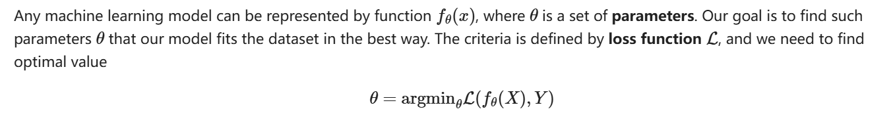
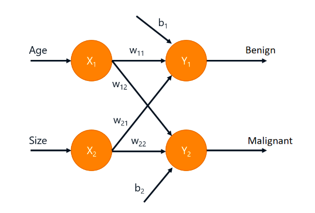
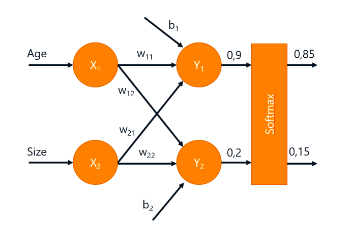
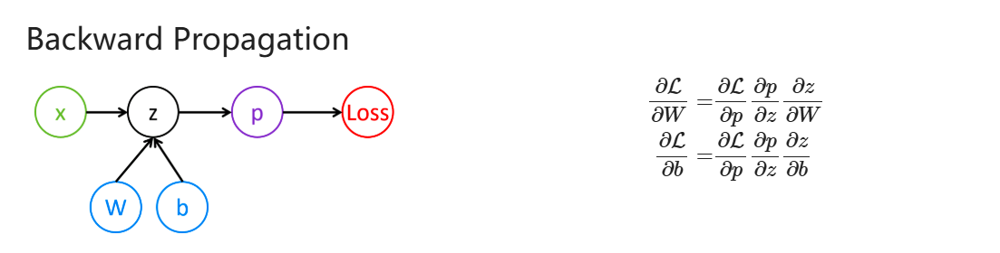
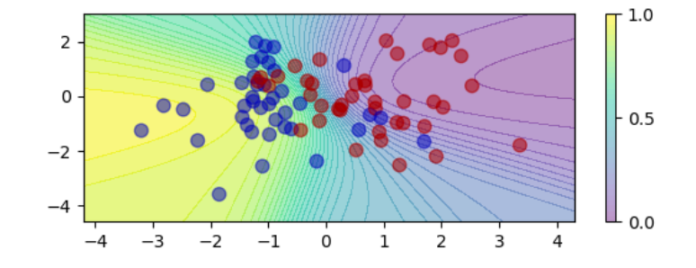

# Multi-Layered Perceptron(多层感知机)

## 机器学习的一般形式

假设我们有一个数据集 **< X, Y >**，其中 **X** 表示的是数据，**Y** 表示的是数据的分类标签。我们需要建立一个带有一些神经元参数的模型 `f`，让它针对这个数据集，有最好的预测表现，也就是说对于输入 X，能够正确的输出 Y 分类。

我们建立评估该模型准确度的函数，也就是损失函数(**Loss function**)&lagran;。我们的目标就是调整模型的参数，让损失函数的结果尽可能小。

对于不同的问题，损失函数的可能形式也不一样。例如对于一个回归问题，一般用绝对值误差 &sum;i|f(x(i))-y(i)|, 或其平方(也就是方差) &sum;i(f(x(i))-y(i))2 衡量。本节针对于感知机，也就是分类问题。

## 分类问题

考虑一个多分类问题，由于有多个类别，所以需要多个 `output`。我们认为某个 `output` 的值越大，表示该输入更有可能属于该类：

在样本数据中，输入 **X** 有两个特征输入 (X1, X2)；其对应标签 Y 为满足独热分布([One-hot](https://zh.wikipedia.org/wiki/%E7%8B%AC%E7%83%AD))的向量。

引入 `softmax` 函数，将输出值转化为概率分布：

### 损失函数表示

用[**交叉熵**](https://blog.csdn.net/tsyccnh/article/details/79163834)来表示预测分类和真实分类分布的差距。

- 第一个分布是我们得到的目前的分布，第二个分布则是真实的分布，由于它是独热分布，所以他们的交叉熵结果,就等于为 `1` 概率的那一项对应的目前结果 `p` 的对数 `log p`。

- 由于独热分布的信息熵是 `0`，所以交叉熵的结果越趋近于 `0`，分布越准确，也就是说，该损失函数趋近 `0` 越好。

根据计算图(computational graph)，我们就可以用导数梯度和链式法则，来逆推所有参数更新的大小：

## 多层神经元

多层神经元，只需要在嵌套的时候必须有一部分的非线性的激活函数即可：

之所以要求是非线性的，是因为线性的函数相互嵌套后仍然是线性的函数，而加入了非线性，就可以表示曲线，比如如下的训练过程：

从这个可视化过程中，可以看到**曲线**正在不断的被调整以适应样本集。

### 复杂神经元导致的过拟合(Overfitting)

多层神经元很好，但容易导致过度吻合当前训练集，而在测试集或实际表现中不佳。也就是过拟合(Overfitting)。

> the more powerful the model is, the better it can approximate training data, and the more data it needs to properly generalize for the new data it has not seen before.

简单模型往往欠拟合(underfitting)，而复杂模型(更多的层数，每层更多的神经元)往往过拟合。

- 可以通过 1. 简化模型或者 2. 增加样本数据的数量(或普遍性) 来解决过拟合。
- 并没有一个普适的衡量神经网络应该被设计的多复杂或者多简单的方法，最好的方法还是实验。

## Literature

1. https://github.com/microsoft/AI-For-Beginners/blob/main/lessons/3-NeuralNetworks/04-OwnFramework/OwnFramework.ipynb
2. https://raw.githubusercontent.com/microsoft/AI-For-Beginners/refs/heads/main/lessons/3-NeuralNetworks/04-OwnFramework/README.md
3. https://blog.csdn.net/tsyccnh/article/details/79163834