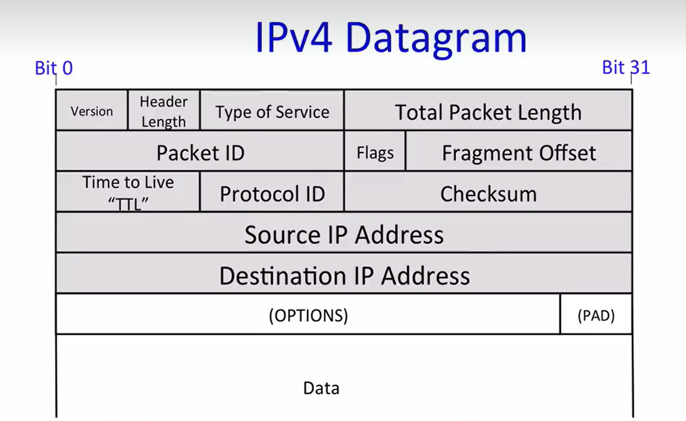
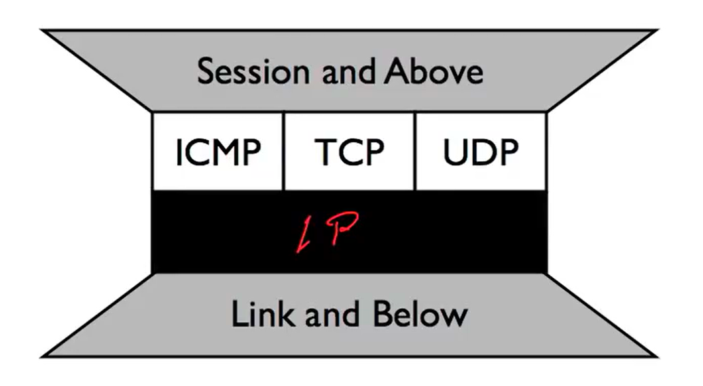
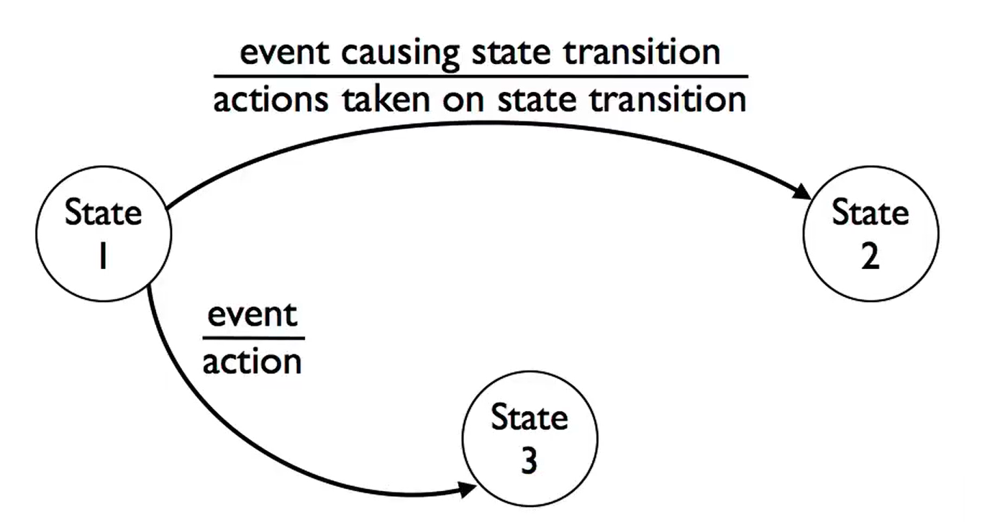

# CS144 notes

Excerpt or notes from some episodes of [CS144 course](https://www.bilibili.com/video/BV1qotgeXE8D/)

## episode 1 - 4

### The IP layer is special

1. We must use the Internet Protocal(IP) if using Internet.
2. IP makes a best-effort attempt to deliver our datagrams to the other end. Bit it makes no promises: IP datagrams can get lost, can be delivered out of order, and can be corrupted.
3. Works over any link layer: IP makes very few assumptions about the link layer below.

### The IP service is very simple

1. Simple, dumb, minimal: Faster, more streamlined and lower cost to build and maintain.
2. The end-to-end principle: Where possible, implement features in the end hosts.
3. These two principles allow maxmium extendsibility to be built on the top.

### 如果我们要实现一个新的传输层协议，需要 IP 层的支持吗？

Protocol ID 的作用是提供表示当前 IP 数据报的 data 部分传递的是什么传输层协议的数据。

我们知道，IP 层提供了端到端的数据交付，在此基础上创建新的传输层协议，需要端设备的支持，也就是 OS 内核的支持。例如，我们需要操作系统能够去支持接收到的 IP 数据报头部 Protocol ID 的识别。这个操作严格来说是属于 IP 层的(对 IP 头部的解析)，而不是传输层。我认为这个 Protocal ID 字段完全可以不要，而在 data 段(也就是传输层数据)中进行进一步识别和格式约束。所以可以看到，在实际的实现上，历史上并没有做到尽善尽美(但这已经很足够用)，不同层之间的具体实现还是存在耦合。

由于该字段的限制，新实现一个传输层协议很难得到推广；加上目前设计实现传输层协议(TCP/UDP/ICMP)在现实世界中已经能够满足公共的需要，所以[再也没有新的传输层协议被实现并推广了](#no-new-transports)：

由于 UDP 最简洁，许多新的协议都是基于 UDP 再开发的。

## episode 5 - 11

### packet switching principle in link layer

This simple building block was revolutionary at the time, but it's now accepted as the common way to build networks.

There are two major benefits of packet switching:

- Packet switches are simple: they forward packets independently, and don't need to know about flows.
- Packet switching is simple: it lets us efficiently share capacity among many flows sharing a link.

### VPN frame construction example

- HTTP(Web) application payload in
- a TCP transport segment in
- an IP network packet in
- a secured TLS presentation message in
- a TCP transport segment in
- an IP network packet in
- an Ethernet link frame

### Byte order in the network

We use the big endian for the communication. But in the computer, small endian is more common.

## episode 21 - 36

### The End-To-End Principle

The functions can completely and correctly be implemented by only with the knowledge and help of the application standing at the end points of the communication system. Therefore, providing that functions as features of the communication system itself is not possible. (Sometimes an imcomplete version of the function provided by the communication system may be useful as a performance enhancement.).

- Do one thing, and do it best.
- Encapsulating and composing with other new features

> The network's job is to transmit datagrams as efficiently and flexibly as possible. Everything should be done at the fringes.
> 
> ——[RFC 1958]

### Finite state mechine

画出状态图(有限状态机)在网络工程中很常见，它常用来清楚描述通信过程中端的状态迁移。

## episode 66 - 70: NAT

### No new transports

Because for practical concerns, we're not going to see new transport protocols. You can build protocols on the top of UDP, and that's generally what's done today. Since UDP just provides a nice datagram service, rather than using a transport identifier at layer three(IP layer).

### NAT traversal

NAT 的优点有很多，它解决了 IP 资源有限的问题，同时由于无法被主动访问，为边缘设备(家用设备等)提供了安全性的天然屏障。由于 NAT 机器所连的为一个私域 IP 网络，所以其无法向外部暴露服务，因为每个机器在 IP 层被分配的是私有地址(如 192.xx)。

内网穿透是一种突破这种限制的技巧。它的思路是，内部 IP 既然无法被外部 IP 直接连接，但内部 IP 可以主动连接外部 IP(即 NAT 的作用)。我们使用一台服务器 A，一旦它与内网 IP 之间的连接被架设，那么我们就可以用这条连接对 IP 层以上的流量进行代理转发。

#### 示例

1. 假设我们位于局域网的私有网络中，使用 `192.xxx:80` 提供服务；我们的公网 IP 为 `p_ip`，向具有公网 IP 的中间服务器 A 的 `A:port` 主动建立这种连接，即 `192.xxx:4040 -> p_ip:xxx -> A:port`。

2. 该连接被架设后，随后外部所有通向 `A:port` 的 IP 数据包的**目标地址**都会重新 rewrite 为 `p_ip:xxx`。`p_ip:xxx` 即 NAT 路由器接收到该数据包后就会成功地分发给自己的主机 `192.xxx:4040` 端口。

3. 随后，`4040` 端口的服务接收到这种数据包，将它直接传给 `80` 端口。假设我们的主机处理好了服务，响应回 `4040` 端口。之后，根据响应的内容构造出一个源地址为 `192.xxx:4040`，目标地址为 `A:port` 的数据包。它经过 NAT 路由器，**源地址** `192.xxx:4040` 被重写为 `p_ip:xxx`，目标地址不变，并被转发出去；A 服务器拿到响应后，再重写源地址为 `A:port`，目标地址为请求服务的外来地址，并发送。至此，流程结束。