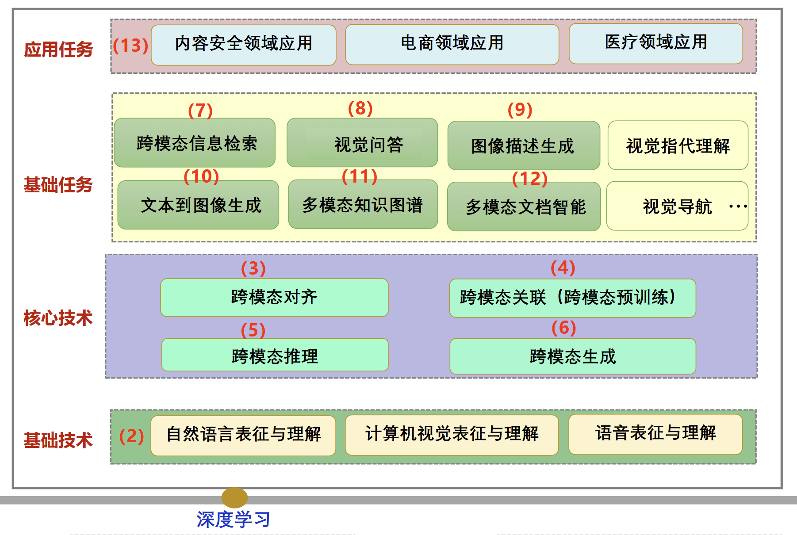

# 跨模态智能计算

跨模态智能计算是利用 AI 实现不同感知模态（视觉、语言、声音）之间的信息融合、理解和交互。它旨在模拟和扩展人类的认知能力，实现对复杂世界的更深入的理解和更高效的决策。

## AI 的历史

- 1956-1980s(符号推理): 1956 年的 Dartmouth Workshop 通常被认为是 AI 学科正式诞生。研究者认为：基于规则来模拟人类智能具有可行性，只要把知识写成**逻辑规则**，机器就能进行推理。代表系统有：专家系统、自动定理证明、规则推理。由于知识工程爆炸、对噪声和现实世界适应差，符号推理失败了。
- 1980–2000s(概率统计): 这个时期大家意识到，世界是不确定的，模拟智能必须能够先能处理概率与统计。于是各种各样的基于**概率与数理统计**的数学模型开始被发明，例如贝叶斯方法、SVM、图模型等等，现在统称为“经典机器学习”。这个时期的重要特点是模型依赖人为设计的数学算法，模型有很强数学理论的解释性。经典机器学习的缺点是极度的依赖人为进行特征预设计。
- 2000-2022(深度学习): 进入 21 世纪，GPU 算力逐步提高，深度神经网络重新被关注。2012 年是个特殊的时间节点，AlexNet 在 ImageNet 比赛大幅领先，标志着基于深度学习的**自动表示学习**开始进入主流，自动表示学习开始全面压倒经典概率统计。CNN、RNN、LSTM、AutoEncoder 等等开始被广泛关注并使用。值得注意的是，这些模型其实都是上世纪就产生的，2012 年后才被证明工程可行性和工业价值。2017 年是另一个重要的时间节点，Transformer 问世。
- 2022-: 2022 作为一个新的划分起点是由于 ChatGPT 的诞生和流行, 它是一个社会扩散节点和人机交互革命的起点。从这一年开始，AI 从工业技术变成了社会技术，开始直接影响社会。AI 竞赛开始明面角逐，并直接加快社会变革。

跨模态任务贯穿 AI 的历史。AI 的发展，本质上一直是在解决一个问题：让机器像人一样理解世界。而人类并不是只靠文字思考的，我们会同时使用视觉、听觉、语言、动作、空间感知等多个模态。所以 AI 从早期的单一任务发展成为今天的大模型，本质上也是逐渐走向多模态所驱使的。

## 跨模态概述

跨模态任务有 5 个基本任务，有一些术语：

- 表征（representation）分为单模态表征和多模态表征。
  - 单模态表征如下图所示是基础技术部分。
  - 多模态表征：
    - 多模态联合表征：多个模态共享相同的向量语义空间。
    - 多模态协同表征：多个模态映射到不同的表征向量，但各模态映射后的向量之间需满足一定的相关性和约束条件，确保不同模态之间的信息在协同空间内能够相互协作。
- 对齐（alignment）：学习不同模态中元素之间的直接对应关系。分为显式对齐和隐式对齐。
- 关联（co-learning）：如何在不同模态信息间传递知识和表示等互补信息，借助其他模态的知识，提升当前模态的性能。
- 推理（Reasoning）：根据已有的模态信息进行分析和推理，得到预测结果
- 转换（Transition）：见字如面，以一种模态作为输入，转换为另一种模态输出，如文生图。它考验模型从低维重新展开成高维细节、或者逆过程（压缩）的能力，以及模型的**生成**能力。

