# 深度学习基础

深度学习和传统的机器学习的区别：

- 深度学习是自动表示学习，不需要进行人为的特征设计。传统方法往往依赖人工设计的数学架构假设（比如线性可分、核函数），而深度学习通过网络结构（卷积、注意力机制）自动进行表示的学习，不依赖严格的数学模型。
- 深度学习模型通常需要大数据量才能学到东西，需要的算力也更高；而传统的机器学习大多是小模型，在小数据量下就能取得稳定的性能。
- 深度学习模型是端到端的学习，通常不具备良好的内部解释性，因为其表示是分布式的和非线性的网络组合。但可以通过可视化、事后验证方法获得一定程度的后验解释，是“可分析但不直观可解释”的模型。

监督和无监督学习：

监督学习是有明确答案作为训练依据的学习；我们说不需要依赖种子数据的训练是指“自监督”而不是无监督。无监督学习是指聚类、降维这类模型自身分析数据结构或规律的模型。

## CNN

相比于使用 DNN 处理图像，CNN 避免用全连接来根据全局信息提取特征，而基于卷积核来根据局部信息提取特征，精度上升的同时参数也大幅度下降。如果考虑图像分类，训练 CNN 的损失函数很简单：

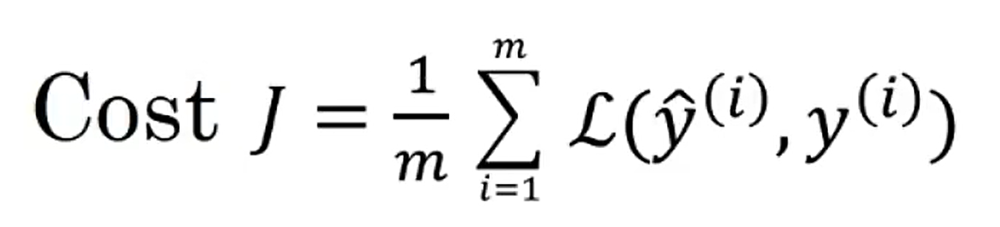

### 卷积

CNN 的卷积过程模拟视觉处理的感受野（reception field），进行特征的识别和提取。卷积层的过程描述如下：

- 输入输出：输入和输出都是叠起来的特征图，但厚度（代表特征的数量）可能不同。例如输入一张长宽为 $n$ 的图片，RGB 三通道特征，则输入特征图为 $n * n * 3$。

- 卷积核（filter）的大小和数量

  - 卷积核的厚度(通道数)等于输入的厚度，在数值上就是输入通道数；长宽大小则记作 $f$，长宽厚则为 $f * f * 3$。
  - 卷积核的数量表示要学多少的特征，即输出通道数。每个卷积核得到了一个特征图，而特征图的数量又称为“通道数”（channel）。

  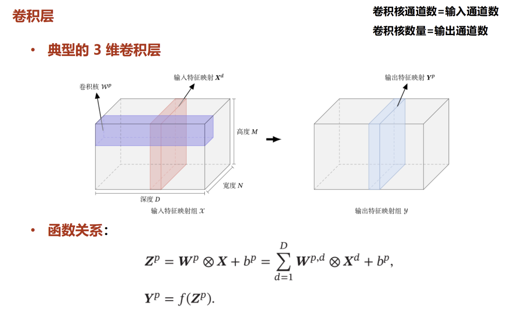

- 卷积核的填充 $ p $ (padding) 和步幅 $s$ (stride)

- 输出的特征图的大小（长宽）计算：$ (n + 2p - f) / s + 1$。厚度即为卷积核的数量。

#### 其他层

在 CNN 成功后，VGG 块作为通用的模板来指导后续的研究人员设计新的 CNN 网络。一个 VGG 块依次包括卷积层、池化层、全连接层。大部分的 CNN 都遵循着 VGG 块进行循环拼接的模式进行设计。

- 池化层：用于降低节点数，如最大池化，平均池化。

- 全连接层。特别的，使用多个 1x1 卷积核就得到一个全连接层。它的用途是在不改变特征图（图片）大小的前提下改变通道数（特征数），这被用于 [inception network](https://www.bilibili.com/video/BV12urfB1E7s)，能够在保证性能的同时降低参数计算量。

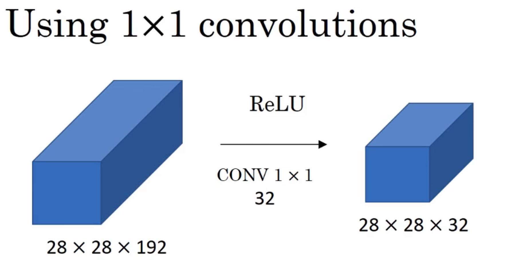

### 变种

在 CNN 架构上作的修改有很多，其努力围绕降低计算量、提高性能。比较有名的有：

- residual connect（残差连接），ResNet 与 DenseNet
- inception network（Network in network, 网络中的网络，降低计算量），GoogleNet
- MobileNet, EfficientNet（降低 CNN 计算量）

### YOLO: object localization

YOLO 使用细小网格分割 + 中心点检测的方式来进行目标对位与框选。

#### 卷积化滑动窗口

对于目标检测问题，一个暴力的思路是，每次框选图片的一部分，然后跑一次设计好的 CNN，然后滑动到下一个位置然后再跑一次，如此循环往复，然后在所有的结果中挑选概率最高的。

但是可以发现，实际上没有必要这么做，这里面有大量重复的计算。CNN 的原理上，**卷积层本来就是局部计算**，卷积本身就是一个滑动窗口，放入整张图片进行卷积和多次移动计算不同窗口跑相同 CNN，中间计算过程是完全等价的。我们可以直接把整张图片丢给之前设计好的 CNN，然后在模型尾部直接得到每一部分窗口的输出。

从直觉上理解 CNN 模型，其越往深处走，特征图的单个像素对应的感受野越大。对于到达一定深度的 CNN，特征图的每个像素从左到右就相当于一一对应人从左到右扫视的过程。

YOLO 将一张图片化为多干个网格（如19 \* 19，每个网格 32 * 32，整张图片 608 \* 608），然后用一个 CNN 处理整张图片，设计到深层时得到一张  19 * 19 的特征图，那么这张特征图的每个像素的含义就可以理解为人眼看原始图像对应的 32 * 32 的部分所提取的特征或信息。

#### anchor box

YOLO v2 引入了一个锚框的概念，它适用于某一种物品自身形状和角度基本不变（或满足规律，如要检测的物体全都是横向长条或者竖向长条）的优化。

### U-Net: semantic segmentation

语义分割和目标检测的不同点如下，语义分割是要用不同色块分割出不同的物体：

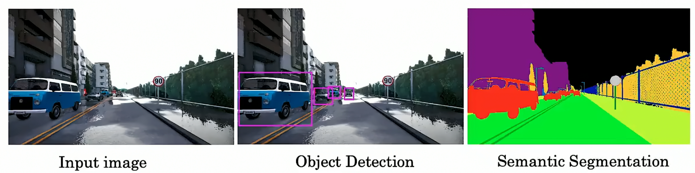

典型的训练数据如下：

U-Net 为解决这个问题提供了思路。U-Net 长得很像 U：

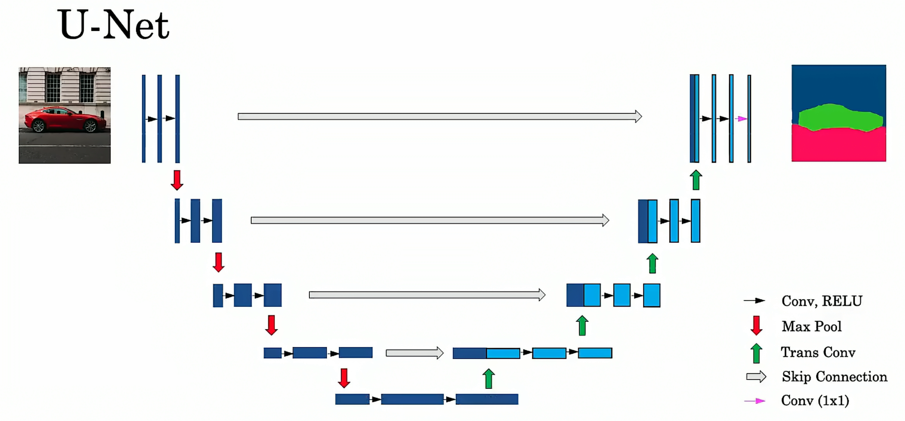

其有两个重要的组成部分：

- 转置卷积让逆向 CNN 变得可能；
- 残差网络能够让逆向网络参考对应正向特征的每一步结果。

#### Transpose convolution

转置卷积一些地方也称为“反卷积“，在深度学习中表示为卷积的一个逆向过程，可以根据卷积核大小和输出的大小，恢复卷积前的图像尺寸（不是恢复原始值）。卷积称为“下采样“，反卷积称为“上采样”。

参考：[卷积与转置卷积的数学理解](https://zhuanlan.zhihu.com/p/115070523)，[A guide to convolution arithmetic for deep learning](https://arxiv.org/abs/1603.07285)

总的来讲，转置卷积核的操作，可以看作是在原先特征图上添加空洞和 padding 后再进行相同尺寸的卷积核操作。也就是说，卷积操作核反卷积操作的联系是，反卷积等于在卷积前对待进行卷积的特征图多进行了一步空洞 + padding的操作。

有了这些空洞，反卷积就能不加约束的改变自己的参数了，从而在后方配合残差连接绘制接近训练目标的图像。

#### residual connection

如上图所示，通过残差连接将浅层的前端和尾部进行连接，由于浅层的网络感受野还较小，学习到的时较为边缘和细化的特征，我们将这部分特征直接和尾部的浅层进行连接，从而让待构造图片细节补充变得有据可依，细化变得可行。

## GNN

### 图基础

- 图直径：图中所有最短路径的最大值
- 有向图：强连通分量/弱联通分量

中心性：

- 度中心性：某个节点的度中心性就是其连节点的个数 / 图的总节点，它直观的衡量节点所连边的密集程度。
- 中介中心性：衡量图中任意两个顶点经过该节点的概率。
- 连接中心性：计算方式为 $(n-1)/到所有其他节点的最短路径之和$。最大为 1，越大越能说明它距离所有点最近，也就是从它访问所有点的代价最低。

#### 图邻接矩阵的特征向量中心性

图的邻接矩阵通常有很多特征向量，但线性代数中修过，每个特征向量像独立的坐标轴一样，给矩阵提供了一种不同的模式特征方向（mode）。最大的特征值对应的特征向量常被解释为中心性模式；第二特征向量常被解释为社区分裂模式；其他特征向量对应更复杂的振荡模式。我们研究中心性模式，给定其对应的特征向量 $x = (x_1, x_2, ..., x_n)^T$。

则有：

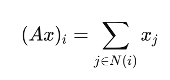

由于 $Ax = λx：$

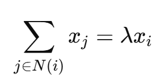

即特征向量的第 $i$ 个元素乘以 $λ$，就等于图中第 $i$ 个节点的所有邻居 $j$ 在特征向量中对应位置的取值之和。由于 $λ$ 是常数：

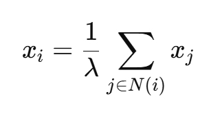

如果把特征向量的第 $i$ 个元素看作图中第 $i$ 个节点的重要性，则**一个节点的重要性由邻居的重要性共同决定**。

#### 经典的 Graph Embedding

图节点的嵌入类似 NLP 的词嵌入，都是为了解决one-hot编码节点间相关性太差、维度太高的问题，我们的目标是寻找一个 Encoder 函数，将图中的每个节点嵌入一个向量空间，让其分布合理:

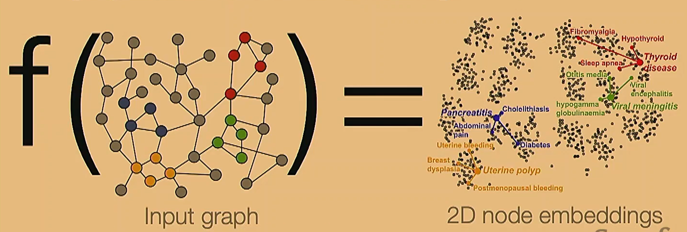

图嵌入有很多方法可以选，选的依据是根据图的性质，每种方法都有自己适用的图类型。传统的方法如 LINE 原理是根据邻居相似来构造的，如果一个图很满足这个性质，那么用这个算法能拿到比较好的表示。经典的图初始化方法如：

1. Deepwalk: 无向图上的无监督学习图表示，使用随机游走计算节点到达概率来为每个节点构造向量表示。
2. Line: Line 算法基于元素的结构信息来构造向量表示，思想是，一阶相似性：对于节点本身，如果两个节点离得近那么它们的表示就应该接近；二阶相似性：对于节点的邻居，共享大量邻居的节点的表示应该接近
3. Struct2Vec, Node2Vec 等

传统的 graph embedding 方法可以和基于深度学习的 GNN 方法一起使用进行图的嵌入，如 GCN。

### GCN

图神经网络需要满足：

- Permutation invariant / equivariant: 输入与顺序无关
- Inductive Capability: 推广到新节点的适应性

GCN 的思想是每一个节点和其相邻节点构成一个计算图，由相邻节点得到本节点：

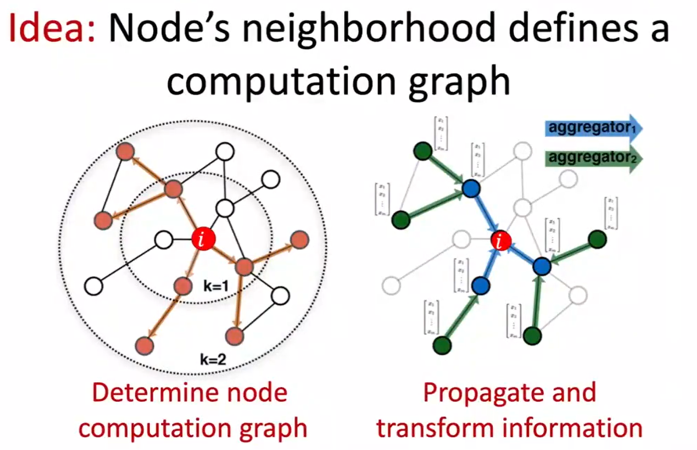

以 A 节点为例，其计算图展开如图所示：

    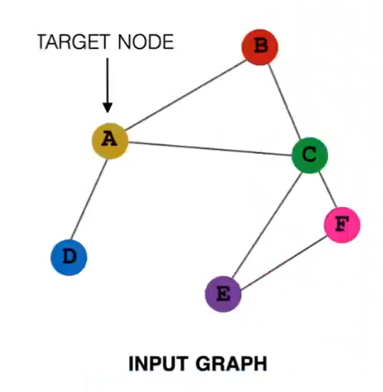
    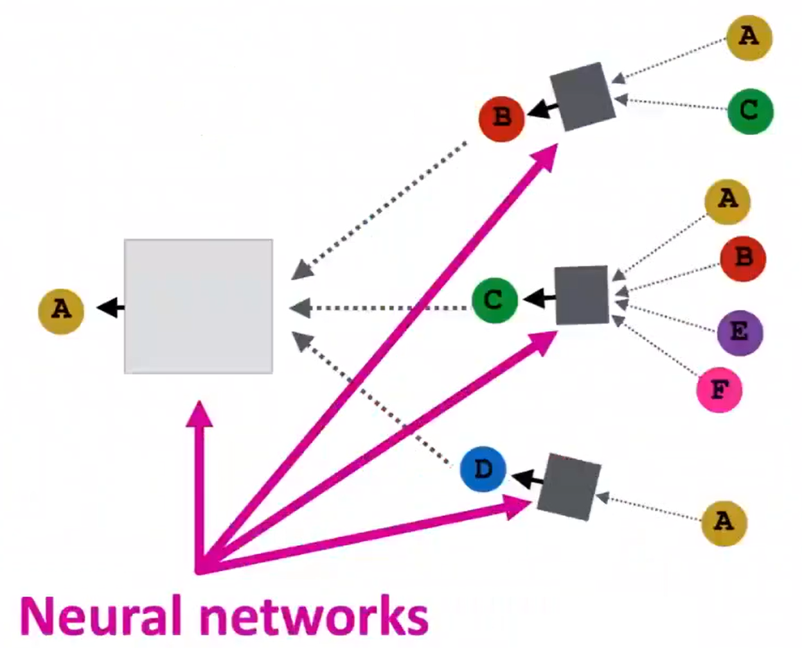

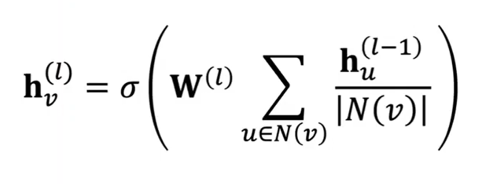

其中 $N(v)$ 表示其所有的邻居节点，$l$ 是当前层数。

GNN 输入节点的初始向量，输出节点被传播后的向量表示。

#### 自监督embedding

GNN 做无监督学习图嵌入，训练损失的基本思路是，相邻的节点经过网络传播后，得到的向量表示应该相似度很近。

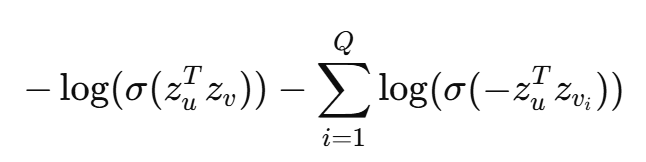

- 这个损失里，$z_u$ 为节点 u 的最终嵌入表示，$z_v$ 是 u 的相邻节点（正样本），$z_{v_n}$​是不相邻的节点（负样本），其采样数量是 Q。
- GraphSAGE 论文是这样生成正样本的：对节点 u 做随机游走（random walk），在游走路径中出现的节点视为上下文节点 $z_v$。

### 其他

- [stacking layer of GNN](https://www.bilibili.com/video/BV18FNQeYEzz?spm_id_from=333.788.videopod.sections&vd_source=5e8bba4ef06ad0ca393ce568e9d08ed3&p=17)，讲述 over-smoothing 问题以及如何多层 GNN 上使用 residual connection
- [Graph Augmentation](https://www.bilibili.com/video/BV18FNQeYEzz?spm_id_from=333.788.videopod.sections&vd_source=5e8bba4ef06ad0ca393ce568e9d08ed3&p=18)，讲述图特征增强、图结构增强，用于定制化 GNN 来适应不同结构的图（如稀疏、密集、初始无特征编码）
- [Deep Generative models for graphs](https://www.bilibili.com/video/BV18FNQeYEzz?spm_id_from=333.788.videopod.sections&vd_source=5e8bba4ef06ad0ca393ce568e9d08ed3&p=37)

### 变种

#### GraphSAGE

它对原始的 GNN 的改造有 3 个：

- 不同于最原始的 GCN 对邻居直接取平均加权，它把取平均加权改成了一个 AGG 聚合函数，这个 AGG 可以是任意的神经网络或者计算方式，常见的由 Mean、Pool、LSTM。同时，还可以加入*邻居采样*。
- 它的节点计算方式多了一个与上一层的自己进行拼接(concat)的操作。

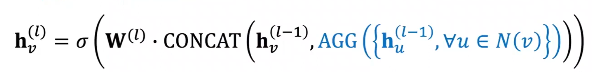

- 最后，它在每一层传播前都加了一个 L2 正则化：

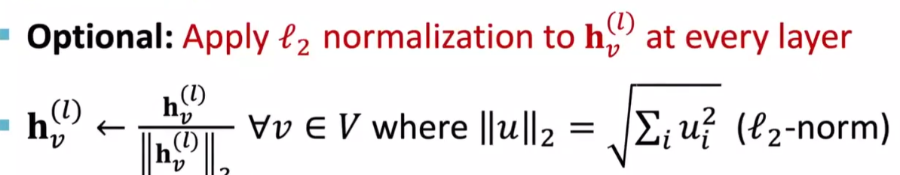

#### GAT

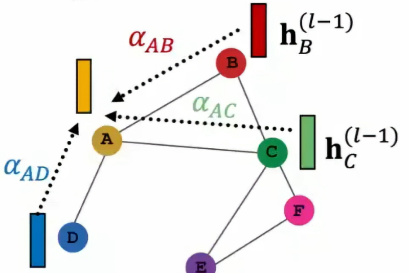

图注意力网络。它对 GNN 的改造是在前面加了一个 $α$，在原始 GNN 里，这个值是恒定的 $1/|N(v)|$，意味着每个邻居节点的权重是相同的；它也可以看作是 GraphSAGE 的一个实例。

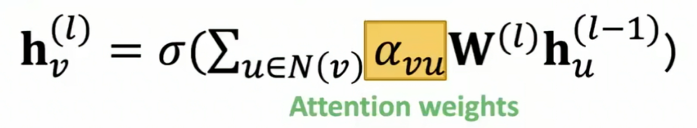

对于节点 v 的邻居 $N(v)$，注意力权重的计算为每个邻居的权重 $e$ 取 softmax，例如 v 的某个邻居 u 的贡献如下：

    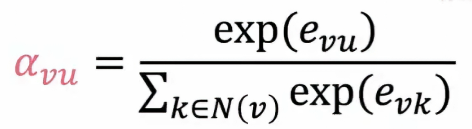

而 $e$ 由其左右两边节点的向量计算得到，这个计算 $a$ 是任意的，最初设计是一个拼接+全连接层：

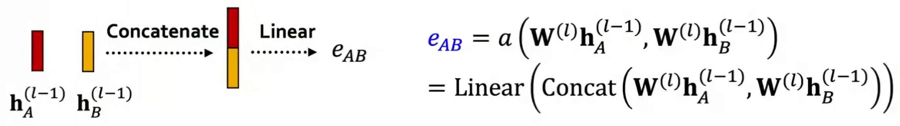

##### 多头注意力

如果用多个上述机制并行计算，最后相加平均的话就变成了所谓的多头注意力：

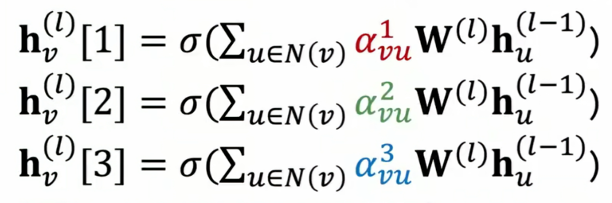

这样做的主要目的是稳定学习过程，其想法是，在训练过程中，如果单个函数陷入了局部最小值附近无法跳出，那么还有其他的函数均衡将其拉出来：

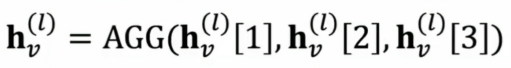

细节上，对于不同注意力参数的初始化是随机的，而且**必须是不同的**，如果相同则它们寻找解的方向会完全一致。

## RNN

### 原理

一个最原始的 RNN 训练和推理过程如下，训练和使用时每一层的输入和输出是每个词的 one-hot 编码：

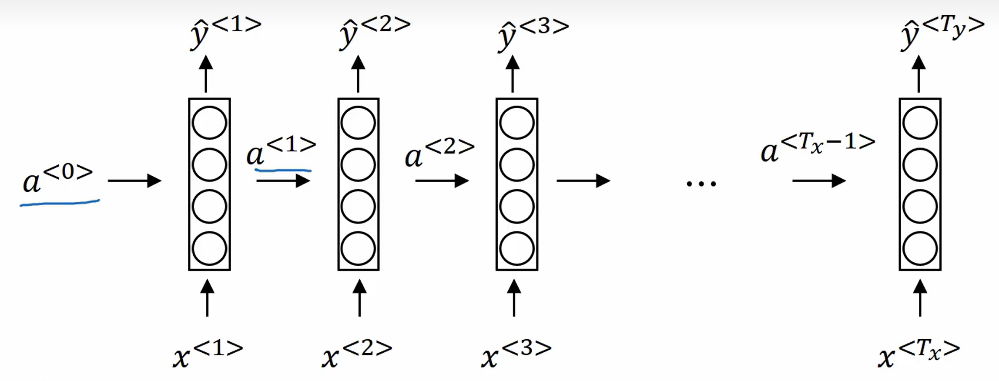

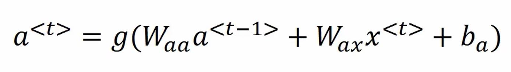

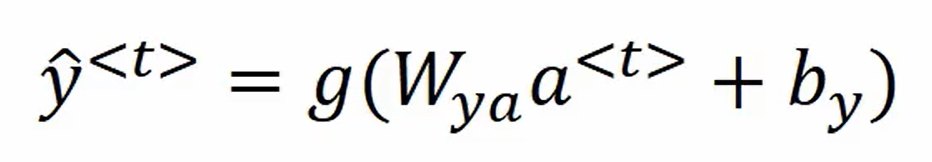

对于每一个预测的 $\hat{y}<t>$ 使用二分类的交叉熵损失。

### 变种

#### 不同的输入输出长度

原始的 RNN 的输入序列和输出序列是相同的，RNN 的变种改善这一点：

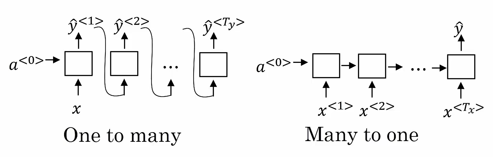

另一种 many-to-many 的是先输入所有的 x 再输出所有的 y：

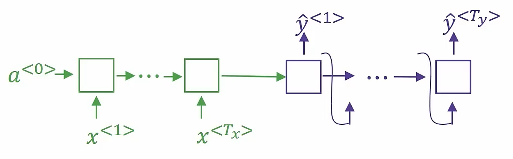

这个是典型的机器翻译/问答系统方法，也是一个典型的 **Encoder-Decoder** 架构。绿色的是 Encoder，输入的 x 是某种语言的序列；紫色部分则是 Decoder，它是一个 RNN Language model，接受 Encoder 编码的句子特征分布向量作为输入，输出另一种语言的句子。

- 在这个模型作预测的时候，我们常常不使用 Greedy Search 来得到结果，详见[这里](https://www.bilibili.com/video/BV12urfB1E7s?spm_id_from=333.788.videopod.sections&vd_source=5e8bba4ef06ad0ca393ce568e9d08ed3&p=179)。

#### RNN Language Model Decoder

它是类似 One-to-many 的情况，但是输入和输出的语义不同。

训练时：输入是已有序列 y 代表模型待预测序列和初始状态 $a^{<0>}$ ；输出向量 $\hat{y}<t>$ 代表一个**分布**，该分布用来采样当前的预测值。注意他和 One-to-many 在训练上的不同是每一轮输入的是 $y<t>$ 而不是 $\hat{y}<t>$。

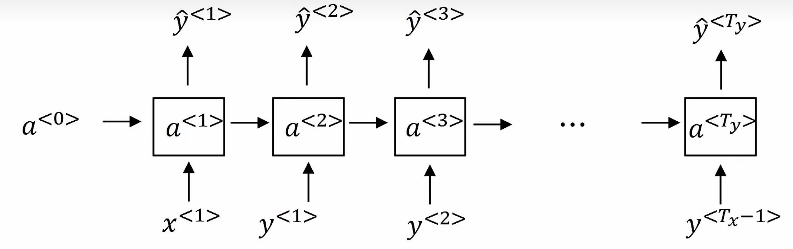

使用时（sampling）: 

1. 无输入，对每一轮输出的 $softmax\ 函数基于分布\ \hat{y}<t>$ 进行随机采样，作为下一轮的输入（等于One-to-many 的形式）：

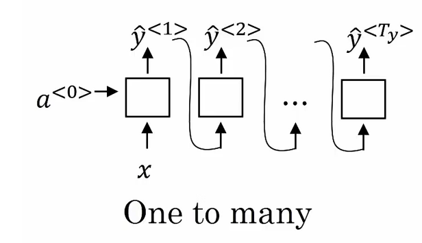

2. 也可以输入 $a^{<0>}$ 可以是任意的 context 向量，例如前面接一个 RNN encoder 编码问题，decoder 编码答案，组成一个many-to-many 的结构，当作问答系统。

#### 双向 RNN

双向 RNN 的构造很简单，就是两个 RNN 的拼接，一个从前向后处理序列，另一个从后向前处理序列。

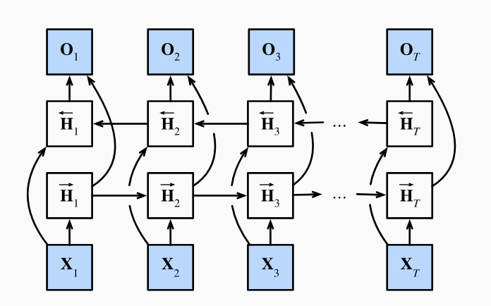

#### Deep RNN

深度循环神经网络就是把 RNN 的每一层变成多步了。

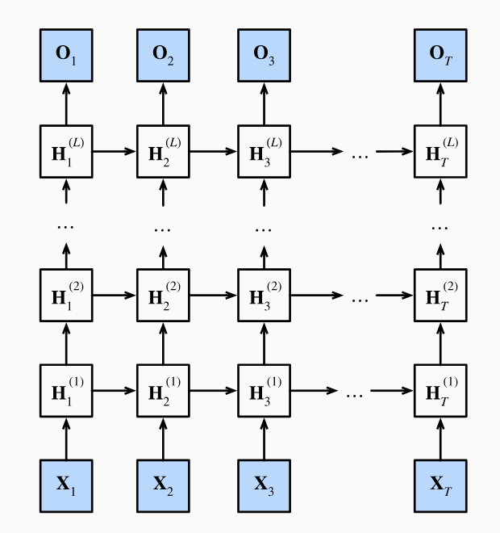

一般步数 $<= 3$，因为竖向 3 层参数量就已经乘以 3 了。

### 梯度消失问题

最原始的 RNN 的特点是在反向传播上梯度的更新是连乘式的，当参数变得很小且层数很深时，梯度也会变得很小，导致较远的参数几乎不更新，也就是梯度消失。从设计思路上，GRU 和 LSTM 相同，通过加入了一个不会产生梯度消失的参数 c(cell memory)缓解这一点。

- 从数学上来看 c 的计算设计包含加法和 tanh，提供了一条梯度恒为 1 的路径（但模型不一定会用到），缓解了梯度消失；当 c 没有被用到（$Γ == 0$ ）时退化成普通 RNN。
- 从设计上来看 c 作为一个记忆机制，能够通过这条梯度为 1 的通路拿到很久之前的数据，从而让当前步能直接受到很久之前的某一步的影响，也就是所谓的参考了记忆。

GRU 相比 LSTM 设计更加简单，参数量更小，意味着计算量可能更小；但 LSTM 出现的更早，其更成熟，GRU 是后期简化版的 LSTM。

#### GRU

如公式所示， $c<t - 1> $ 为初始隐状态；$\tilde{c}<t>$表示候选隐状态，$c<t>$是输出隐状态，它通过门限 $Γ_u$ 来在前两者中抉择。

而候选隐状态的计算有包括当前层的输入 $x$ （代表新的知识/记忆）+ 初始隐状态（代表旧记忆，乘以因子 $Γ_r$ 表示旧记忆占比）影响。

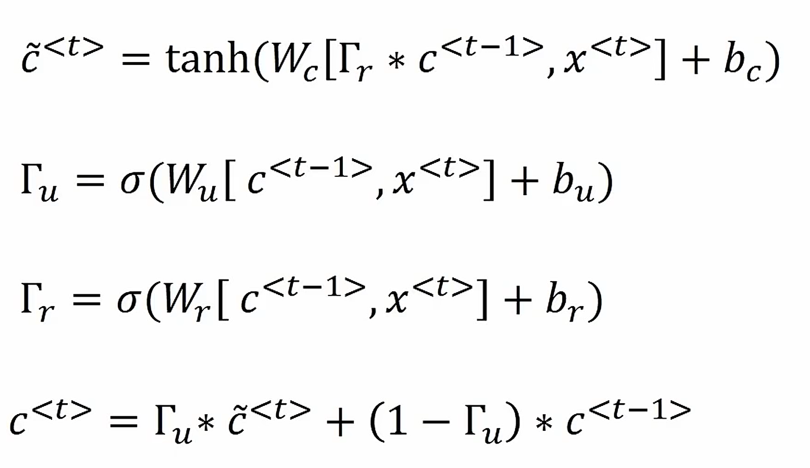

一般 c 写作 $h$：

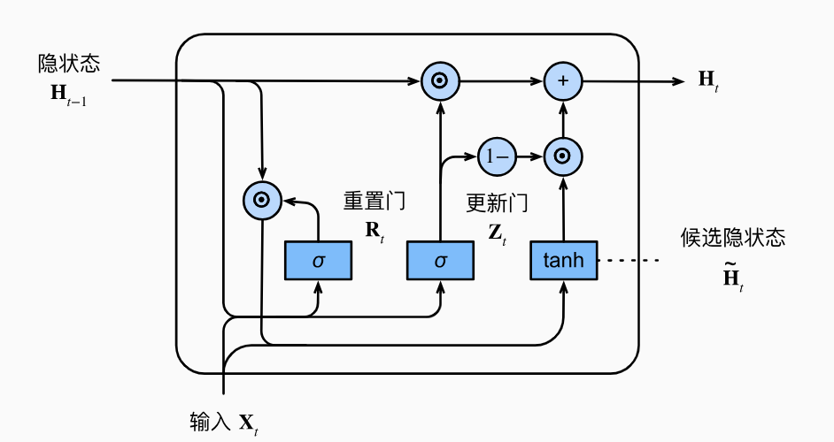

#### LSTM

LSTM 基本思路是一样的，设计上比 GRU 多维护了一个隐状态 $a<t-1>$，更改了一些计算方式。LSTM 同样有很多变体，它们同样也只是更改某些参数的计算方式。

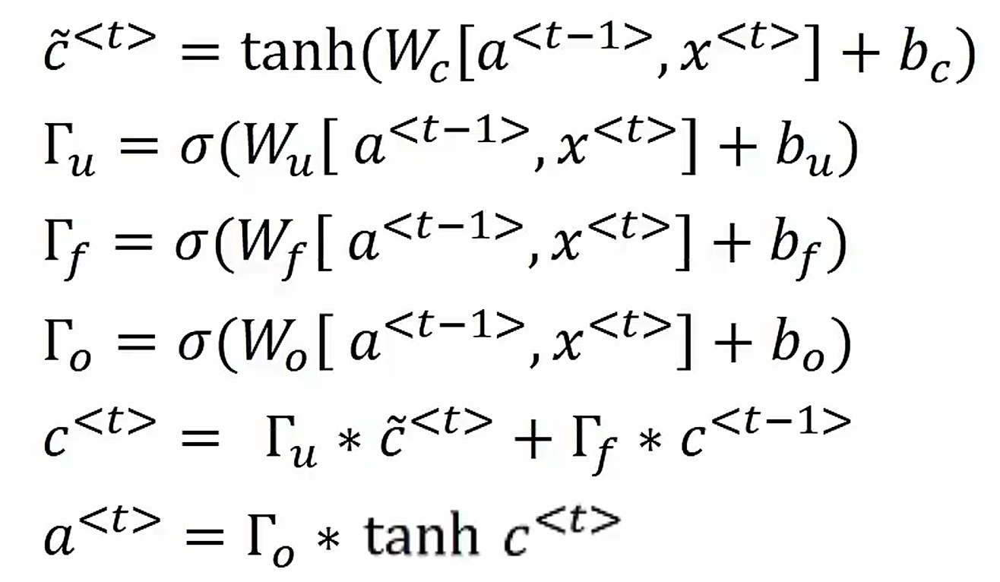

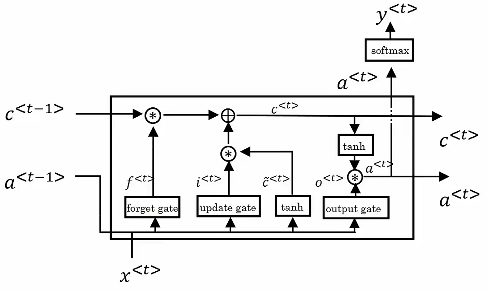

## 注意力模型

### Word Embedding

词嵌入是 NLP 的核心，如何将一个词用一个语义向量来表示和存储。

- 发展过程：one-hot 编码、bag-of-word、基于上下文特征的表示

- 如何学习基于上下文特征的表示：基于 context 预测下一个词来学习表示（word2Vec）；在此基础上可以加入对比学习（负样本）

### 注意力模型

最早的注意力机制是为了解决 RNN 无法处理长段落而设计的，是对 RNN 的改造。在 Encoder-Decoder 架构的 RNN 上，使用 encoder 来获取整个句子或段落的 embedding 表示，再使用 Decoder 进行解码。在句子非常长（>200词）时，即使引入了 LSTM，这个模型的效果也下降了，因为用单个 embedding 来表示整个段落有一些乏力。

注意力的思路是，Decoder 的每一个单元都直接依赖 Encoder **每一个词 **的输出表示。在生成时，每个词都会对所有 $h$ 计算所谓的”注意力“。由一个双向 RNN 上套一个全连接层，并且全连接层自身也是一个 RNN构成：

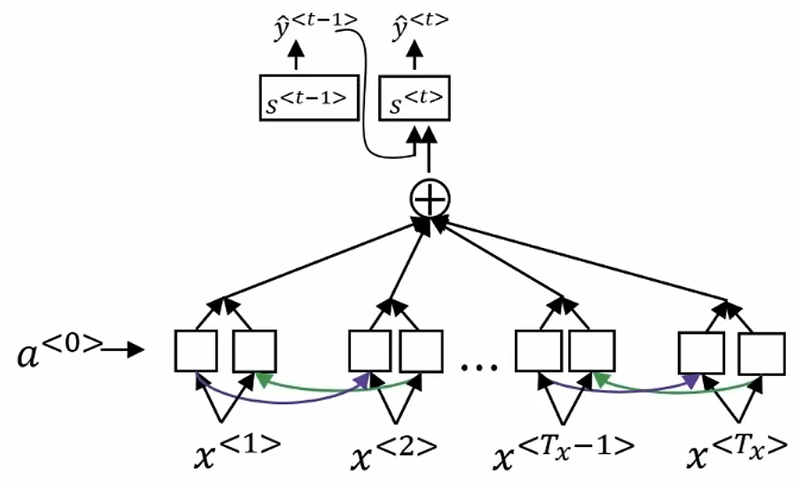

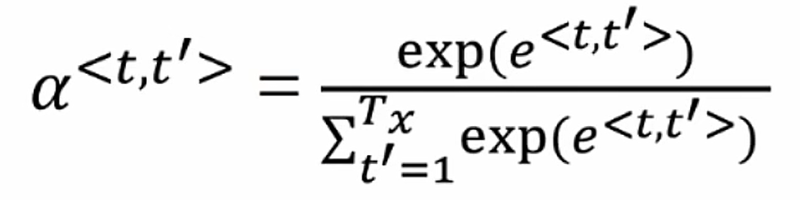

由于注意力是全局的，所以它是全局注意力。全局 Attention 最灵活，但计算贵；滑动窗口更高效，但可能错过远距离信息。现代模型往往在两者之间折中，而对于序列本身不长的输入（几十到几百词），通常直接采用全局 Attention。

### Transformer

Transformer 没有再使用 RNN，但是借鉴了前文所述的早期在 RNN 上使用的注意力机制。其架构是 Encoder-decoder 的，直观上解释的话 Encoder 负责理解，Decoder 负责依据理解的上下文生成。

两者在现在均有非常广泛的应用。Transformer 的 Encoder 就是 **BERT** 的原理，Decoder 则用于各种生成模型：

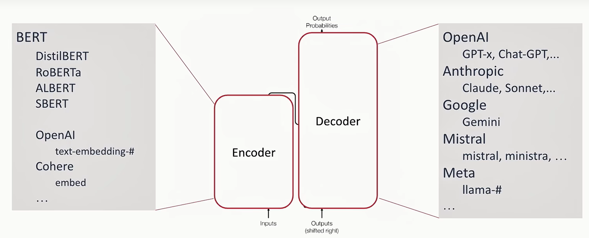

核心部分如下：

  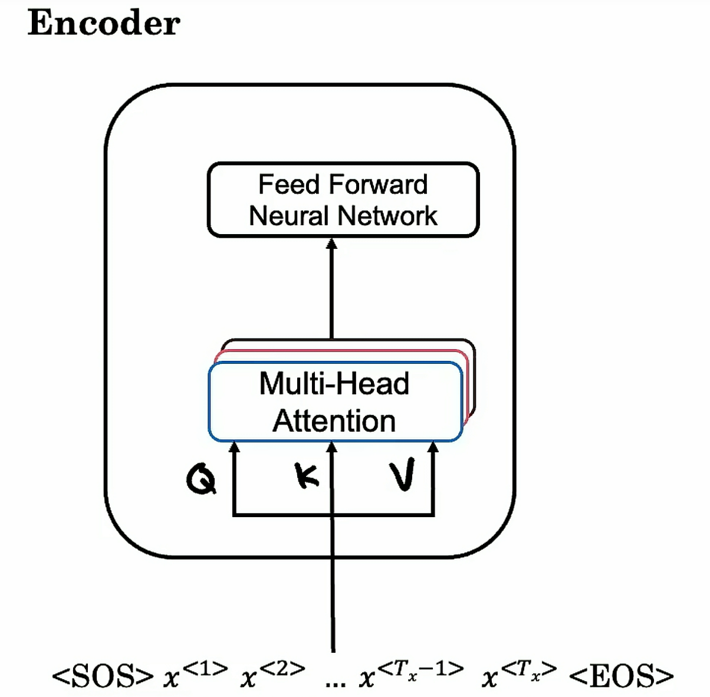
  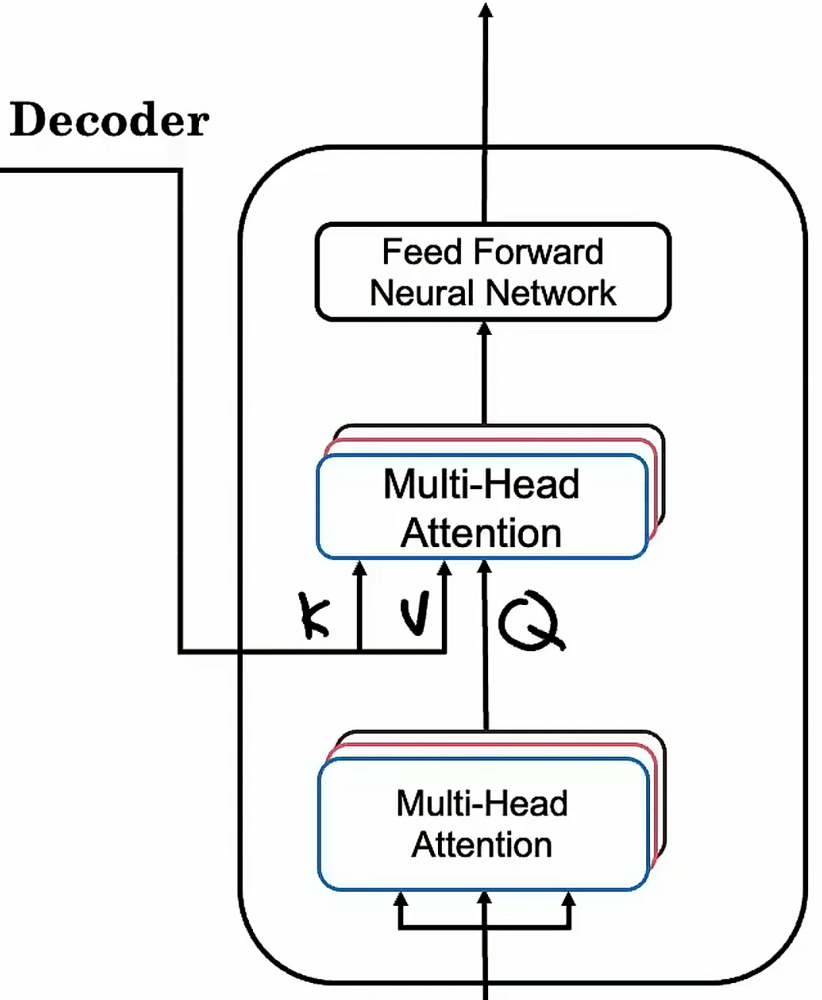

core:

- self-attention / Multi-attention: Q, K, V 来自同一输入序列
- cross-attention: K,V 来自 Encoder 输出序列; Q 来自已有 Decoder 输出序列

implement details & other component:

- position encoding: 全连接的 CNN 不包括位置信息，所以要混入位置编码
- residual connection: 引入残差链接的目的是在模型各个阶段传播位置编码
- Add & Norm: 加速训练
- mask attention (training)：训练阶段很自然的处理，训练的时候 Decoder 的 Q 来自已有答案而非已有 Decoder 输出序列，所以需要掩盖后面的内容

## 迁移学习

迁移学习是指借助现有已经训练好的模型，将其迁移至自己的需求进行部分改造和微调。它有一些固定的套路，针对不同的任务和网络也有一些固定的经验。

