# 跨模态生成

图片-文本的相互转化。

## 图生文

图生文任务是跨模态生成的经典任务，其目的是让计算机生成图片相应的文字描述。图生文的一个难点在于描述的多样性和准确性。既可以描述事实、也可以基于事实进行一定的推理。例如，对于图生文任务，如果有一张图描述的画面是一个人在半空中，那么图生文的结果是生成“这个人在半空中”比较好还是“这个人在下坠”比较好？具体来讲，就是图生文究竟应该做“视觉事实陈述（grounded description）”，还是做“视觉常识推理（visual commonsense reasoning）”。 不同数据集和任务定义下，答案是不一样的。现代视觉语言模型对这个问题的处理，已经从“二选一”变成了按任务目标动态调整描述层级，也就是不再追求唯一正确的 caption 风格，而是根据问题动态的选择输出程度。

基本技术思路源于机器翻译，参考机器翻译模型的架构（Seq2Seq），先用 Encoder(如 CNN 等) 将图片转换为向量，再用 Decoder(如 RNN 等) 将向量翻译成文本。

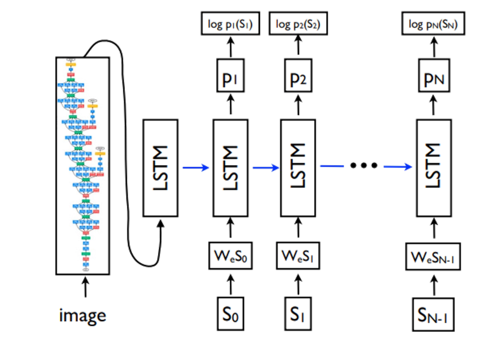

### 图像区域注意力

如何选择要关注的图像区域是图生文的一个重要决策。CNN 特征图具备了空间性，多通道性和多深度层的性质，我们可以选择和抽取合适粒度的目标层进行编码：

- 基于网格级的注意力，选择和关注某些图像区域。
- 基于通道级的注意力，选择和关注某些具体的特征。可以同时使用空间注意力和通道注意力，使用不同顺序的混入多头注意力（拼接后融合/顺序融合/并行处理后直接融合）。
- 基于目标检测的注意力：这被称为 Top-Down & Bottom-up attention。
- 空间感知的注意力：在计算注意力时不但考虑图像区域自身的特性，同时将其所在整张图中的坐标位置混入计算，希望模型能够在对图像编码的过程中，考虑到物体在空间上的相对关系。

### 辅助手段

#### 哨兵机制

Knowing when to look: Adaptive attention via a visual sentinel for image captioning, CVPR, 2017

部分描述单词可能并不直接和图像相关，如介词、语气词等和图片无关的词，它们可能只是属于语种所属语法的一部分，并不是真的靠图片产生；所以在 Decoder 阶段模型不一定每生成一个单词就要去看一次图片生成下一个图片，而是可以直接生成。哨兵机制考虑当前单词的生成依赖图片的程度，作为一个权重控制模型对图片 $c_t$ 和当前已有文本 $s_t$ 的关注程度：

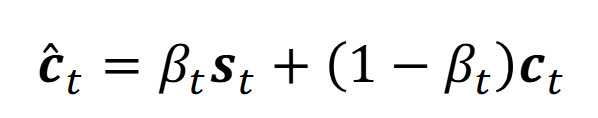

#### 利用图神经网络进行关系型的归纳偏好

Exploring visual relationship for image captioning, ECCV, 2018

提取出的图像区域之间，存在语义和空间关系，能够进一步约束表征。其具体步骤如下：

首先使用 Faster R-CNN 来进行目标定位得到显著目标，然后对显著目标通过分类器进行分类，然后根据检测框的相对位置定义好空间关系：

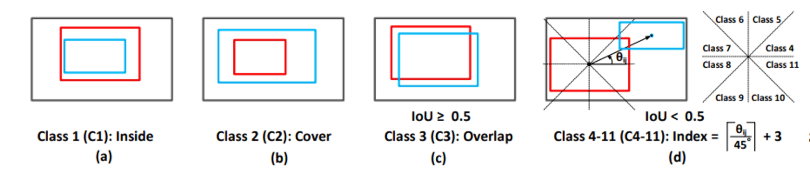

建立一个图神经网络，通过 GCN 将不同的定位区域链接起来。最后后方接 Decoder 来进行文本生成：

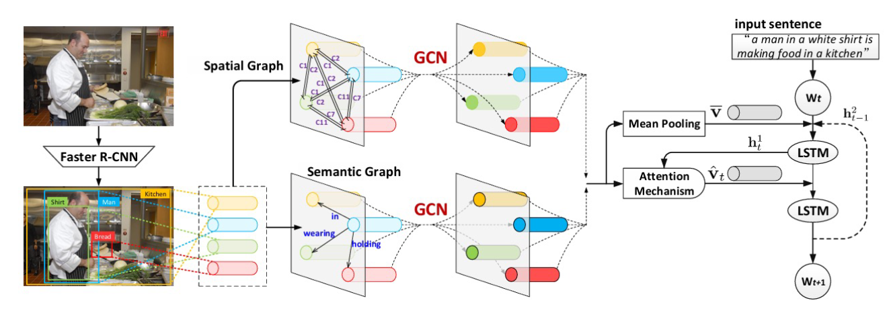

#### 外部记忆增强

引入外部先验知识来辅助图生文。主要思路是在 Transformer 自注意力计算过程中引入持久记忆向量参与计算，作为先验知识。

## 文生图

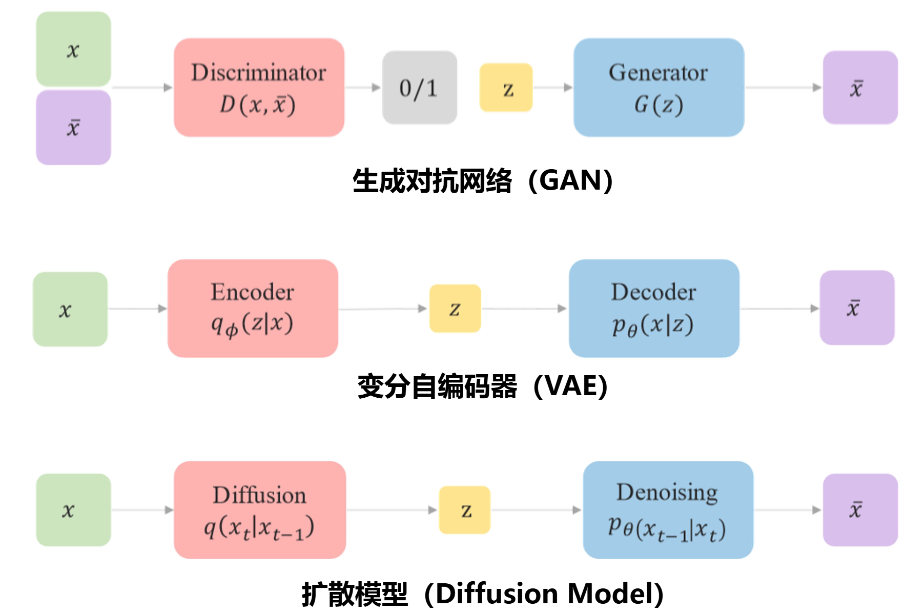

### GAN

GAN 的缺点是存在模式坍塌问题（生成器认为只要能骗过判别器 D 就够了，而不需要覆盖所有真实分布）导致 GAN 的方式生成的图片的**多样性**可能较低；GAN 很难对风格进行精准控制，如笔触或色彩。

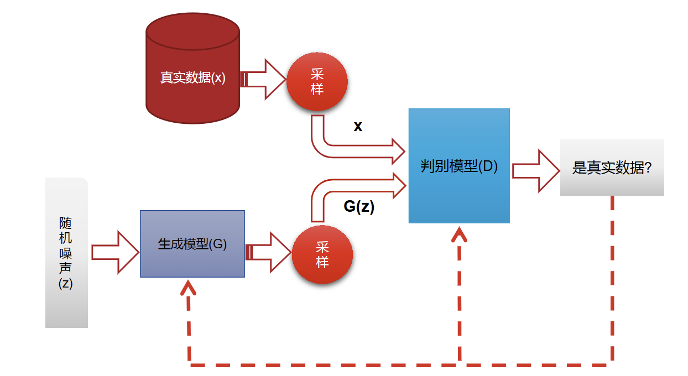

#### 条件 GAN

传统的 GAN 模型使用单类图片训练 GAN，输入随机向量 z 输出此类图片，不能指定某个条件。 条件 GAN 在输入上加入额外的信息如描述文本，生成符合该条件的 GAN。混入的信息将被分别输送给生成模型和判别模型：

1. 在生成模型，通过自然语言处理模型来理解输入中的描述，并通过生成网络输出一个准确的图像，体现文字描述
2. 在判别模型，通过自然语言处理模型来理解输入中的描述，并判断条件信息和给定生成图像的语义是否一致

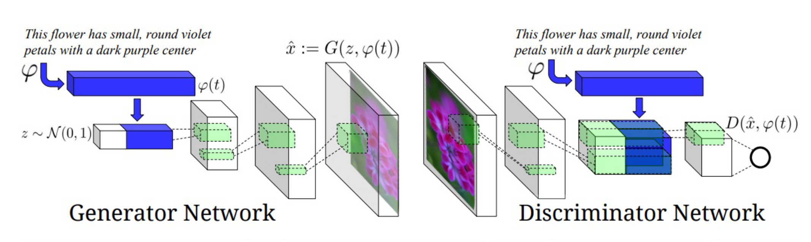

#### Pix2Pix

Pix2Pix 使用成对图片训练 GAN，输入不再是一整类图片+随机向量，而是图片对（经典上使用草图），相当于把随机向量 z 换成草图 z。它解决的问题是如何在有成对数据监督的情况下，学习一种通用的图像到图像（image-to-image）翻译框架：

> 给定一张输入图像 x，学习一个映射 G:x→y，把它转换成另一种视觉形式的图像 y。

#### Cycle-GAN

使用两个整类图片进行训练，不需要成对的样本进行训练了。原理上，它同时学习了两个生成器 + 两个判别器，损失保证A → B → A 要能还原回来。称为 Cycle consistency（循环一致性）。它避免了成对的训练数据样本。

### VQ-VAE

参见 [第二章 VQ-VAE](./2_深度学习常见模型.md/#vq-vae)

### Diffusion Model

扩散模型是文生图主要的模型之一，其稳定性和性能均被证明强于 GAN 网络。扩散模型分为前向加噪和反向生成两个过程，前向加噪是对一个图像逐渐添加高斯噪音直到变成随机噪音，而反向生成就是该过程的逆向去噪过程。

reference: [知乎](https://zhuanlan.zhihu.com/p/563661713)

#### DDPM

无论是前向过程还是反向过程都是一个参数化的马尔可夫链（Markov chain）。对于原始图片 $x_0$，总共包含 T 步的加噪过程：

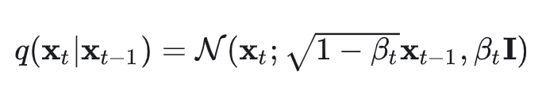

这里的 $\{\beta_t\}_{t=1}^T$ 是每一步所采用的方差，介于 0~1。越往后 timestep 对应的 $\beta$ 值越大，即越往后采用越大的方差，整个扩散过程是一个携带参数的马尔可夫链：

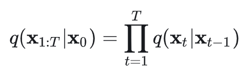

扩散过程在实际使用中并不基于上述的公式来进行新噪声的添加，而是直接从最原始的图像 $x_0$ 直接得到第 $t$ 步的混入噪声的图像，也就是实上是有 $x_t ~ q(x_t | x_0)$。公式推导如下，这里定义 $\alpha_t = 1 - \beta_t$ 和 $\bar{\alpha}_t = \prod_{i=1}^{n}\alpha_i$:

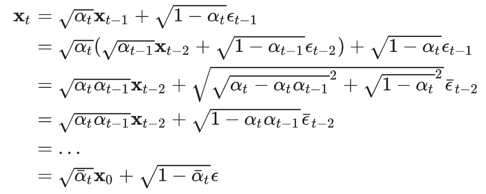

上述推导过程用到了两个方差不同的高斯分布相加等于一个新的高斯分布，对应噪声 $\epsilon$ 。于是我们得到

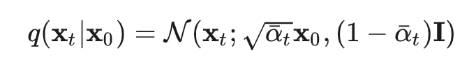

我们可以看到组合系数 $\sqrt{\bar{\alpha}_t}$ 和 $\sqrt{ 1 - \bar{\alpha}_t}$，它们的平方和等于1。

在加噪完后，我们开始分析如何进行去噪过程。我们可以直接通过上述公式从 x_t 直接求解得到 x_0:

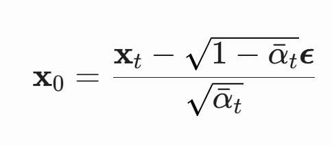

这里的 $\epsilon$ 是所有噪声的混合。我们的目标就是要求解这个噪声，但是直接求解它是不可行的，所以我们还是转而研究每一步如何去噪：

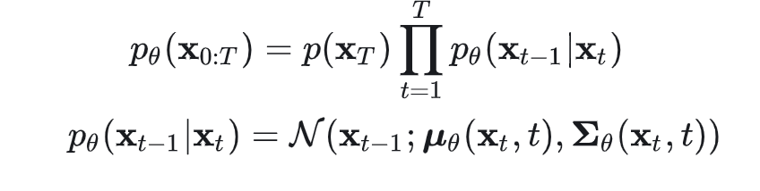

这里 $p(\mathbf{x}_T) = \mathcal{N}(\mathbf{x}_T; \mathbf{0}, \mathbf{I})$，而 $p_\theta(x_{t-1} | x_t)$ 为参数化的高斯分布，它们的均值和方差由训练的网络的参数 $\theta$ 和当前步骤的 $x_t$, $t$ 给出。所以，扩散模型就是要通过神经网络的参数来估算出每一步噪声分布的均值和方差，接下来我们求具体均值 $\mu_\theta(\mathbf{x}_t, t)$ 和方差 $\Sigma_\theta(\mathbf{x}_t, t)$ 的表达式。

由于我们知道：

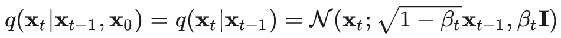

根据贝叶斯公式：

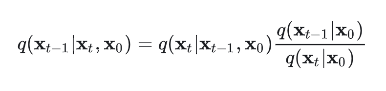

将下面两个式子带入上式：

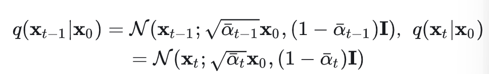

化简后得到：

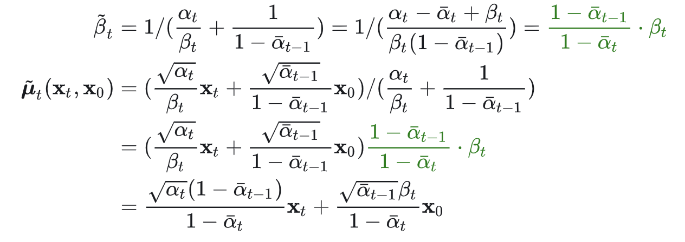

可以看到方差是一个常量，其计算来自于前向扩散每一步的参数，所以我们不再管他，让他直接算出来恒等固定值即可。下面研究均值如何得出。

均值是一个依赖 $x_0$ 和 $x_t$ 的函数。由于 x_0$ 可以用 $x_t$ 来表示（在加噪过程 $x_t$ 用 $x_0$ 直接表示）：

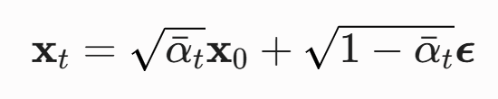

将上式带入均值式子得到：

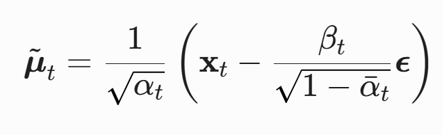

于是我们知道，在这个公式里，$\mathbf{x}_t$ 是当前带噪图像，$\alpha_t$、$\beta_t$、$\bar{\alpha}_t$ 都是固定的常数。唯一的未知量，就是加进去的真实噪声 $\boldsymbol{\epsilon}$。我们的最终目的就是使用神经网络来预测这个噪声 $\boldsymbol{\epsilon}$，让两者尽可能的接近：

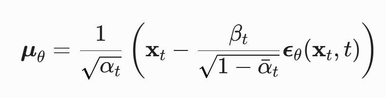

构造损失函数：

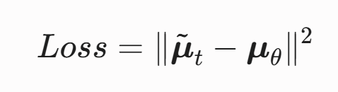

把预测的 $\mu_\theta$ 和真实的 $\mu_t$ 带入，得到：

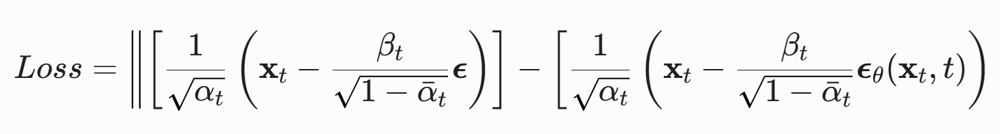

化简后得到：

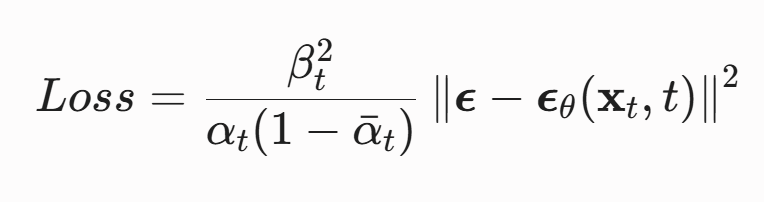

剥离前面的常数后得到：

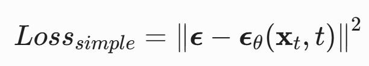

这就是最终的损失了。这里的 $\epsilon_\theta$ 在 DDPM 的实现中采用 U-Net 网络来正向传播得到。

其实在原版的 DDPM 上，损失函数是通过把扩散模型看作是隐变量模型基于变分推断得到的，使用 ELBO（variational lower bound）作为优化目标：

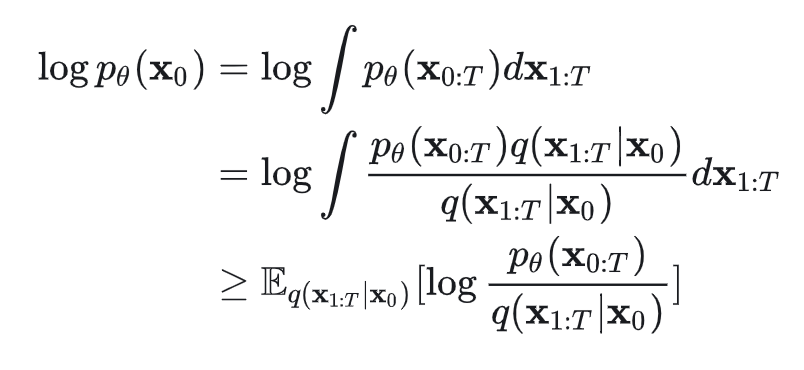

这个式子经过非常复杂的推导，最后得到的损失函数的最终结果仍然和上式 $L_{simple}$ 等价，都是均方误差（MSE）损失。

#### LDM

Latent Diffusion Model (LDM) 是扩散模型（Diffusion Models）的一种高效改进，将加噪和去噪过程放到了低维隐空间（Latent Space）中进行，而非原始像素空间，从而显著降低计算成本。

#### 分类器与无分类引导

最基本的 DDPM 没有基于文字生成的能力，它只有根据训练集所学特征重建新图像的能力（例如训练集全是猫，则它就能把随机噪声图重建为猫）。对于一个通用 DDPM（训练集并非某一类，而是大量图片），其只有随机生成图像的能力，我们需要让其能够根据用户文本来生成指定特征的图像。解决方案有两条思路：

- 分类器（Classifier guidance），早期使用；不需要重新训练 DDPM，而是作为冻结模型使用
- 无分类器指导（Classifier-Free Guidance, CFG）与交叉注意力

##### 分类器原理

根据贝叶斯定理：

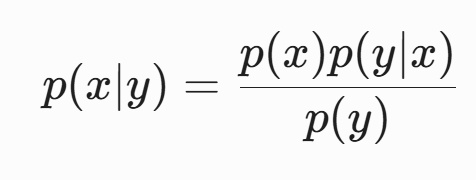

对公式两边同时取对数，然后对 x 求梯度：

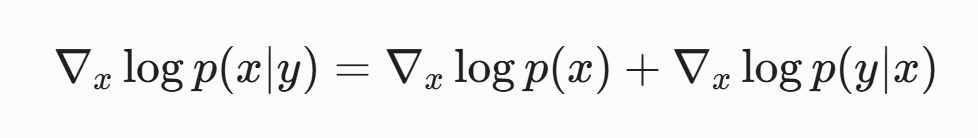

则新的条件指引方向 = U-Net 预测的原本去噪方向 + 分类器预测的分类概率梯度方向。那么我们可以在通用 DDPM 的基础上，训练一个分类器，该分类器每次预测的分类概率梯度方向并加到基础的 DDPM 上。

这种方式的缺点是分类器的训练效果不理想，原因在于对于在初始阶段（图像还大部分都是噪声的情况下），训练一个朝向指定特征的梯度（朝向猫狗）本身就是一件难以预测的事情（我们可以注意到，它本身就是专用 DDPM 所做的事情，这也是无分类器的思想，通过计算专用 DDPM 和通用 DDPM 的差异来替代分类器）。

##### 无分类器

联合训练有条件模型 $\epsilon_\theta(x_t, c)$ 和无条件模型 $\epsilon_\theta(x_t, \phi)$，当需要无条件生成时使用无条件模型，需要有条件时使用有条件模型。随后，计算两者的差值，得到纯粹的、指向目标条件的概念向量，并用超参数 $\omega$ 放大它加到通用向量上，增强条件生成：

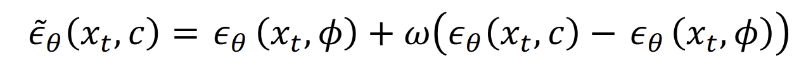

而有条件的模型的生成使用了交叉注意力，它隐藏在了 $\epsilon_\theta(x_t, c)$ 这个公式底部，具体来讲，通过在 U-Net 内部加入交叉注意力层，让模型自己学习处理条件 $c$ 的能力。

#### Stable diffusion

模型结构：

- VAE：使用 LDM 来讲加噪去噪放在隐空间进行，降低计算成本  
- CLIP：负责文本信息编码
- 条件控制模块：在 UNet 的基础上添加了交叉注意力，使用 LDM 的无分类器引导生成
