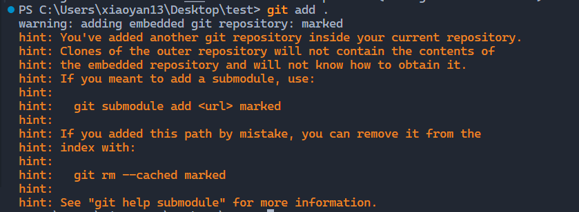
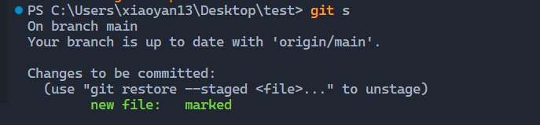
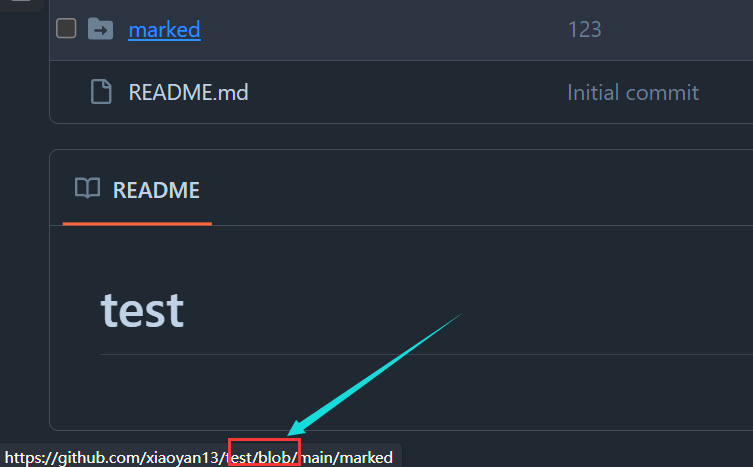
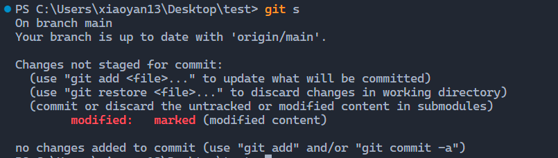
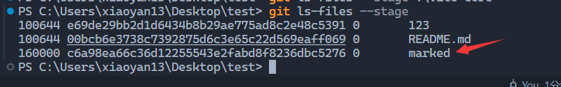

# git submodule 的使用

## 起因

起因是因为我的 js 笔记仓库中，因为学习目的，克隆了一份别人的 github 代码来参考。我直接的把它克隆到了我的笔记目录下，然后我发现，自己的仓库无法正常的进行提交了。

默认情况下，`git` 仓库的子文件夹不能是另一个 `git` 仓库，即含有 `.git` 。如果是， `git` 会就会识别到它，并且创建一个软连接。也就是说，如果我们此时执行一系列正常操作：

```bash
git add .
git s
```




```bash
git c -m "一次正常提交"
git push
```

执行完这些命令，我们打开 github, 查看本次提交的那个文件夹（也就是 clone 下载的源代码），就会发现那个文件夹没有了，取而代之的是它指向了一个不存在的连接（实际上时一个 `blob` 对象，它是 git 底层的一个对象）。



在之后的所有提交中，该文件（夹）的改动都不会被 `add`(也就是说， `git` 对软连接对象添加到暂存区是不支持的，但是它确实是被追踪了)，其他文件不受影响。我们以后执行 `git` 命令，无论是 `add` 还是 `commit`，都会有该文件被 `modified` 但是还是红色的神奇现象：



确实被追踪可以通过 `ls-files` 内置指令来证明，它能展示索引和工作树中文件的信息，如果该文件出现说明就被追踪了：



找到了。该文件确实被 `git` 追踪，只不过它只有第一次 `new` 出来的时候这个新建的软连接被 `add` 到了暂存区，后面的改动（`modify`）都不会被 `add` 了。

这样子的话，我们就没有办法在 github 查到自己克隆的文件夹的内容了，只能看到一个连接，还点不了。

## git submodule

我尝试把这个软连接搞成真实的文件夹，然后了解到了 submodule 这个东西。它能指定目标仓库作为自己的子仓库，而对方是无感的（所有信息都在自己的仓库这里）。

关于它的芝士，这篇文章就够用：

> 参考：
> [腾讯云_关于submodule](https://cloud.tencent.com/developer/article/2136829)

执行如下命令把该软连接变为未追踪：

```bash
git rm --cached projectfolder
```

然后把加入子模块：

```bash
git submodule add url_to_repo projectfolder
```

成功把仓库变成了子仓库，当我兴冲冲的 push 上去的时候，才发现，远程的那个文件夹还是连接，只不过变成了这个样子：


> 参考：[stack overflow](https://stackoverflow.com/questions/12898278/issue-with-adding-common-code-as-git-submodule-already-exists-in-the-index)

