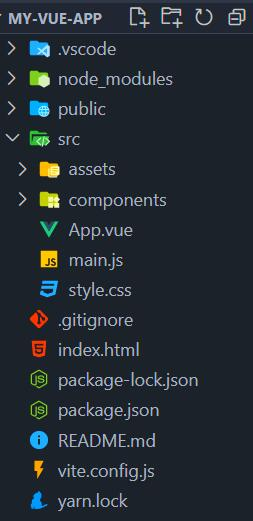

# Vite搭建

[官方文档](https://cn.vitejs.dev/guide/)

## CDN与工程项目

在一般的开发中，大部分都不会用到`CDN`，而是使用`Vue脚手架`进行`SFC`(单文件组件，也就是`.vue`文件)开发，再借助`Vite`等构建工具生成最终的网站代码抛给用户浏览器运行。**打包工具作用，其实就是把诸如`.vue`、`.less`、`.ts`等文件给转换为原生的`css`和`js`**，并最终整合成整个可以在浏览器中运行的网页。

## 打包工具Vite

使用`yarn`：

```bash
yarn create vite
```

也可以通过附加的命令行选项直接指定项目名称和你想要使用的模板。例如，要构建一个`Vite + Vue`项目，运行：

```bash
yarn create vite my-vue-app --template vue
```

### Vite项目的基本文件



- `node_modules`：项目依赖。
- `public`：静态文件
- `src`：写项目的主要地方。
- `index.html`：根`html`。
- `package.json`：node的配置文件。
- `vite.config.js`：打包工具的配置文件。

### Vite对各种文件的支持情况

官网：[功能支持情况](https://cn.vitejs.dev/guide/features.html#css-pre-processors)

- ts：原生支持。
- jsx：`.jsx` 和 `.tsx` 文件同样内置支持。JSX 的转译同样是通过 [esbuild](https://esbuild.github.io/)。
- vue：提供第一优先级支持。

- css：Vite 提供了对 `.scss`, `.sass`, `.less`, `.styl` 和 `.stylus` 文件的内置支持。没有必要为它们安装特定的 Vite 插件，但必须安装相应的预处理器依赖：

```bash
yarn add -D sass
```

## 通过ES模块理解Vite项目结构

使用传统es模块模拟`vue`构建工具中的文件结构：

- 所有组件，包括根组件，其实都是组件，都需要单独建一个`js`文件（也就是对应`vue`文件）
- 最外层的根组件比较特殊，它需要挂在一个`dom`节点上。所以需要多出一个`main.js`来操作这一步骤：`main.js`引入根组件，并根据它创建一个`vueApp`，最后把它挂在目标`dom`上。

`vite`的构建工具和`vue`新文件类型，实际上就是对这种构建进行了“语法糖”的优化，让我们写起来更加流畅。

## 一个细节

`vite`处理`vue`组件的时候会把驼峰命名转换为标准的`html`标签格式。

```html
<MyComponent></MyComponent>
```

和

```html
<my-component></my-component>
```

是**等价**的。

对于组件的属性名也是如此：

```vue
<my-component myId="1"></my-component>
```

和

```vue
<my-component my-id="1"></my-component>
```

是**等价**的。
