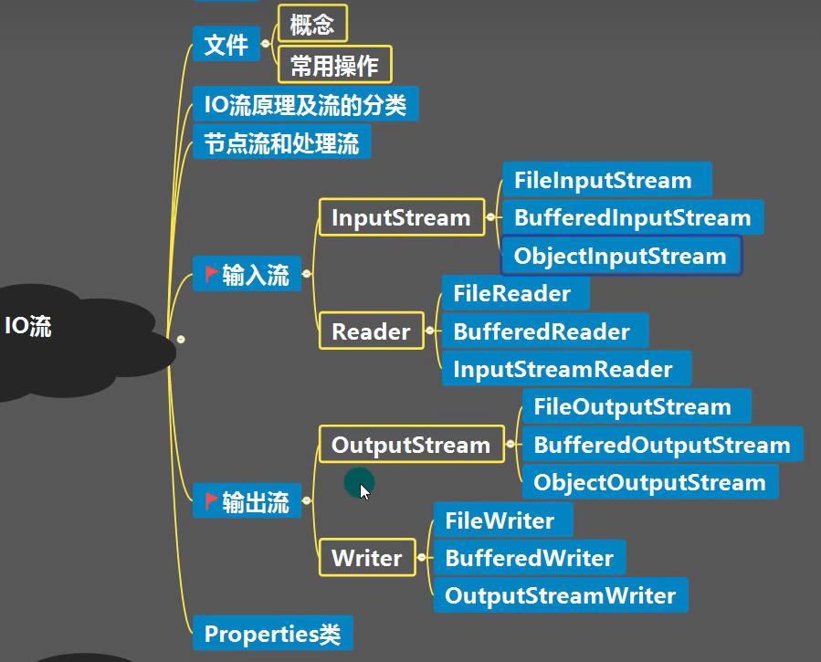
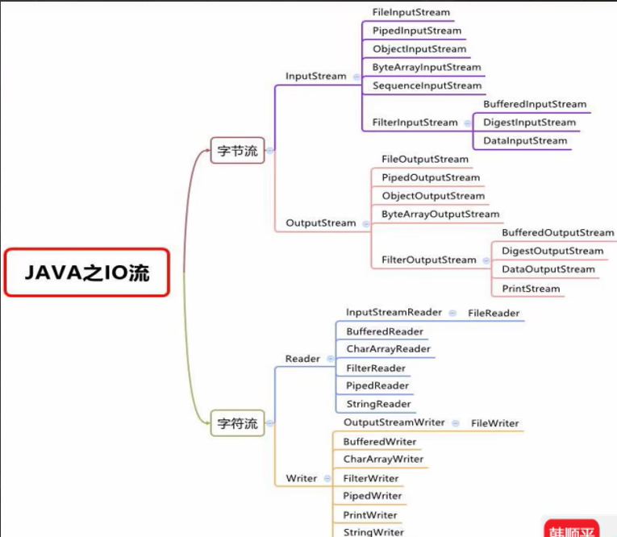
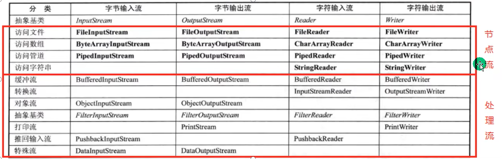

# JAVA IO流基础

## 文件

- 文件是**保存数据的地方**。

- **文件流** ：文件在程序中以流的形式来操作。流是数据在数据源（文件）和程序（内存）之间经历的路径。

  输入流：从文件到程序；输出流：从程序到文件。

- 常用文件操作

  - 创建文件的构造器：

  ```java
  new File(String pathname);//根据一个路径创建File对象
  new File(File parent, String child);//根据父目录文件+子路径构建
  new File(String parent, String child);//根据父目录+子路径构建
  
  new File(...).createNewFile(); ////利用File对象在硬盘中创建相应文件
  ```

  - 获取文件的相关信息

  ```java
  getName, getAbsolutePath, getParent, length, exists, isFile, isDirectory...所见即所得，用到了再查。 
  ```

  - 目录操作和文件的删除

    在java中，目录也被当做文件，所以空目录就是空文件。

  ```java
  boolean mkdir(); //创建一级目录
  boolean mkdirs(); //创建多级目录
  boolean delete(); //删除空目录或者文件。
  ```

## IO流的原理以及流的分类

- I/O流用于处理数据传输，比如读写文件，网络通讯。

- 流的分类

  - 按照数据来分，分为了**字节流**和**字符流**；
  - 按流向分，分为输入流和输出流；
  - 按流的角色不同，分为**节点流**和**处理流/包装流**。

- 关闭流

  流使用之后必须手动关闭。

  - 文件描述符

    > Linux 系统中，把一切都看做是文件（一切皆文件），当进程打开现有文件或创建新文件时，内核向进程返回一个文件描述符。
    >
    > 文件描述符就是内核为了高效管理已被打开的文件所创建的索引，用来指向被打开的文件，所有执行I/O操作的系统调用都会通过文件描述符。
    >
    > 文件描述符、文件、进程间的关系：
    > （1）每个文件描述符会与一个打开的文件相对应；
    > （2）不同的文件描述符也可能指向同一个文件；
    > （3）相同的文件可以被不同的进程打开，也可以在同一个进程被多次打开；

    由于jvm不能管理文件描述符，也就没有办法通过垃圾回收器去回收，所以必须手动关闭！

## 字符流Reader Writer

- 无论是字节流还是字符流，都记得在操作完成后关闭流！
- 字节流比字符流更底层。所以字符流能够处理的东西，字节流一定能处理。

## 节点流和处理流

- 基本介绍：
  - 节点流可以从一个特定的数据源来读写数据，如FileReader，FileWriter等；
  - 处理流（也叫包装流）是连接在已经存在的流之上，为程序提供更加强大的读写功能，如BufferedReader,BufferedWriter等。

- 节点流是底层流，直接和数据源连接。而处理流包装节点流，使用**修饰器设计模式**，不会直接与数据源相连，但包含了与数据源相连的节点流。
- 处理流主要作用：
  - 提高流的性能；
  - 以及通过一些方法来一次输入输出大批量数据，进一步简化操作。

## 对象处理流：序列化和反序列化

1.序列化就是在保存数据的时候保存数据的值和数据类型；

2.反序列化就是在恢复数据的时候得到数据的值和数据的类型。

3.某个对象支持序列化机制，必须让它的类实现两个接口之一：

- `Serializable` 这是一个标记接口，没有方法
- `Externalizable`  
  - Externalizable 接口继承于Serializable，实现该接口，需要重写readExternal和writeExternal方法。
  - 在项目中，大部分的类还是推荐使用Serializable, 有些类可以使用Externalizable接口。

### ObjectOutputStream/ObjectInputStream

- ObjectOutputStream提供 序列化功能，ObjectInputStream提供反序列化功能。
- 通过构造函数可以看到，他俩都是包装类。
- 序列化和反序列化的顺序应当一致。
- 在反序列化对象的时候，一定要拥有待序列化对象所属的类，否则会报错。

#### **序列化UID**

> serialVersionUID适用于Java的序列化机制。简单来说，Java的序列化机制是通过判断类的serialVersionUID来验证版本一致性的。在进行反序列化时，JVM会把传来的字节流中的serialVersionUID与本地相应实体类的serialVersionUID进行比较，如果相同就认为是一致的，可以进行反序列化，否则就会出现序列化版本不一致的异常，即是InvalidCastException。

#### 反序列化的过程

反序列化的过程：

1. 读取二进制文件；
2. 读取序列化的对象，读取过程中虚拟机会在当前工程当中寻找序列化的目标类(反序列化类)：
   - 如果没找到报ClassNotFoundException；
   - 如果找到了目标类(立即加载该类)，但是反序列化类的ID和序列化类的ID不同，则报InvalidClassException；
   - 如果类全限定名相同，且序列化ID相同，则对象读取成功，默认为Object类型
3. 找到合适的类(全限定名相同，且序列化ID相同)，然后进行强转
   - 此强转在代码中由开发人员显式写明；
   - 如果强转类，和虚拟机找到的类在语法上不一致，则报ClassCastException

## 转换流

1.InputStreamReader：Reader的子类，可以将InputStream（字节流）包装成Reader（字符流）

2.OutputStreamWriter：Writer的子类，实现OutputStream（字节流）包装成Writer（字符流）

3.当处理纯文本数据的时候，使用字符流的效率更高，并且可以有效解决中文乱码，所以建议使用将字节流转换成指定编码格式（比如utf-8,gbk）的字符流进行处理。

## 打印流

1.PrintStream 输出打印流

2.PrintWriter 输入打印流

## Properties类

1.这是一个专门用于读配置文件的集合类；

2.Properties是Hashtable的一个子类，本质上它就是一个用于处理数据的哈希表。

## 总览图



