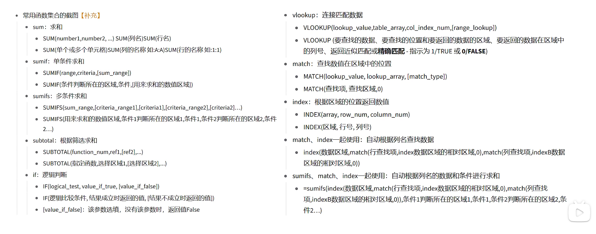

# excel

拿到Excel 第一步要做的就是数据备份！

表头和字段 工作簿和工作表 右下角有数据量级

数据透视表的使用和字段添加功能，出现字段名重复前面加空格解决（y = x，所以重复了）。

数据透视表的切片器和自带的筛选功能的区别

数据透视图的插入。

excel八大函数的使用
1 excel敲 = 方向键+tab键来选择函数
2 sum求和函数：=sum(，可以用逗号选中多个块型区域求和
3 sumif函数：三个参数，第一个是判断的属性列，第二个是属性的具体范围（哪些行），第三个是待筛选的属性。
4 十字准星拖动技巧：对于函数，加$符号可以锁定行列。对于普通的表格，十字准星可以批量填充数据。
5 sumifs函数：多条件求和函数，和单条件相反，它先列出待筛选的属性。
6 sum和subtotal的区别：后者可以根据筛选模式自动的变换总和，前者比较死板。
7 vlookup( 要查找的数据，要查找的位置和要返回的数据的区域，要返回的数据在区域中的列号，返回近似匹配或者精确匹配-指定为1/0)
8 vlookup的查找区域中，待查找数据一定在第一列。查找区域最好锁定，避免自动填充的时候数据偏移。
9 vlookup的模糊匹配和精确匹配的区别： 前者在查找数据的时候，在查找的列进行模糊匹配（找到最相近的数据）。

技巧：
1 冻结窗口与取消冻结可以固定某一行或者列
2 函数的参数用逗号隔开，可以是用双引号括起来的中文。对于比较运算符和通配符*和占位符？，也需要用双引号括起来然后加上 &。
3 环比=（本期数 - 上期数）/上期数 = 本期数 /上期数 - 1
   同比=（本期数 - 同期数）/同期数 = 本期数 /上期数 - 1
4 按Esc可以退出编辑模式。
5 excel的函数本质和数学点函数一模一样，只是换成了表格。
