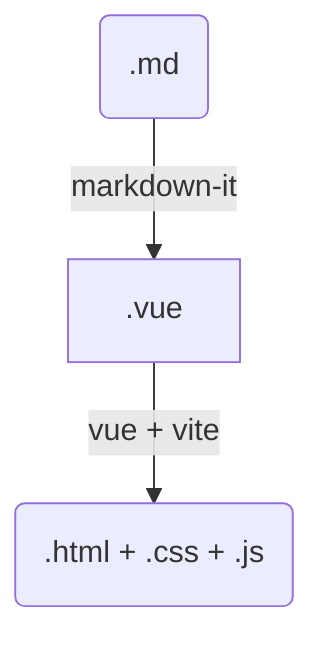

# 迁移过程

## 起步

- 在 github 上面先创建一个仓库;
- 本地桌面新建一个文件夹, 并将它初始化为一个仓库, 和远程关联

```bash
git init .
git remote add origin https://github.com/xiaoyan13/personal.git
```

- 初始化仓库为 js 仓库, 新建一些必要文件:

```bash
npm init -y
touch README.md
touch .gitignore
```

- 给gitignore写一些初始配置(抄的之前vuepress的:

```bash
# VitePress files
docs/.vitepress/.temp/
docs/.vitepress/.cache/
docs/.vitepress/dist/

# Dist files
dist/
lib/

# Node modules
node_modules/

# Log files
*.log
```

- 构建项目为 vitepress:

```bash
npm add -D vitepress
npx vitepress init
```

这里建议搭建在子目录 (`./docs`) 中，表示用这个目录用于装所有的 `md` ，以便它与其余代码部分分开。(个人强迫症导致的。也可以参考 `vitepress`  的[建议](https://vitepress.dev/zh/guide/getting-started#file-structure)。

- 进行一次推送

  小插曲:这里推送的时候发现本地分支的名字是`master`而不是`main`,导致本地和github的主分支的名字都变成`master`了.我尝试执行了下面的指令

  ```bash
  git branch -M main # 将本地的分支名字改成了 `main` 
  git push --set-upstream origin main # 然后 push 到远程, 相当于自动创建了一个远程分支 main
  ```

  然后上 github, 在仓库 `settings` 把默认分支改为 `main`,然后把 `master` 删掉即可. 使用命令验证是否正常链接远程分支:

  ```
  git fetch

## 旧文档的处理

  迁移的契机是看到了[大佬的网站](https://nolebase.ayaka.io/)。这个网站使用 `vitepress` 将自己在 [`Obsidian`](https://obsidian.md) （一个 `markdown` 编辑器）上面的文档部署到网络。作者貌似是该编辑器的中毒（重度）用户，不满足 `obsidian Publish`（一个将用户 `md` 文档部署到网络的服务）不支持 [`Obsidian`](https://obsidian.md/) 自带的插件功能，就创建了 [Nólëbase 集成](https://github.com/nolebase/integrations) 来尝试提供一些常见的 [`Obsidian`](https://obsidian.md/) 插件在 [`VitePress`](https://vitepress.dev/) 的环境下的替代方案（还有这等好事，直接白嫖）。

  但是这并不是我想迁移的最根本理由。我惯用的编辑器是异常简洁的 [`typora`](https://typora.io)，虽然它没有像 [`Obsidian`](https://obsidian.md/) 那样丰富的插件生态，但是最基本和最通用的 `md` 和 `html` 的语法已经足够我去用了。我认为，`md` 文档是一种类似于笔记的存在，花里胡哨的插件和各种样式，已经背离了它的设计初衷：易读，而且更重要的，要**易写**。如果真的要在万维网展示更加定制化的网页，倒不如直接新建一个 `vue` 文件夹来的实在。`vitepress` 甚至支持使用 `vue` 的组件，但是我感觉，如果真的要记笔记给自己看的话，没有多少人会使用它，而是默默点开自己的 `markdown` 编辑器...

### 迁移目的

- 旧文档并没有规范的 `md` 语法检查。这导致自己的文档虽然能够正常被渲染成网页，但是并不规范，增加了出错的可能性（虽然现在看起来没什么问题，大抵是由于 `typora` 的自动修复）。我希望在新的文档库中引入语法检查。
- 可以使用插件和 `css` 来美化页面，增加阅读体验，这方面 `vitepress` 一定会比 `vuepress` 更多更好。

- `vitepress` 自身的优点，比如作为 `vuepress` 的替代品，是下一代 [`SSG`](https://cn.vuejs.org/guide/extras/ways-of-using-vue.html#jamstack-ssg) 解决方案；`vitepress` 可以用来写长久性的公示文档（当然 `vuepress` 也可以）。

### md 文档规范

- 首先阅读 [commonMark 规范](https://commonmark.org/), 以了解 Markdown 的历史。
- `vitepress` 构建过程大体是这样的：



大体上，`.md` 文件会被 [`markdown-it`](https://www.npmjs.com/package/markdown-it) 解析，解析后的代码被视为一个个 `vue` 组件处理，最后变为一个网页。

`.md` 文件的语法检查的相关插件是 [`markdownlint`](https://github.com/DavidAnson/markdownlint). [这里](https://github.com/DavidAnson/markdownlint-cli2?tab=readme-ov-file#overview)有相关的介绍。遵循规范，`.md` 就可以被 [`markdown-it`](https://www.npmjs.com/package/markdown-it) 正确的解析。

### 处理旧文档

使用 `markdownlint-cli2`：

```bash
npm install markdownlint-cli2 --global
cd old_documents/docs
markdownlint-cli2 --fixed "**/*.md" "#node_modules/"
```

处理时间取决于文件数量和内容多少。处理后，剩下的就是 [`markdownlint-cli2`](https://github.com/DavidAnson/markdownlint-cli2) 无法修复的错误或者警告了。它们需要手动一个个处理。

打开 `vscode`，安装插件 [`markdownlint`](https://marketplace.visualstudio.com/items?itemName=DavidAnson.vscode-markdownlint)。它将自动对 `md` 文件进行语法检查，把整个文件夹丢给 `vscode`，按 `ctrl+shift+P` 输入 `markdownlint.lintWorkspace`，回车执行，他将把工作目录的文件都语法检查一遍（可以通过配置项指定包含或者去除哪些目录，具体配置见官网）。我大概扫出来几百个问题，看起来很多，但由于 `md` 语法很简单，`vscode` 还带自动修正，十分钟不到就点完了。

最后按 `ctrl+shift+M` 查看问题。创建一个 `.markdownlint-cli2.json` 配置文件（而非`.markdownlint.json`，它们有一些区别），它将对 `markdownlint` 的命令行 `markdownlint-cli2` 和 vscode 插件语法检查起效果：

```json
{
    "config": {
        "default": true,
        "MD003": { "style": "atx_closed" }
    },
    "ignores": [
        "!node_modules/",
        "!.git/"
    ]
}
```

新增自己的配置，忽略掉一些自己认为不必要的警告。（忽略前请查看相关警告的文档以确定它是不必要的。尽量不要禁用，但可以修改风格之类的选项）。

将处理后的文档审阅、分类，丢到新的仓库的 `/docs` 中。运行新的仓库：

```bash
npm run docs:dev
```

## 生成路由

`vitepress` 和 `vuepress` 一样，都是遵循 **“约定优于配置”** 的原则，说白了就是根据目录结构来生成对应路由。写了一个简陋的`js`，能够扫描当前的代码目录，自动生成侧边栏。后期需要改进，为每个 `url` 页面都生成一个对应的路由：

```js
import fs from 'fs'
import path from 'path';
import { fileURLToPath } from 'url';

// 获取 sidebar 数组。
// sidebar 是一个数组，里面有两种对象：
// md 文件，{ text: string, link: string }
// 另一个目录， { text: string, items: [] }

// 获取目标目录的路径
const __filename = fileURLToPath(import.meta.url);
const __dirname = path.dirname(__filename);
const dir = path.join(__dirname, '../docs/笔记/');

// console.log(dir)

async function getRes(now, url = '/笔记/', nowDir = dir) {
    const files = await fs.promises.readdir(nowDir);
    for (const file of files) {
        const filePath = path.join(nowDir, file);

        let fileName = path.basename(filePath);
        const isDirectory = fs.lstatSync(filePath).isDirectory();
        // 如果是目录，则递归遍历该目录
        if (isDirectory) {
            if (fileName === 'black-box' || fileName === 'images') continue;
            now.push({
                text: fileName,
                collapsed: true,
                items: await getRes([], url + fileName + '/', nowDir + fileName + '/')
            })
        } else {
            // 如果是文件
            fileName = fileName.slice(0, fileName.length - 3);
            if (fileName === 'index') continue;
            now.push({
                text: fileName,
                link: url + fileName,
            });
        }
    }
    return now;
}

const res = await getRes([]);
const target = __dirname + '/test.json';


await fs.promises.writeFile(
    target, JSON.stringify(res, null, 2),
    { flag: 'w', encoding: 'utf-8' }
);

console.log('sideBar 生成完毕')
```

