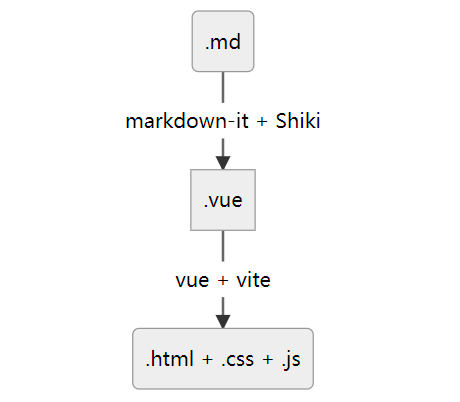

# 迁移过程

## 起步

- 在 github 上创建一个仓库;
- 本地桌面新建一个文件夹, 并将它初始化为一个仓库, 和远程关联:

```bash
git init .
git remote add origin https://github.com/xiaoyan13/personal.git
```

- 初始化仓库为 js 仓库, 新建一些必要文件:

```bash
npm init -y
touch README.md
touch .gitignore
```

- 给 `gitignore` 写一些初始配置(抄的之前 vuepress 的):

```bash
# VitePress files
docs/.vitepress/.temp/
docs/.vitepress/.cache/
docs/.vitepress/dist/

# Dist files
dist/
lib/

# Node modules
node_modules/

# Log files
*.log
```

- 构建项目为 vitepress:

```bash
npm add -D vitepress
npx vitepress init
```

这里建议搭建在子目录 (`./docs`) 中，表示用这个目录用于装所有的 `md` ，以便它与其余代码部分分开。(个人强迫症导致的。也可以参考 `vitepress`  的[建议](https://vitepress.dev/zh/guide/getting-started#file-structure)。

- 进行一次推送

  小插曲:这里推送的时候发现本地分支的名字是`master`而不是`main`,导致本地和github的主分支的名字都变成`master`了.我尝试执行了下面的指令

  ```bash
  git branch -M main # 将本地的分支名字改成了 `main` 
  git push --set-upstream origin main # 然后 push 到远程, 相当于自动创建了一个远程分支 main
  ```

  然后上 github, 在仓库 `settings` 把默认分支改为 `main`,然后把 `master` 删掉即可. 使用命令验证是否正常链接远程分支:

  ```bash
  git fetch
  ```

## 旧文档的处理

  迁移的契机是看到[大佬的网站](https://nolebase.ayaka.io/)。这个网站使用 `vitepress` 将自己在 [`Obsidian`](https://obsidian.md) （一个 `markdown` 编辑器）上面的文档部署到网络。作者貌似是该编辑器的中毒（重度）用户，不满足 `obsidian Publish`（一个将用户 `md` 文档部署到网络的服务）不支持 [`Obsidian`](https://obsidian.md/) 自带的插件功能，就创建了 [Nólëbase 集成](https://github.com/nolebase/integrations) 来尝试提供一些常见的 [`Obsidian`](https://obsidian.md/) 插件在 [`VitePress`](https://vitepress.dev/) 的环境下的替代方案（还有这等好事，直接白嫖）。

  但是这并不是我想迁移的理由。我惯用的编辑器是异常简洁的 [`typora`](https://typora.io)，虽然它没有像 [`Obsidian`](https://obsidian.md/) 那样丰富的插件生态，但是最基本和最通用的 `md` 和 `html` 的语法已经足够我去用了。

  我认为，`md` 文档是一种类似于笔记的存在，花里胡哨的插件和各种样式，已经背离了它的设计初衷：易读，而且更重要的，要**易写**。如果真的要在万维网展示更加定制化的网页，倒不如直接新建一个 `vue` 文件夹来的实在。`vitepress` 甚至支持使用 `vue` 的组件，但是我感觉，如果真的要记笔记给自己看的话，没有多少人会使用它，而是默默点开自己的 `markdown` 编辑器...

### 迁移目的

- 旧文档并没有规范的 `md` 语法检查。这导致自己的文档虽然能够正常被渲染成网页，但是并不规范，增加了出错的可能性（虽然现在看起来没什么问题，大抵是由于 `typora` 的自动修复）。我希望在新的文档库中引入语法检查。
- 可以使用插件和 `css` 来美化页面，增加阅读体验，这方面 `vitepress` 一定会比 `vuepress` 更多更好。

- `vitepress` 自身的优点，比如作为 `vuepress` 的替代品，是下一代 [`SSG`](https://cn.vuejs.org/guide/extras/ways-of-using-vue.html#jamstack-ssg) 解决方案；`vitepress` 可以用来写长久性的公示文档（当然 `vuepress` 也可以）。

### md 文档规范

- 首先阅读 [commonMark 规范](https://commonmark.org/), 以了解 Markdown 的历史。
- `vitepress` 构建过程大体是这样的：



大体上，`.md` 文件会被 [`markdown-it`](https://www.npmjs.com/package/markdown-it) 解析，解析后的代码被视为一个个 `vue` 组件处理，最后变为一个网页。

`.md` 文件的语法检查的相关插件是 [`markdownlint`](https://github.com/DavidAnson/markdownlint). [这里](https://github.com/DavidAnson/markdownlint-cli2?tab=readme-ov-file#overview)有相关的介绍。遵循规范，`.md` 就可以被 [`markdown-it`](https://www.npmjs.com/package/markdown-it) 正确的解析。

### 处理旧文档

使用 `markdownlint-cli2`：

```bash
npm install markdownlint-cli2 --global
cd old_documents/docs
markdownlint-cli2 --fixed "**/*.md" "#node_modules/"
```

处理时间取决于文件数量和内容多少。处理后，剩下的就是 [`markdownlint-cli2`](https://github.com/DavidAnson/markdownlint-cli2) 无法修复的错误或者警告了。它们需要手动一个个处理。

打开 `vscode`，安装插件 [`markdownlint`](https://marketplace.visualstudio.com/items?itemName=DavidAnson.vscode-markdownlint)。它将自动对 `md` 文件进行语法检查，把整个文件夹丢给 `vscode`，按 `ctrl+shift+P` 输入 `markdownlint.lintWorkspace`，回车执行，他将把工作目录的文件都语法检查一遍（可以通过配置项指定包含或者去除哪些目录，具体配置见官网）。我大概扫出来几百个问题，看起来很多，但由于 `md` 语法很简单，`vscode` 还带自动修正，十分钟不到就点完了。

最后按 `ctrl+shift+M` 查看问题。创建一个 `.markdownlint-cli2.jsonc` 配置文件（而非`.markdownlint-cli2.json`，它们有一些区别），它将对 `markdownlint` 的命令行 `markdownlint-cli2` 和 vscode 插件语法检查同时起效果：

```jsonc
{
    "config": {
        "default": true,
        "MD028": false,
        "MD036": false,
        "MD013": false
    },
    "ignores": [
        "!node_modules/",
        "!.git/"
    ]
}
```

新增自己的配置，忽略掉一些自己认为不必要的警告。（忽略前请查看相关警告的文档以确定它是不必要的。尽量不要禁用，但可以修改风格之类的选项）。

将处理后的文档审阅、分类，丢到新的仓库的 `/docs` 中。运行新的仓库：

```bash
npm run docs:dev
```

## 生成路由

`vitepress` 和 `vuepress` 一样，都是遵循 **“约定优于配置”** 的原则，说白了就是根据目录结构来生成对应路由。写了一个简陋的 js 代码，能够扫描当前的代码目录，自动生成侧边栏。后期需要改进，为每个 `url` 页面都生成一个对应的路由。

这里面有个优化构建速度的小技巧，就是对每层目录都进行异步迭代，而对每个目录项进行同步递归（说的抽象，看代码）：

```js
import fs from 'fs'
import path from 'path';
import { fileURLToPath } from 'url';

// 获取 sidebar 数组。
// sidebar 是一个数组，里面有两种对象：
// md 文件，{ text: string, link: string }
// 另一个能够构建合法路由的目录，用 { text: string, items: [] } 表示；

// 获取当前目录的路径
const __filename = fileURLToPath(import.meta.url);
const __dirname = path.dirname(__filename);
const dir = path.join(__dirname, '../docs/笔记/');

// console.log(dir)

// now: 现在构建的目录数组 []
// url：对应的 url 路由
// nowDir：对应的实际本地路径
async function getRes(now, url = '/笔记/', nowDir = dir) {
    const files = await fs.promises.readdir(nowDir);
    let directorys = [];
    for (const file of files) {
        const filePath = path.join(nowDir, file);

        let fileName = path.basename(filePath);
        const isDirectory = fs.lstatSync(filePath).isDirectory();
        // 如果是能够构建路由的目录，则收集到数组中，稍后再 push
        if (isDirectory) {
            if (fileName === 'black-box' || fileName === 'images') continue;
            directorys.push(fileName);
        } else {
            // 如果是文件，则直接 push 
            fileName = fileName.slice(0, fileName.length - 3);
            if (fileName === 'index') continue;
            now.push({
                text: fileName,
                link: url + fileName,
            });
        }
    }

    // 异步迭代
    const task = directorys.map(async (directoryName) => {
        now.push({
            text: directoryName,
            collapsed: true,
            // 同步递归
            items: await getRes([], url + directoryName + '/', nowDir + directoryName + '/')
        })
    })
    // 等待本层所有子项构建完成
    await Promise.all(task);
    return now;
}

const res = await getRes([]);
// console.log(__dirname)
const target = __dirname + '/test.json';


await fs.promises.writeFile(
    target, JSON.stringify(res, null, 2),
    { flag: 'w', encoding: 'utf-8' }
);
console.log('sideBar 生成完毕')
```

- 小插曲：

  我发现目录项也可以加 `link` 属性：官方文档并没有提到，但也并没有这么用。我猜测，`link` 属性并不是文件对象所独有的，而是在构建过程中判断是否含有 `link` 属性来加的。我尝试给某个目录加上 `link`，结果生效了。

## 插件

即使使用原生 Markdown，[`markdown-it`](https://github.com/markdown-it/markdown-it) 依然支持插入扩展语法。这里就给代码块换了点高亮：

```js
  // .vitepress/config.mjs
  markdown: {
    // 代码块的主题 参考 https://shiki-zh-docs.vercel.app/themes
    theme: {
      light: 'github-light',
      dark: 'one-dark-pro',
    },
    config: (md) => {
        // 没有配置
    }
  }
```

## 自动化部署

修改 `package.json` ：

```json
  "scripts": {
    "update": "node ./scripts/getChilds.mjs",
    "docs:dev": "npm run update && vitepress dev docs",
    "docs:build": "npm run update && vitepress build docs",
  },
```

新建 `.github/workflows/` 目录，在其中创建一个 `yaml` 并写入：

```yaml
name: 构建并部署到 Netlify

on:
  push:
    branches:
      - 'main'

env:
  STORE_PATH: ''

concurrency:
  group: ${{ github.ref }}
  cancel-in-progress: true
  
jobs:
  build:
    name: 构建
    runs-on: ubuntu-22.04
    environment:
      name: 正式 Production
    steps:
      - name: 签出代码
        uses: actions/checkout@v4

      - name: 安装 Node.js 21.x
        uses: actions/setup-node@v4
        with:
          node-version: 21.x

      - name: 安装依赖
        run: npm i --frozen-lockfile

      - name: 构建
        run: npm run docs:build

      - name: 安装 Netlify CLI
        run: npm install -g netlify-cli

      - name: 推送到 Netlify
        timeout-minutes: 10
        run: netlify deploy --dir docs/.vitepress/dist --prod
        env:
          NETLIFY_AUTH_TOKEN: ${{ secrets.NETLIFY_AUTH_TOKEN }}
          NETLIFY_SITE_ID: ${{ secrets.NETLIFY_SITE_ID }}
```

在 [`netlify`](https://app.netlify.com/) 注册，新建一个新的 `site`。生成个人的 [`access token`](https://app.netlify.com/user/applications) 和网站的 `ID`。然后将这两个东西作为仓库的 `secret` 添加到 `github` 上。具体可以参考[这篇文章](https://juejin.cn/post/6844904135838400526)（大同小异）。

运行 `npm run docs:build`， 生成 `dist` 目录。

运行 `git push`，进行第一次的 `github action`，不断调试、修改工作流钩子直到 `push` 触发的工作流正常运行。这样，每次 `push` 之后，我们的网站就会被 `github` 自动的部署到 `netlify` 上。

## 尾声 & 下一步

到现在的，基本上已经迁移完毕。剩下的事情，可以美化一下网站、给网站整一个自己的域名、有必要的话还可以上 CDN（不过我测试`netlify` 在国内的访问速度还是很快的，感觉没必要）。

