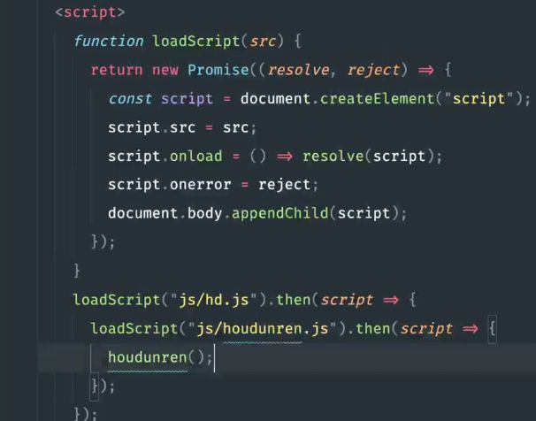

# 异步基础

## setTimeout的时候发生了什么

（知识点：主线程，宿主环境，异步队列（宏任务））

## 产生阻塞

最常见的情况是调用某个函数产生了阻塞：

```js
function A() {
  for (int i = 0; i < 100000000000; i++);
  return 1;
}

let a = A();
```

这看起来很傻，但是如果一个函数的计算量非常大，不能第一时间产生结果，那么代码就是造成阻塞，用户体验上就是卡死。

实际上，这种情况是很少的，js的效率虽然比不上C++，但绝不慢。所以，除非故意为之，或者写出了死循环之类的错误代码，很少会发生阻塞。

阻塞对于正常代码来讲一般发生在请求中。当js代码去调用宿主环境的API，让它去某个网址中请求一段数据，就产生了问题：可能这个网址的响应速度非常慢，js不得不等待其返回结果后才继续顺序执行代码：这和上面的上亿次for循环不同，这里的js引擎什么都没有做，它只是在等待它的宿主环境返回结果后才继续运行——这就浪费了很多CPU时间。

为了充分的压榨CPU，异步产生了，它可以在js处理请求的时候“分心”，效果上就等价于在等待请求的时候去处理其他事务。

异步是通过循环队列实现的。当遇到异步操作的时候，js会在异步操作完成后把回调加到一个异步队列中。它被称为供任务队列。一旦主线程中没有任务了，js就去看这个异步队列中的回调，并依次执行，直到队列变为空。

## 并发和并行

并行是指多线程，js不能实现并行，因为它被设计为**单线程的语言**。

但js可以实现并发。并发就是指js充分的利用CPU时间，一刻不停的压榨CPU，以达到在效果上看起来很像“能够同时处理多个事务”。即使是这样，js也还是无法在效率上和C++等多线程语言相比的，毕竟人家可以同时调度多核，而js只能压榨单核——但这已经非常够用了。

单线程的优点也是有的，因为多线程内部是及其复杂的，学习成本很大。这也是为什么不需要深入了解js就可以去用它实现各种东西的原因。

## 回调：异步的最初形式

### 为什么需要回调：函数的本质

```js
var data = ajax( "http://some.url.1" );

console.log( data ); //undefined，因为ajax还在运行
```

这就是理由：对于ajax的异步操作，并不能立即的得到结果，所以data的输出是undefined。

**对于有延迟的函数动作，不能直接让其返回一个值**。这种做法对于同步的js（即，阻塞过程中什么都不做）会阻塞运行；对于实现了异步的js（即采用了异步队列，在阻塞过程中继续运行主代码）则只会得到undefined。

直观的解决方法是让ajax在执行完之后**再产生一个动作**，用它来对结果进行处理。所以我们传进去一个函数，让ajax在请求完毕后去调用，这个函数的参数就是我们想要的结果，并且这个函数内部实现我们对结果的处理（也可以直接在这个函数内部不做任何处理的返回结果）。

这被称为回调，即把一个函数作为参数传递，希望在对方的函数代码中调用自己的函数，以达到一些目的。例如获取远程图片的函数，我们调用它，传进去一个函数，函数的参数就是需要的结果，而函数体是把获取到的图片挂载到dom树上。

异步的实现在代码层面最初写起来是回调的形式。这是最通用的形式，可以在大部分不复杂的场景下使用。

### javaScript中异步的基础：携带上下文

通过回调函数，可以携带当前上下文到陌生代码中执行任务，并携带结果最终回到该上下文（也就是执行回调函数）。

## 嵌套的不合理性

我们想要在执行a产生结果之后再执行b，而a和b都是异步任务，这就需要我们把b任务放在a的异步回调中，来保证b一定在a后面执行。这就意味着回调中嵌套了另一个函数。这是不合理的，代码耦合了。a任务本就应该只负责a，而不应该在里面调用b，即使只是在代码片段的最后调用。我们想要实现“a产生结果之后再执行b"的语义，所以就把b的代码放在了a代码中..

另外，我们可能想要c在b之后执行，于是我们继续嵌套....嵌套层数就会非常深。我们想要避免嵌套。

所以，我们迫切需要一个第三方来管理异步任务，由它来监视全局，依次的调用a得到结果，然后调用b，最后是c,d...确保b调用在a调用之后发生，而不用把b放在a的回调函数中。promise就是为这而诞生的。

## Promise对象

promise本身只是一个外壳，用于管理一组异步操作链（一系列需要先后发生的异步操作）。

一个promise对象接收一个函数A作为参数。该函数A内部指明了异步操作。这个函数需要一个回调函数B作为参数。当promise对象被创建的时候，它调用函数A，并把自己的resolve函数作为参数传递进去。

### then

then默认返回一个promise外壳。then也里可以new新的promise，return和不return它的语义是不一样的：

return类似新的promise取代了原先的promise

不return则表示新建一个promise链，而且不再管它，让它(宿主环境)自己走,走完后把回调加到微任务中。

这改变了这次then返回的结果取决于谁，如果只是new一个promise则执行它，是不会改变本次then的结果的，而且是同步状态，直接new一个promise就不再管他了。但是return就不一样了，本次then的结果会变成它。可以参考xj的loadscript用promise封装一节。一般都return，而不是嵌套多个promise——为了避免回调地狱：



在promise中抛出错误或者调用reject都会把状态标记为failed然后把结果传给下一个then。

promise对象在处理异步过程中(也就是那个有resolve和reject参数的回调）产生了错误，就会结束并调用reject，它返回一个promise，调用.then并使用对应的reject函数：如果没有提供，则会直接返回promise，重复上述调用reject函数过程，直到结束。

promise本身全都是同步的，只是它用于管理异步操作，即那个有resolve和reject参数的回调中的操作，这也就解释了为什么then中没有resolve和reject一说，它本身就是用于一次异步promise的收尾，接受是不是成功的两种信号，成功就将调用resolve，不成功就调用reject

### reject

reject用于记录异常。reject后promise的状态会变成failed，如果到最后这个fail状态也没有被处理掉，那么就会抛出异常。

### finally

finally也用于一次异步promise的收尾，不过它的更特殊，它用于最后一次promise操作的收尾，它后面不能.then了

## 异步和异常

### 特性：异步请求中不能抛异常

这是因为其执行代码环境不在当前上下文，在外部。由此可见，异步操作中不可以抛出异常。

### catch异常处理

catch一般放在promise的最后，用于捕获异常。

### then中使用Promise.reject进行异常抛出

我们在拿到数据后进行resolve的处理，但是在处理的时候发生了错误，这个时候有两种方法，最简单粗暴的就是抛出一个错误，这个错误会被Promise对象捕获到并且向后传递寻求then的reject或者catch来解决；另一种方式就是直接返回一个promise，不过它的状态是failed。

```js
return Promise.reject("...");
```

Promise.reject和Promise.resolve都可以接收任意值并他们封装为一个看起来是“已经执行过异步操作并且产生了结果”的promise外壳。

如果这个值是一个 promise，那么将返回这个 promise；如果这个值是 thenable（即带有 [`then`](https://developer.mozilla.org/zh-CN/docs/Web/JavaScript/Reference/Global_Objects/Promise/then) 方法），返回的 promise 会“跟随”这个 thenable 的对象，采用它的最终状态；否则返回的 promise 将以此值完成。此函数将类 promise 对象的多层嵌套展平。

## 缓存后台数据

封装的函数可以定义一个缓存数组，用于缓存后台数据，以减轻多次请求造成的延迟。

## 一些Promise接口

### Promise.all和allSettled

Promise.all用于批量的处理异步请求。但是它的参数是一个数组，也就是说它可以接收多个promise。它的状态取决于数组中所有的promise的状态。如果有一个promise的状态为failed，则它的状态标记为failed，执行后面的reject来处理。它的结果就是数组中所有的promise执行的结果返回值组成的一个数组。

promise.allSettled和all的唯一一个区别就是它允许出现failed。只要不全是failed，他的状态就会标记为resolve。

### Promise.race()

该方法也接收多个Promise，用于处理异步请求的结果。但是它只处理其中的一个：哪个Promise返回的结果快，他就处理哪个。

```html
    <script>
        function f(dalay, name) {
            return new Promise((resolve, reject) => {
                setTimeout(() => {
                    resolve(name);
                }, dalay)
            })
        }

        let p1 = f(1000, "p1");
        let p2 = f(2000, "p2");

        let p = Promise.race([p1, p2]).then(res => console.log(res))

    </script>
```

## async和await语法糖

ascync代表了一个Promise链,初始状态为resolve。await相当于.then(resolve => return new Promise;)。也就是说代表了Promise链中的一次Promise异步请求。

### 一个栗子

```js
// 封装模拟一个异步请求，打印一个数字
let func = (n) => {
    return new Promise(resolve => {
        setTimeout(() => {
            console.log(n);
            resolve();
        }, 1000)
    })
}

//一个promise链，依次输出1, 2
async function func1() {
    await func(1);
    await func(2);
}
//一个promise链，依次输出3，4
async function func2() {
    await func(3);
    await func(4);
}

// let myfunc = () => {
//     func1();
//     func2();
// }
//1 3 (1s后) 2 4

let myfunc = async () => { //async == Promise链,初始状态为resolve。
    //..resolve..
    await func1(); //await == .then(resolve => return new Promise;)
    await func2();
}
//1 (1s后) 2 (1s后) 3 (1s后) 4

myfunc();
```

### 错误处理

他就是一个Promise，所以错误处理和Promise差不多，我们没了reject，可以通过throw和try catch来对其异常进行处理。
