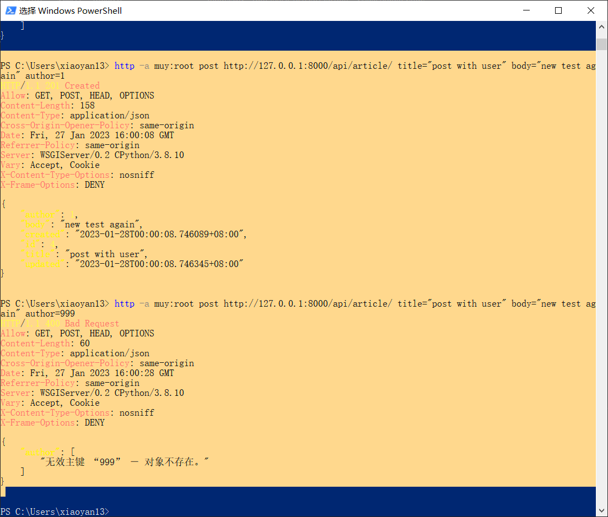

# Django 环境搭建

## 从零开始的搭环境生活

- 使用root进行操作。为了避免繁杂的权限问题。

```bash
sudo apt update && sudo apt upgrade 
# 云端创建新用户并加权限
adduser muy
usermod -aG sudo muy
su muy
```

- 本地配置 ssh:
```bash
ssh-keygen
ssh-copy-id不能用，可以试试：
ssh 用户名@主机ip # 这个也无权限，就手动copy公钥到主机
```
- ssh成功，最后配置别名，写入config文件主机别名

- 安装桌面
```bash
sudo apt update && sudo apt upgrade -y
sudo apt install tasksel
sudo tasksel # 安装过程真的太慢了
sudo systemctl set-default graphical.target
sudo reboot
```
---到这里突然意识到，可以用 win 下的 vscode 远程连接 linux 下的工作文件夹。我在搞什么啊啊啊

- 远程创建/muy/django/drf文件夹
- 配置本地vscode远程连接
- 打开该文件夹，查看python版本（我是3.8.10）
  
- 配置虚拟环境
```bash
pip install virtualenv
```
- 创建虚拟环境 venv
```bash
virtualenv venv
# 如果不想使用系统的包,加上–no-site-packeages参数
virtualenv  --no-site-packages 创建路径名
# 激活环境
source venv/bin/activate #必须用source
# 配置vscode项目的python解释器：
# ctrl+shift+P -> python解释器选项 -> 
#配置成./venv/Script/python.exe
# 退出环境
deactivate
```

- 补充：迁移虚拟环境的方法

    1 在旧计算机上，在virtualenv中运行pip freeze -l > packages.txt.
    2 将packages.txt移到新计算机上.
    windows下env的使用：./Scripts/activate
    3 在新计算机上创建一个新的virtualenv并输入它.
    4 从txt文件中安装软件包:pip install -r packages.txt.

- 安装 django：
```bash
pip install django
```

- 创建项目
```bash
django-admin startproject drf_vue_blog
```

- 打开settings.py，看看必要的配置.
- 运行测试（记得加allowed_hosts):
```bash
python manage.py runserver
```

- 安装drf等库
```bash
pip install djangorestframework
pip install markdown
pip install django-filter
```

- 创建一个app，并把他和drf注册到列表。并在admin.py中把Article添加到后台管理。
接着还需要添加 DRF 的登录视图，以便 DRF 自动为你的可视化接口页面生成一个用户登录的入口。
```bash
python manage.py startapp appname
```

- 最后，进行数据迁移：
```bash
python manage.py makemigrations
python manage.py migrate
```

- 创建一个后台用户 muy:
```bash
python manage.py createsuperuser
```

- 配置git环境
```bash
在服务器生成密钥，并把公钥拷贝到acwing上。
# ssh-keygen
初始化文件夹
git init 
# 登录acgit，创建新仓库
在服务器执行:
git config --global user.name "xiao yan"
git config --global user.email "693086605@qq.com"
# 并把当前待更新的内容加入版本库
git add .
git status
git commit -m "start project"
# 配置远程连接
git remote add origin git@git.acwing.com:xiaoyan/drf_vue_blog.git
git push -u origin --all
git push -u origin --tags
```

- 开tmux

---

- 登录服务器安装 nodejs：
```bash
sudo apt update && sudo apt upgrade
curl -fsSL https://deb.nodesource.com/setup_19.x | sudo -E bash - 
sudo apt-get install -y nodejs
sudo apt install nodejs
```

- 配置vue

```bash
cd drf/drf_vue_blog
npm init vue@latest
project写frontend
cd frontend
npm install
npm run dev
```

网页运行成功。

---

- 配置nginx
```bash
# 安装gcc后（一般自带的有）
# 安装pcre库：
sudo apt-get install libpcre3 libpcre3-dev  
# zlib库
sudo apt-get install zlib1g-dev
# OpenSSL库
sudo apt-get install openssl libssl-dev 
# 下载Nginx（2022.4月版本）
wget https://nginx.org/download/nginx-1.19.9.tar.gz 
# 解压nginx
tar -zxvf nginx-1.19.9.tar.gz
cd nginx-1.19.9
# 执行nginx-configure文件
./configure
# make命令编译
make
make install
# 查询nginx 安装目录
whereis nginx
# 前往安装目录找到sbin 执行nginx
./nginx
# 此时进程已经启动了：
ps -ef | grep nginx
# 配置nginx全局变量:
cd /etc/
vim profile
export PATH=$PATH:/usr/local/nginx/sbin
source profile
```

- 为网站配置ssl证书
```bash
# 安装nginx_ssl模块
nginx -s stop
cd /usr/local/nginx-1.19.9
./configure --prefix=/usr/local/nginx --with-http_ssl_module
make
# 备份原来的nginx：
cp /usr/local/nginx/sbin/nginx /usr/local/nginx/sbin/nginx.bak
# 覆盖原来的nginx：
cp objs/nginx /usr/local/nginx/sbin/nginx
nginx
nginx -V
```

---

- 遗留问题

  - 关于url多一个"/"就无法正确识别的问题：为了保证url的唯一性，加斜杠和不加斜杠本来就是两个url，只是浏览器默认会在不加斜杠的路由做一次重定向,因此我们在设计url的时候最好给末尾都加/，以保证不加斜杠的时候也能正确映射到制定的路由，否则不加斜杠是无法正确映射到试图函数的。

  - 关于url输入的www会被省略的问题

  - 关于manage.py两种不同执行方式有一种行不通的问题

至此完成基础环境搭建。

---

##  前后端分离

> REST旨在让各大平台平等的公用一套API为用户提供服务。
DRF就是这样一个django库，为django序列化服务提供了一套API。
相比于直接render，drf采用序列化器进行序列化，再传输json数据，json是前后端交互的基础。

### 使用序列化器

序列化器类的第一部分定义了序列化/反序列化的字段。`create()`和`update()`方法定义了在调用`serializer.save()`时如何创建和修改完整的实例。


```python
# 使用序列化器
from rest_framework import serializers

#serializers.Serializer是一种序列化器
class ArticleListSerializer(serializers.Serializer):
    # 字段名要对应
    id = serializers.IntegerField(read_only=True)
    title = serializers.CharField(allow_blank=True, max_length=100)
    body = serializers.CharField(allow_blank=True)
    created = serializers.DateTimeField()
    updated = serializers.DateTimeField()


# 或者使用另一种更简单的序列化器，他使用内部类：
class ArticleListSerializer(serializers.ModelSerializer):
    class Meta:
        model = Article
        fields = [
            'id',
            'title',
            'created',
        ]
'''
ModelSerializer 的功能与 Serializer 基本一致，不同的是它额外做了些工作：
 自动推断需要序列化的字段及类型
 提供对字段数据的验证器的默认实现
 提供了修改数据需要用到的 .create() 、 .update() 方法的默认实现
'''
```

---

- 进一步包装视图。

REST框架提供了两个可用于编写API视图的包装器（wrappers）。

1. 用于基于函数视图的`@api_view`装饰器。
2. 用于基于类视图的`APIView`类。

```python
# 我们还可以为视图添加一些新东西：
from rest_framework.decorators import api_view
from rest_framework.response import Response
from rest_framework import status
...

@api_view(['GET', 'POST'])
def article_list(request):
    if request.method == 'GET':
        articles = Article.objects.all()
        serializer = ArticleListSerializer(articles, many=True)
        return Response(serializer.data)

    elif request.method == 'POST':
        serializer = ArticleListSerializer(data=request.data)
        if serializer.is_valid():
            serializer.save()
            return Response(serializer.data, status=status.HTTP_201_CREATED)
        return Response(serializer.errors, status=status.HTTP_400_BAD_REQUEST)

'''
@api_view 装饰器：增强功能是允许视图接收 GET 、POST 请求，以及提供如 405 Method Not Allowed 等默认实现，以便在不同的请求下进行正确的响应。
返回了 Response ：该对象由 Django 原生响应体扩展而来，它可以根据内容协商来确定返回给客户端的正确内容类型。如果数据验证有误，还可以返回适当的状态码以表示当前的情况。
'''
```

### 基于类的视图（重新学习）

对于这个东西，首先要明确，django处理请求的三大步骤：URLconf ---- 视图 ----- 数据模型

其中，视图之前是被做成了函数的形式，用于与数据模型交互并返回给用户最终页面。但是，我们发现，对于一个数据模型，可以定义多个视图，而这些视图都是去处理同一个模型，只不过由于请求的方法不一样（有可能是POST增，DELETE删，PUT改，GET查），就写成了不同的方法。这有点繁杂。我们可以定义一个类，用于集合多个方法，他们的功能都在这个类中被实现，而该类本身自动**根据请求的方式不同**而调用不同的方法，但都是对同一个数据模型操作。

而DRF 类视图与传统 Django 的区别，`.get()` 、 `.put()` 就是多了一个将对象序列化（或反序列化）的步骤。

```python
# article/views.py

from rest_framework.response import Response
from rest_framework.views import APIView
from rest_framework import status

from django.http import Http404

from article.models import Article
from article.serializers import ArticleDetailSerializer

class ArticleDetail(APIView):
    """文章详情视图"""

    def get_object(self, pk):
        """获取单个文章对象"""
        try:
            # pk 即主键，默认状态下就是 id
            return Article.objects.get(pk=pk)
        except:
            raise Http404

    def get(self, request, pk):
        article = self.get_object(pk)
        serializer = ArticleDetailSerializer(article)
        # 返回 Json 数据
        return Response(serializer.data)

    def put(self, request, pk):
        article = self.get_object(pk)
        serializer = ArticleDetailSerializer(article, data=request.data)
        # 验证提交的数据是否合法
        # 不合法则返回400
        if serializer.is_valid():
            # 序列化器将持有的数据反序列化后，
            # 保存到数据库中
            serializer.save()
            return Response(serializer.data)
        return Response(serializer.errors, status=status.HTTP_400_BAD_REQUEST)

    def delete(self, request, pk):
        article = self.get_object(pk)
        article.delete()
        # 删除成功后返回204
        return Response(status=status.HTTP_204_NO_CONTENT)
```

注意，我们不再显式地将请求或响应绑定到**某一给定的类型**。`request.data`可以**自动**处理传入的`json`请求，也可以处理其他格式(一般是json)。同样，我们返回带有数据的响应对象，但允许REST框架将响应给我们渲染成正确的内容类型。

### 视图再重构

使用基于类视图的最大优势之一是它可以轻松地创建可复用的行为。

到目前为止，我们使用的创建/获取/更新/删除操作和我们创建的任何基于模型的API视图非常相似。这些常见的行为是在REST框架的mixin类中实现的。

---

理一下思路

创建了文章列表类（实现了文章列表，增加单个文章的功能）和

文章详情类（实现了文章的删查改）；

添加了权限类，后端在接收数据的时候会先检查操作权限够不够；

给文章添加了作者外键，引起了一些问题：

json上传后，作者怎么添加到数据模型中？解决方法：既然请求体中已经包含用户信息了，那就可以从 `Request` 中提取用户信息：

```django
def perform_create(self, serializer):
	serializer.save(author=self.request.user)
```


设置了author不为空，所以必须要填author；而author填入则必须合法，不合法就会抛出错误（序列化器会解析author字段到相应的对象，虽然我们多此一举的使用了上面的`perform_create`方法又去根据user去save了一遍。。）怎么不让他抛错误而直接忽略错误？



解决方案：给序列化器处理的时候，序列化器允许你指定只读字段。只读意味着不对该传入的数据做任何处理，直接丢弃。我们由于已经有个user了，author选择直接丢弃就好。

---

到现在，和教程相比，我没有去实现文章的标签；没有去实现评论；没有去实现JWT身份认证。很多复杂的请求都是与用户交互产生的，而我的博客可能只有get请求，所以才感觉会很简单吧。。

我没有把 markdown 渲染成 html 的过程放在后端，而是把它放在前端······渲染的时机有几种选择：

- 放在django中渲染，与vue交互的时候直接丢html给vue。

- 放在vue中，vue中通过js库来渲染，最终的html丢给浏览器直接生成。
- 后端不渲染，vue丢给浏览器后，让浏览器执行js库，渲染出最终效果。


---

## django的组件：

- model模块
- views模块
- url模块
- admin后台模块django.contrib
- auth权限模块
- form表单处理模块
- 其他
