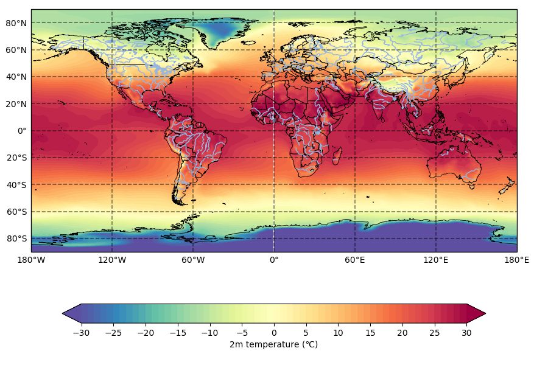

# xarray入门

## 参考

[从xarray走向netCDF处理(一)：数据结构及数据读取](https://mp.weixin.qq.com/s/zqxuLuLkgKdkVYVh8V8tdw?scene=25#wechat_redirect)

[官方文档](https://docs.xarray.dev/)

## 安装

```bash
conda install xarray
```

## 概述

### 数据结构

xarray有两大数据类型：DataArray、Dataset。

#### DataArray

一个带有标签的多维数组，它有如下几个重要的属性：

- `values` 获取数组的具体数值
- `dims` 获取维度的名字，如 `('x', 'y', 'z')`
- `coords` 获取一个类似于字典的结果，里面包含各个坐标
- `attrs` 获取原始数据的属性，比如变量的名字、单位等

#### Dataset

Dataset 可以简单的理解为由多个DataArray组成的集合，它有如下几个重要的属性

- `dims` 获取维度的名字，结果类似于字典，如 `{'x': 6, 'y': 6, 'time': 8}`
- `data_vars` 获取物理量的名字
- `coords` 获取一个类似于字典的结果，里面包含各个坐标
- `attrs` 获取原始数据的属性，比如变量的名字、单位等

## 读入数据

- `xarray.open_dataset()`读取 Dataset 类型数据，即能读取多个物理量。
- `xarray.open_dataarray()`读取 DataArray 类型数据，即只能读取单个物理量。

如果 nc 文件中含有多个物理量，用`open_dataarray()`读取会报错，因此建议统一都用`open_dataset()`来读取文件。

## 通过一个实例分析

此处使用的是ERA-Interim中2018年的月数据，包含10米的径向风、纬向风和2米气温,在ECMWF注册过的都可以直接下载。

```bash
>>>import xarray as xr

# 由于数据包含了多个物理量（u10，v10，t2m），所以要用open_dataset来读取数据
>>>ds = xr.open_dataset('EC-Interim_monthly_2018.nc')

# ds的类型为Dataset，里面包含u10，v10，t2m三个物理量，每个物理量都有经度、纬度、时间三个坐标系
>>>ds
<xarray.Dataset>
Dimensions:    (latitude: 241, longitude: 480, time: 12)
Coordinates:
  * longitude  (longitude) float32 0.0 0.75 1.5 2.25 .. 357.75 358.5 359.25
  * latitude   (latitude) float32 90.0 89.25 88.5 87.75 .. -88.5 -89.25 -90.0
  * time       (time) datetime64[ns] 2018-01-01 2018-02-01 .. 2018-12-01
Data variables:
    u10        (time, latitude, longitude) float32 ..
    v10        (time, latitude, longitude) float32 ..
    t2m        (time, latitude, longitude) float32 ..
Attributes:
    Conventions: CF-1.6
    history:    2019-03-28 02:03:39 GMT by grib_to_netcdf-2.12.0: grib_to_n...

#  取出ds中名为t2m的物理量,可以看到它的维度，坐标系，以及t2m有单位和名字两个属性
>>>ds['t2m']
<xarray.DataArray 't2m' (time: 12, latitude: 241, longitude: 480)>
[13e88160 values with dtype=float32]
Coordinates:
  * longitude  (longitude) float32 0.0 0.75 1.5 2.25 ... 357.75 358.5 359.25
  * latitude   (latitude) float32 90.0 89.25 88.5 87.75 ... -88.5 -89.25 -90.0
  * time      (time) datetime64[ns] 2018-01-01 2018-02-01 ... 2018-12-01
Attributes:
    units:     K
    long_name:  2 metre temperatur
```

可以看到，Coordinates属性包含三个维度，分别是经纬度和时间。

Dimensions参数包含了三个维度的数据信息，例如经度轴上面有241个坐标点。

而variables参数包含了三个xarry数据集，分别是10米的径向风、纬向风和2米气温数据。

Attributes属性则包含了整个数据集的其他全局信息，比如`history`。

`ds['t2m']`对其中一个variables物理量`t2m`取数据，得到一个`DataArray`。它同样有类似的信息。所以我们才说，可以把`Dataset`看作是`DataArray`的集合。

## 可视化

`xarray`封装了`matplotlib`的部分绘图函数。通过`plot`就可以进行绘制。下面的实例通过cartopy地图进行绘制。

```python
import numpy as np
import xarray as xr
import cartopy.crs as ccrs
import cartopy.feature as cfeat
from cartopy.mpl.gridliner import LONGITUDE_FORMATTER, LATITUDE_FORMATTER
import matplotlib.pyplot as plt

# 数据读取及时间平均处理
ds = xr.open_dataset('EC-Interim_monthly_2018.nc')
temp = (ds['t2m'] - 273.15).mean(dim='time')  #把温度转换为℃并对其时间纬求平均
temp.attrs['units'] = 'deg C'  #温度单位转换为℃
# 创建画图空间
proj = ccrs.PlateCarree()  #创建投影
fig = plt.figure(figsize=(9,6))  #创建页面
ax = fig.subplots(1, 1, subplot_kw={'projection': proj})  #子图
# 设置地图属性:加载国界、海岸线、河流、湖泊
ax.add_feature(cfeat.BORDERS.with_scale('50m'), linewidth=0.8, zorder=1)
ax.add_feature(cfeat.COASTLINE.with_scale('50m'), linewidth=0.6, zorder=1)  
ax.add_feature(cfeat.RIVERS.with_scale('50m'), zorder=1)  
ax.add_feature(cfeat.LAKES.with_scale('50m'), zorder=1)  
# 设置网格点属性
gl = ax.gridlines(crs=ccrs.PlateCarree(), draw_labels=True, 
  linewidth=1.2, color='k', alpha=0.5, linestyle='--')
gl.xlabels_top = False  #关闭顶端标签
gl.ylabels_right = False  #关闭右侧标签
gl.xformatter = LONGITUDE_FORMATTER  #x轴设为经度格式
gl.yformatter = LATITUDE_FORMATTER  #y轴设为纬度格式
# 设置colorbar
cbar_kwargs = {
   'orientation': 'horizontal',
   'label': '2m temperature (℃)',
   'shrink': 0.8,
   'ticks': np.arange(-30,30+5,5)
}
# 画图
levels = np.arange(-30,30+1,1)
temp.plot.contourf(ax=ax, levels=levels, cmap='Spectral_r', 
    cbar_kwargs=cbar_kwargs, transform=ccrs.PlateCarree())
fig.show()
```


