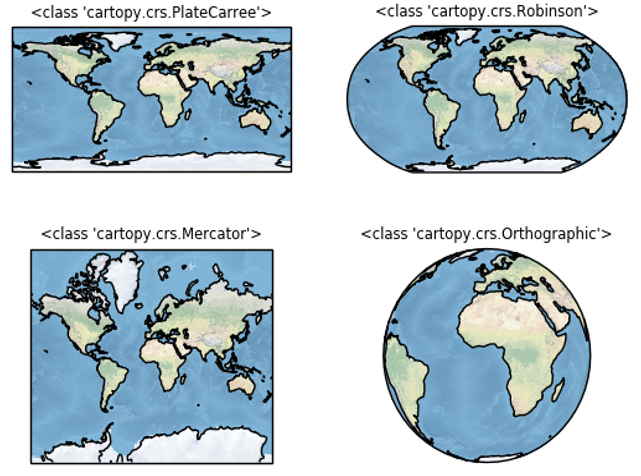

# Cartopy入门

## 参考

<https://zhajiman.github.io/post/cartopy_introduction/>

[官方文档](https://scitools.org.uk/cartopy/docs/latest/)

## 概述

Cartopy利用`Matplotlib`来画图，Matplotlib 画图则是通过调用 `Axes` 类的方法来完成的。Cartopy 创造了一个 `Axes` 的子类`GeoAxes`，它继承了前者的基本功能，还添加了一系列绘制地图元素的方法。创建一个 `GeoAxes` 对象的办法是，在创建 axes（或 subplot）时，通过参数 `projection` 指定一个 `ccrs` 中的投影：

```python
# 选取多种投影
projections = [
    ccrs.PlateCarree(),
    ccrs.Robinson(),
    ccrs.Mercator(),
    ccrs.Orthographic()
]

# 画出多子图
fig = plt.figure()
for i, proj in enumerate(projections, 1):
    ax = fig.add_subplot(2, 2, i, projection=proj)
    ax.stock_img()  # 添加低分辨率的地形图
    ax.coastlines()
    ax.set_title(f'{type(proj)}', fontsize='small')

plt.show()
```

这里使用了Cartopy库**自带的一个世界地图**。Cartopy也支持导入各种格式的地图文件。



这个例子展示了如何使用其它投影和画出多子图。其中`stock_img`方法可以给地图添加低分辨率的地形背景图，让地图显得不那么寒碜。
