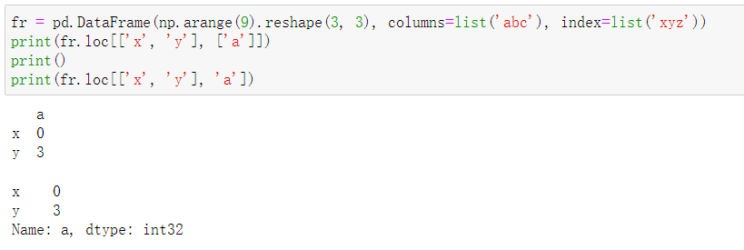
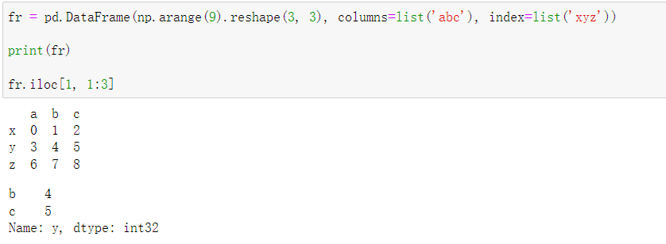
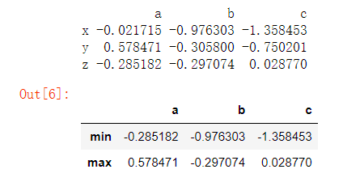

# pandas概述

```python
import pandas as pd
```

与基本的`numpy`相比，`pandas`库是用来处理 *表格型* 数据 或者 *异构型* 数据的。相对的，最基本的`numpy`更适合处理 *相同类型的数值类数组数据*。

pandas库中内置了两个数据结构：`Series`和`DataFrame`。

## 缺失值

pandas的设计目标之一就是 *尽可能简单的处理缺失数据*。这将大幅简化我们的数据清洗操作。

NaN, 即`Not a number`,是一个浮点值。 `pandas`处理空缺值的方式就是把一个数据赋值为NaN。`NaN`值被`pandas`的诸如`mean()`之类的函数自动的跳过。不同函数处理`NaN`的行为不同，有的直接报错，有的忽略它。

`python`内建的`None`、`numpy`中的`nan`都在使用`pandas`的时候都被自动处理为`NaN`。

## 索引的概念

索引是`map`的键，就这么简单。但是，在`pandas`数据结构中，它**允许重复**。

### 索引对象

`index`属性可以获取`pandas`对象的索引。这个引用的索引通过`[]`和`.`取的值**不允许被直接修改**，是只读属性。索引对象类似于集合（但里面的元素是可重复的），它内置了一些**集合运算**的方法帮助我们筛选索引。

## Series

`series`是一个一维数组对象，只不过它的每一个下标对应一个`索引(index)`。所以，**一个长度固定并且有序的map**，就是`series`。

```python
class pandas.Series(data=None, index=None, dtype=None, name=None)
```

`data`参数可以是一个列表，也可以是一个字典。如果是一个字典，它的`index`将被自动赋值为键。如果显式的传入`index`，则它的优先级最高。不在`index`列表中的缺失值将自动填充`NaN`。

```python
sdata = {'a': 1, 'b': 2, 'c': 3};
s = pd.Series(sdata, index = ['b', 'a', 'd'])
s

"""
output:
b    2.0
a    1.0
d    NaN
dtype: float64
"""
```

`dtype`参数和`numpy`的数组一样，表示数据的类型。

`name`参数，则是`Series`对象的另一个基本属性。`Series`对象和它的索引都有`name`属性。

## DataFrame

可以被视为二维的`Series`，也就是二维有序的`map`。说白了，就是一张`excel`表格。

> 可以视为一个共享相同索引的Series的有序字典。

```python
class pandas.DataFrame(data=None, index=None, columns=None, dtype=None, copy=None)
```

`data`传入的最常见方式是一个包含了等长度列表作为值的字典。字典的每一个键值对就是一个**Series列**。

另一种传入方式是嵌套字典。这种情况下外层键值对的键将作为列索引，内层键值对的键作为行索引。

`index`是行索引，`colunms`参数是列索引。

`dtype`默认为`None`。如果强制`DataFrame`必须只有一种数据类型，可以指定它。

`copy`表示是否从`data`拷贝数据。对于`data`传入的是一个`DataFrame`的情况，`copy`默认是`False`，也就是引用了源数据。

## 数据处理

由于基于`numpy`，所以`pandas`数据结构很多行为上和`numpy`原生数组雷同。

### 选取数据

选取数据默认全部返回**引用**。

- df[clm]/df.clm

`frame[column]`和`frame.column`都可以用于选取列，但是前者对于任意列名有效，后者只对于`python变量名`有效。但是后者的这一特性决定了它可以享受`Tab`键的自动补全。前者的另一特性是它可以用于**创建新列**。

```python
fr = pd.DataFrame(np.arange(9).reshape(3, 3), columns=list('abc'), index=list('xyz'))

fr['a']
"""
x    0
y    3
z    6
Name: a, dtype: int32
"""
```

- df.loc[row, clm]

**轴**索引函数(location)，`row`切出行，`clm`切出列。



- df.iloc[row, clm]

**整数**索引函数(int location)，`row`切出行，`clm`选中列。



- df.values属性

返回数据集中所有的数据组成的一个数组。

### 修改数据

#### 算术

选取的数据全部都是**引用**，支持修改。

- 和标量进行运算

和`numpy`一样，`pandas`数据结构与标量之间的运算将传给数组中的每一个元素。

- Series自身和DataFrame自身的运算

和`numpy`一样。除了满足`numpy`的四则运算，还内置了一些运算函数，每组中的函数互为反函数。

|方法|描述|
|:---:|:---:|
|add, radd|加法|
|sub, rsub|减法|
|mul, rmul|乘法|
|div, rdiv|除法|
|floordiv, rfloordiv|整除|
|pow, rpow|幂次方|

- DataFrame和Series之间的运算

  - 和`numpy`一样，`pandas`数据结构之间的运算依然满足**广播**机制。

  - 可以把`Series`赋值给`DataFrame`的某一列。`Series`的索引会去匹配`DataFrame`的索引。如果不存在则补入`NaN`。

#### 通用值替换

可以通过方括号或者`.`运算选中一个元素后进行单个值替换；如果要对某一个值全部替换，则可以用`replace()`。

#### 索引的修改

- `reindex()`用于重建索引。返回**新的对象**。

```python
DataFrame.reindex(labels=None, *, index=None, columns=None, axis=None, method=None, copy=None, level=None, fill_value=nan, limit=None, tolerance=None)
```

- `rename()`用于修改索引。默认返回一个**新的对象**：

```python
DataFrame.rename(mapper=None, *, index=None, columns=None, axis=None, copy=None, inplace=False, level=None, errors='ignore')
```

- `.index.map()`也可以用于修改索引。`map`参见[映射](#作用于每个元素上)

- `drop`用于删除索引。

### 常见配套函数

#### 通用函数

所有`numpy`中的通用函数都可以作用于`pandas`中，被称为*通用函数*。

#### 映射函数

##### 作用于每个元素上

对于`Series`，有一个`map()`函数，接收一个`f`，作用于**每一个元素上**；对于`DataFrame`，类似的函数名叫做`applymap`。

另外，`index对象`也含有一个`map()`函数，用于修改索引：

```python
# index的修改
fr.index = fr.index.map(myf)
```

##### 作用于某一行/列

`DataFrame`的一个常见操作是，对某一行或者某一列进行处理。

`apply()`函数接收一个函数`f`，该函数默认传入`DataFrame`的**每一列**，然后把结果返回，最后得到的是一个以原`DataFrame`的列名作为索引的`Series`。

```python
fr = pd.DataFrame(np.random.randn(3, 3), columns=list('abc'), index=list('xyz'))

f = lambda x : x.max() - x.min()

fr.apply(f)

"""
a    0.411482
b    1.914997
c    1.847477
dtype: float64
"""
```

传入的`f`，不一定返回一个标量，也可以返回一个`Series`，这样得到的结果就变成了一个`DataFrame`：

```python
fr = pd.DataFrame(np.random.randn(3, 3), columns=list('abc'), index=list('xyz'))

print(fr)

def f(x):
    return pd.Series([x.min(), x.max()], index=['min', 'max'])

fr.apply(f)

```



#### 排序函数

- `sort_index()`函数用于根据**索引**字典序排序，`sort_values()`根据**值**进行排序。

- `sort_values()`如下：

```python
sort_values(by='##',axis=0,ascending=True, inplace=False, na_position='last')
```

|参数| 说明 |
|:----:|:----:|
|by| 指定列名(axis=0或’index’)或索引值(axis=1或’columns’) |
|axis| 若axis=0或’index’，则按照指定列中数据大小排序；若axis=1或’columns’，则按照指定索引中数据大小排序，默认axis=0 |
|ascending| 是否按指定列的数组升序排列，默认为True，即升序排列 |
|inplace| 是否用排序后的数据集替换原来的数据，默认为False，即不替换|
|na_position|{‘first’,‘last’}，设定缺失值的显示位置|

#### 排名函数

`rank()`用于根据每个值的相对大小对数据进行排名。相当于把每个数据改为了一个值，值越小排名越靠前。

默认情况下，如果两（多）个数据的值相等，则称为`平级`，这时`rank()`通过这两个值的排名平均值决定最后的值为多少（也就是相加除以2）。可以通过`method`参数改变这种默认行为。
